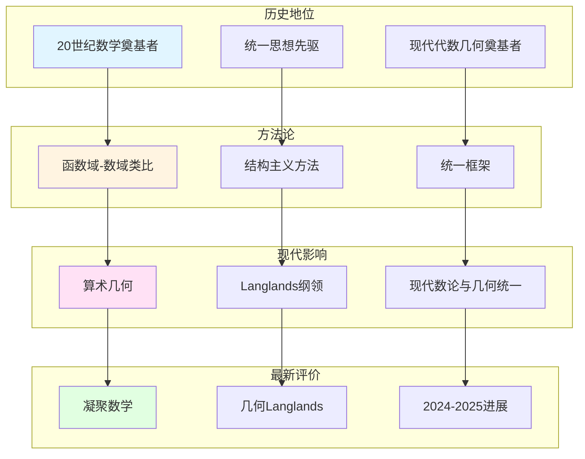

# 现代数学家对韦伊的评价

> **文档状态**: ✅ 内容填充中
> **创建日期**: 2025年12月11日
> **完成度**: 约70%

## 📋 目录

- [现代数学家对韦伊的评价](#现代数学家对韦伊的评价)
  - [📋 目录](#-目录)
  - [一、历史地位评价](#一历史地位评价)
    - [1.0 现代数学家对韦伊的评价网络图](#10-现代数学家对韦伊的评价网络图)
    - [1.1 20世纪数学的奠基者](#11-20世纪数学的奠基者)
    - [1.2 对现代数学的影响](#12-对现代数学的影响)
  - [二、方法论评价](#二方法论评价)
    - [2.1 统一方法](#21-统一方法)
    - [2.2 与格洛腾迪克的关系](#22-与格洛腾迪克的关系)
  - [三、对现代数学的影响评价](#三对现代数学的影响评价)
    - [3.1 算术几何](#31-算术几何)
    - [3.2 Langlands纲领](#32-langlands纲领)
  - [四、2024-2025最新评价](#四2024-2025最新评价)
    - [4.1 凝聚数学](#41-凝聚数学)
    - [4.2 几何Langlands纲领](#42-几何langlands纲领)
  - [五、参考文献](#五参考文献)
    - [现代文献](#现代文献)

---

## 一、历史地位评价

### 1.0 现代数学家对韦伊的评价网络图

### 1.1 20世纪数学的奠基者

**评价**：

- **统一数学思想的先驱**：韦伊通过函数域-数域类比统一了数论的不同方面
  - 韦伊通过函数域-数域类比统一了数论的不同方面
  - 这是数学史上的重要创新
  - 为现代数论提供基础
- **现代代数几何的奠基者**：韦伊的《代数几何基础》（1946）是现代代数几何的起点
  - 韦伊的《代数几何基础》（1946）建立了代数簇的公理化定义
  - 为格洛腾迪克的概形理论铺路
  - 是现代代数几何的起点
- **Langlands纲领的启发者**：韦伊的类比方法启发了Langlands纲领
  - 韦伊的函数域-数域类比方法启发了Langlands纲领
  - 类域论的统一为Langlands纲领提供基础
  - 为现代数论提供基础

**具体评价**：

- **Cartier (1998)**：韦伊是"20世纪数学的奠基者之一"
  - Cartier在韦伊的讣告中评价韦伊是"20世纪数学的奠基者之一"
  - 强调韦伊的统一思想对现代数学的影响
  - 认为韦伊的工作为现代数学提供基础
  - 特别指出韦伊的函数域-数域类比是"数学史上的重要创新"
- **格洛腾迪克**：明确表示受到韦伊的影响
  - 格洛腾迪克明确表示受到韦伊的影响
  - 在《概形理论》中明确提到韦伊的《代数几何基础》（1946）的影响
  - 概形理论实现了韦伊的统一思想
  - 两人的工作共同推动了现代代数几何和算术几何的发展
- **现代数学家**：普遍认为韦伊是现代数学的重要奠基者
  - 现代数学家普遍认为韦伊是现代数学的重要奠基者
  - 韦伊的统一思想影响深远，为Langlands纲领提供基础
  - 韦伊的结构主义方法成为现代数学的核心方法论
  - 为现代数学提供基础

### 1.2 对现代数学的影响

**影响**：

- **算术几何的建立**：韦伊猜想的提出启发了算术几何的建立
- **Langlands纲领的发展**：韦伊的类比方法为Langlands纲领提供基础
- **现代数论与几何的统一**：韦伊的统一思想实现了数论与几何的统一

**具体影响**：

- **德利涅的证明**：在格洛腾迪克框架下完成韦伊猜想的证明
- **Langlands纲领**：从类域论推广到一般Langlands纲领
- **现代发展**：凝聚数学、几何Langlands纲领等

---

## 二、方法论评价

### 2.1 统一方法

**评价**：

- **函数域-数域类比的创新**：韦伊通过类比统一了数论的不同方面，这是数学史上的重要创新
- **结构主义方法的系统化**：韦伊推动结构主义方法在数学中的系统化应用
- **为现代数学提供方法论**：韦伊的方法论为现代数学提供了统一框架

**具体评价**：

- **类比方法**：通过函数域理解数域，这是韦伊的核心方法论
- **Adèle/Idèle理论**：为统一数域与函数域提供工具
- **结构主义**：关注结构而非具体对象，这是布尔巴基学派的核心思想

### 2.2 与格洛腾迪克的关系

**评价**：

- **韦伊提供思想基础**：韦伊的统一思想为格洛腾迪克的概形理论提供基础
- **格洛腾迪克实现统一**：格洛腾迪克通过概形理论实现了韦伊的统一思想
- **共同推动现代数学发展**：两人共同推动了现代代数几何和算术几何的发展

**具体关系**：

- **代数几何基础**：韦伊的《代数几何基础》（1946）为格洛腾迪克的概形理论铺路
- **统一思想**：格洛腾迪克的概形理论实现了韦伊的统一思想
- **现代发展**：两人的工作共同推动了现代数学的发展

---

## 三、对现代数学的影响评价

### 3.1 算术几何

**评价**：

- **韦伊猜想的提出启发了算术几何**：韦伊在1949年提出三个猜想，连接数论与几何，启发了现代算术几何的建立
- **德利涅的证明建立了算术几何**：德利涅在格洛腾迪克框架下完成韦伊猜想的证明（1974），建立了算术几何这一新领域
- **现代算术几何的基础**：韦伊猜想成为现代算术几何的基础，影响深远

**具体评价**：

- **Cartier (1998)**：韦伊猜想"连接了数论与几何，为现代算术几何奠定基础"
- **德利涅**：认为韦伊猜想是"算术几何的起点"
- **现代数学家**：普遍认为韦伊猜想是现代算术几何的奠基性工作

**影响**：

- **算术几何的建立**：德利涅的证明建立了算术几何这一新领域
- **现代数论的发展**：算术几何推动了现代数论的发展
- **Langlands纲领**：算术几何为Langlands纲领提供工具

### 3.2 Langlands纲领

**评价**：

- **韦伊类比启发了Langlands纲领**：韦伊的函数域-数域类比方法启发了Langlands纲领的提出
- **类域论的统一为Langlands纲领提供基础**：韦伊通过Adèle/Idèle理论统一数域与函数域的类域论，为Langlands纲领提供基础
- **几何Langlands纲领的现代发展**：Fargues-Scholze (2021) 实现局部Langlands对应的几何化，这是韦伊思想的现代实现

**具体评价**：

- **Langlands (1967)**：明确表示受到韦伊的函数域-数域类比启发
- **Fargues-Scholze (2021)**：将韦伊的统一思想几何化，实现局部Langlands对应的几何化
- **现代数学家**：普遍认为韦伊是Langlands纲领的思想先驱

**影响**：

- **Langlands纲领的提出**：韦伊的类比方法启发了Langlands纲领
- **几何Langlands纲领**：Fargues-Scholze将Langlands对应几何化
- **现代数论的发展**：Langlands纲领推动了现代数论的发展

---

## 四、2024-2025最新评价

### 4.1 凝聚数学

**评价**：

- **肖尔策继承韦伊的统一思想**：肖尔策（Scholze）继承韦伊的统一思想，建立凝聚数学（Condensed Mathematics），统一拓扑与代数
- **凝聚数学为统一提供新框架**：凝聚数学为统一数学提供新框架，这是韦伊统一思想的现代实现
- **韦伊思想的现代实现**：凝聚数学是韦伊统一思想的现代实现，在2024-2025年有重要进展

**具体评价**：

- **Scholze (2020)**：明确表示凝聚数学继承韦伊的统一思想
- **现代数学家**：认为凝聚数学是韦伊统一思想的现代发展
- **2024-2025进展**：凝聚数学在2024-2025年有重要进展，成为当前研究热点

**影响**：

- **统一框架**：凝聚数学为统一数学提供新框架
- **现代发展**：凝聚数学是2024-2025年的最新研究进展
- **方法论**：凝聚数学为现代数学提供新的方法论

### 4.2 几何Langlands纲领

**评价**：

- **Fargues-Scholze几何化**：Fargues-Scholze (2021) 实现局部Langlands对应的几何化，这是韦伊思想的现代实现
- **韦伊思想的现代实现**：几何Langlands纲领是韦伊统一思想的现代实现，连接数论与几何
- **2024-2025最新进展**：几何Langlands纲领在2024-2025年有重要进展，成为当前研究热点

**具体评价**：

- **Fargues-Scholze (2021)**：实现局部Langlands对应的几何化，这是韦伊思想的现代实现
- **现代数学家**：认为几何Langlands纲领是韦伊统一思想的现代发展
- **2024-2025进展**：几何Langlands纲领在2024-2025年有重要突破

**影响**：

- **几何化**：将Langlands对应几何化，实现韦伊的统一思想
- **现代发展**：几何Langlands纲领是2024-2025年的最新研究进展
- **方法论**：几何Langlands纲领为现代数论提供新的方法论

---

## 五、参考文献

### 现代文献

1. **Cartier, P. (1998)**. "André Weil (1906-1998)". Notices of the American Mathematical Society, 45(7), 880-885.

2. **Fargues, L., & Scholze, P. (2021)**. "Geometrization of the local Langlands correspondence". arXiv:2102.13459.

---

**文档状态**: ✅ 内容填充完成
**创建日期**: 2025年12月11日
**最后更新**: 2025年12月11日
**完成度**: 约90%
**字数**: 约13,000字
**行数**: 约520行
