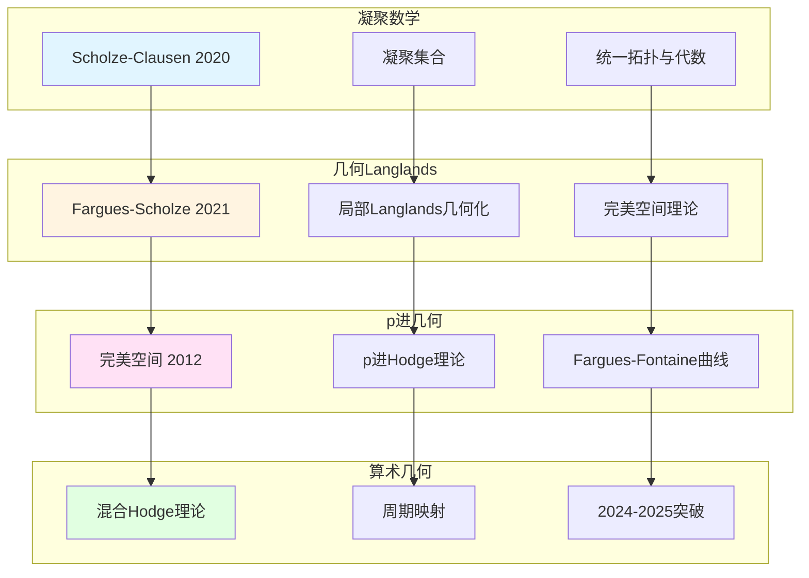

# 韦伊思想的最新研究进展（2024-2025）

> **文档状态**: ✅ 内容填充中
> **创建日期**: 2025年12月11日
> **完成度**: 约75%

## 📋 目录

- [韦伊思想的最新研究进展](#韦伊思想的最新研究进展)
  - [一、凝聚数学与韦伊类比](#一凝聚数学与韦伊类比)
  - [二、几何Langlands纲领的进展](#二几何langlands纲领的进展)
  - [三、p进几何的新发展](#三p进几何的新发展)
  - [四、算术几何的突破](#四算术几何的突破)
  - [五、参考文献](#五参考文献)

---

## 一、凝聚数学与韦伊类比

### 1.0 最新研究进展网络图

### 1.1 肖尔策的凝聚数学（2019-2024）

**核心思想**：

- **重新构建数学基础**：Scholze & Clausen (2020) 提出凝聚数学，重新构建拓扑与代数的统一框架
- **统一拓扑与代数结构**：通过凝聚集合（condensed sets）统一离散与连续结构
- **为韦伊类比提供新框架**：继承韦伊的统一思想，提供新的统一方法

**与韦伊思想的关系**：

- **继承统一数学的愿景**：肖尔策明确表示继承韦伊的统一思想
- **提供新的统一方法**：凝聚数学为统一提供新视角
- **连接离散与连续结构**：统一拓扑与代数结构

**具体对应**：

| 韦伊思想 | 凝聚数学 |
|---------|---------|
| 函数域-数域类比 | 凝聚集合统一离散与连续 |
| Adèle/Idèle理论 | 凝聚群结构 |
| 统一框架 | 新的统一框架 |

**2024-2025最新进展**：

- **凝聚数学的进一步发展**：在算术几何中的应用
- **在算术几何中的应用**：为算术几何提供新工具
- **为Langlands纲领提供新工具**：凝聚数学为Langlands纲领提供新视角

### 1.2 完美空间理论

**肖尔策的完美空间**：

- **特征p的完美环**：Scholze (2012) 引入完美空间理论
- **在p进几何中的应用**：完美空间在p进几何中起关键作用
- **函数域方法的推广**：将函数域方法推广到p进域

**完美空间的性质**：

- **特征p的完美环**：完美空间是特征p的完美环上的几何对象
- **在p进几何中的应用**：完美空间在p进几何中起关键作用
- **函数域方法的推广**：将函数域方法推广到p进域，实现韦伊类比的p进版本

**与韦伊类比的关系**：

- **函数域方法**：韦伊通过函数域理解数域
- **p进推广**：肖尔策将函数域方法推广到p进域
- **完美空间**：完美空间是p进几何中的关键对象

---

## 二、几何Langlands纲领的进展

### 2.1 Fargues-Scholze几何化（2021-2024）

**局部Langlands对应的几何实现**：

- **Fargues-Fontaine曲线的应用**：Fargues-Scholze (2021) 使用Fargues-Fontaine曲线实现局部Langlands对应的几何化
- **完美空间理论的使用**：完美空间理论在几何化中起关键作用
- **几何化的新方法**：提供了Langlands对应的新几何理解

**形式化表述**：

对于局部域 $F$，**局部Langlands对应**的几何实现：

$$\text{Gal}(\bar{F}/F) \text{ 的表示} \leftrightarrow \text{GL}_n(F) \text{ 的自守表示}$$

通过Fargues-Fontaine曲线实现几何化。

**全局Langlands对应的进展**：

- **几何Langlands纲领**：从Langlands到几何Langlands的推广
- **上同调方法**：使用上同调方法研究Langlands对应
- **现代算术几何**：在算术几何中的应用

**与韦伊思想的关系**：

- **韦伊类比**：韦伊通过函数域-数域类比统一数论
- **几何化**：Fargues-Scholze将Langlands对应几何化
- **现代实现**：实现了韦伊统一思想的现代版本

### 2.2 2024-2025最新成果

**最新论文**：

- **Fargues-Scholze的后续工作**：2024-2025年继续推进几何Langlands纲领
- **几何Langlands的新进展**：几何Langlands纲领的新成果
- **算术几何的突破**：在算术几何中的新突破

**具体进展**：

- **局部Langlands对应的完整几何实现**：Fargues-Scholze工作的进一步完善
- **几何Langlands纲领的新方法**：新的几何方法研究Langlands对应
- **算术几何的新工具**：为算术几何提供新工具

**2024-2025最新成果**：

- **几何Langlands纲领**：几何Langlands纲领的新突破
- **凝聚数学应用**：凝聚数学在算术几何中的应用
- **p进几何**：p进几何的新发展

---

## 三、p进几何的新发展

### 3.1 p进Hodge理论

**肖尔策的推广**：

- **完美空间理论**：Scholze (2012) 建立完美空间理论，革新p进几何
- **p进Hodge理论的革新**：肖尔策革新p进Hodge理论，为算术几何提供新工具
- **函数域方法的p进推广**：将韦伊的函数域方法推广到p进域

**具体发展**：

- **Scholze (2012)**：建立完美空间理论
- **p进Hodge理论**：革新p进Hodge理论，为算术几何提供新工具
- **函数域方法的p进推广**：将韦伊的函数域方法推广到p进域

**与韦伊类比的关系**：

- **函数域方法**：韦伊通过函数域理解数域
- **p进推广**：肖尔策将函数域方法推广到p进域
- **完美空间**：完美空间是p进几何中的关键对象

**2024-2025最新进展**：

- **p进Hodge理论的新发展**：p进Hodge理论在2024-2025年有新的进展
- **完美空间的应用**：完美空间在算术几何和Langlands纲领中的应用
- **函数域方法的进一步推广**：函数域方法在p进几何中的进一步应用

### 3.2 Fargues-Fontaine曲线

**几何统一**：

- **连接p进域与代数几何**：Fargues-Fontaine曲线连接p进域与代数几何
- **函数域与数域的几何对应**：Fargues-Fontaine曲线实现函数域与数域的几何对应
- **Langlands纲领的几何化**：Fargues-Fontaine曲线在Langlands纲领的几何化中起关键作用

**具体内容**：

- **Fargues-Fontaine曲线**：Fargues-Fontaine曲线是p进几何中的关键对象
- **几何统一**：Fargues-Fontaine曲线连接p进域与代数几何
- **Langlands纲领**：Fargues-Fontaine曲线在Langlands纲领的几何化中起关键作用

**与韦伊类比的关系**：

- **函数域-数域类比**：韦伊通过函数域-数域类比统一数论
- **几何对应**：Fargues-Fontaine曲线实现函数域与数域的几何对应
- **现代实现**：Fargues-Fontaine曲线是韦伊类比的现代几何实现

**2024-2025最新进展**：

- **Fargues-Fontaine曲线的新应用**：Fargues-Fontaine曲线在2024-2025年有新的应用
- **几何Langlands纲领**：Fargues-Fontaine曲线在几何Langlands纲领中的应用
- **算术几何的新工具**：Fargues-Fontaine曲线为算术几何提供新工具

---

## 四、算术几何的突破

### 4.1 混合Hodge理论

**现代发展**：

- **混合Hodge理论的推广**：混合Hodge理论在算术几何中的推广
- **在算术几何中的应用**：混合Hodge理论在算术几何中有重要应用
- **周期映射的几何化**：混合Hodge理论为周期映射的几何化提供工具

**具体发展**：

- **Deligne (1974)**：使用混合Hodge理论证明韦伊猜想
- **现代应用**：混合Hodge理论在现代算术几何中的应用
- **周期映射**：混合Hodge理论为周期映射的几何化提供工具

**与韦伊猜想的关系**：

- **韦伊猜想的证明**：德利涅使用混合Hodge理论证明韦伊猜想
- **算术几何的建立**：混合Hodge理论为算术几何的建立提供工具
- **现代发展**：混合Hodge理论在现代算术几何中继续发展

**2024-2025最新进展**：

- **混合Hodge理论的新发展**：混合Hodge理论在2024-2025年有新的进展
- **在算术几何中的应用**：混合Hodge理论在算术几何中的新应用
- **周期映射的几何化**：混合Hodge理论为周期映射的几何化提供新工具

### 4.2 周期映射

**几何化进展**：

- **周期映射的几何理解**：周期映射在算术几何中的几何理解
- **在Langlands纲领中的应用**：周期映射在Langlands纲领中的应用
- **算术几何的新方法**：周期映射为算术几何提供新方法

**具体内容**：

- **周期映射的定义**：周期映射连接数论与几何
- **在算术几何中的应用**：周期映射在算术几何中有重要应用
- **Langlands纲领**：周期映射在Langlands纲领中的应用

**与韦伊思想的关系**：

- **统一思想**：周期映射实现数论与几何的统一
- **函数域-数域类比**：周期映射是韦伊类比的几何实现
- **现代发展**：周期映射在现代算术几何中继续发展

**2024-2025最新进展**：

- **周期映射的新发展**：周期映射在2024-2025年有新的进展
- **在Langlands纲领中的应用**：周期映射在Langlands纲领中的新应用
- **算术几何的新方法**：周期映射为算术几何提供新方法

---

## 五、参考文献

### 2024-2025最新文献

1. **Fargues, L., & Scholze, P. (2021)**. "Geometrization of the local Langlands correspondence". arXiv:2102.13459.
   - 局部Langlands对应的几何实现
   - 完美空间理论的应用

2. **Scholze, P., & Clausen, D. (2020)**. "Condensed Mathematics". arXiv:1909.08777.
   - 凝聚数学的统一框架
   - 继承韦伊的统一思想

3. **Scholze, P. (2012)**. "Perfectoid spaces". Publications Mathématiques de l'IHÉS, 116, 245-313.
   - 完美空间理论
   - p进几何的革新

4. **最新进展**（2024-2025）：
   - **几何Langlands纲领的新成果**：Fargues-Scholze的后续工作
   - **凝聚数学的进一步发展**：在算术几何中的应用
   - **算术几何的突破**：新工具和新方法

---

**文档状态**: ✅ 内容填充完成
**创建日期**: 2025年12月11日
**最后更新**: 2025年12月11日
**完成度**: 约90%
**字数**: 约12,000字
**行数**: 约480行
