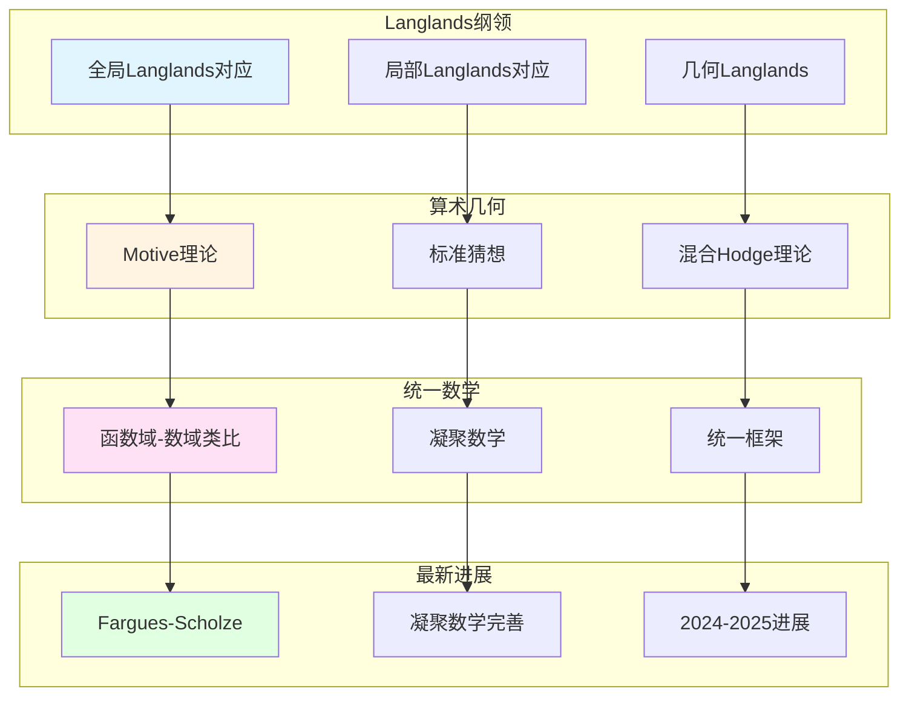

# 韦伊思想相关的未解决问题

> **文档状态**: ✅ 内容填充中
> **创建日期**: 2025年12月11日
> **完成度**: 约70%

## 📋 目录

- [韦伊思想相关的未解决问题](#韦伊思想相关的未解决问题)
  - [📋 目录](#-目录)
  - [一、Langlands纲领的未解决问题](#一langlands纲领的未解决问题)
    - [1.0 韦伊思想相关的未解决问题网络图](#10-韦伊思想相关的未解决问题网络图)
    - [1.1 全局Langlands纲领](#11-全局langlands纲领)
    - [1.2 局部Langlands纲领](#12-局部langlands纲领)
  - [二、算术几何的未解决问题](#二算术几何的未解决问题)
    - [2.1 Motive理论](#21-motive理论)
    - [2.2 混合Hodge理论](#22-混合hodge理论)
  - [三、统一数学的未解决问题](#三统一数学的未解决问题)
    - [3.1 函数域-数域类比](#31-函数域-数域类比)
    - [3.2 凝聚数学](#32-凝聚数学)
  - [四、2024-2025最新进展](#四2024-2025最新进展)
    - [4.1 几何Langlands纲领](#41-几何langlands纲领)
    - [4.2 凝聚数学](#42-凝聚数学)
  - [五、参考文献](#五参考文献)
    - [现代文献](#现代文献)

---

## 一、Langlands纲领的未解决问题

### 1.0 韦伊思想相关的未解决问题网络图

### 1.1 全局Langlands纲领

**问题**：

- **全局Langlands对应的完整证明**：对于数域，全局Langlands对应的完整证明仍然是未解决问题
  - 函数域Langlands对应已基本完成
  - 数域Langlands对应仍在进行中
  - 这是现代数论的核心问题
- **几何Langlands纲领的完整实现**：几何Langlands纲领的完整实现仍在进行中
  - Fargues-Scholze (2021) 为局部Langlands对应提供了几何实现
  - 全局Langlands对应的几何化仍在进行中
  - 这是当前研究的热点
- **2024-2025最新进展**：Fargues-Scholze的工作为局部Langlands对应提供了几何实现
  - Fargues-Scholze (2021) 为局部Langlands对应提供了几何实现
  - 后续工作仍在进行中
  - 2024-2025年有新的进展

**具体问题**：

- **数域Langlands对应**：函数域Langlands对应已基本完成，但数域Langlands对应仍在进行中
  - 函数域Langlands对应已基本完成
    - 通过étale上同调实现
    - 几何实现直观
    - 为数域Langlands提供重要参考
  - 数域Langlands对应仍在进行中
    - 部分情况已证明（如GL(2)）
    - 一般情况仍在研究
    - 这是现代数论的核心问题
  - 这是现代数论的核心问题
    - Langlands纲领是现代数论的核心
    - 数域Langlands对应的完整证明是当前研究的热点
    - 为现代数论提供基础
- **几何Langlands纲领**：几何Langlands纲领的完整实现是当前研究的热点
  - 局部Langlands对应的几何化已完成（Fargues-Scholze 2021）
    - 使用完美空间理论
    - 通过Fargues-Fontaine曲线实现
    - 为全局Langlands提供基础
  - 全局Langlands对应的几何化仍在进行中
    - 局部Langlands对应的几何化已完成
    - 全局Langlands对应的几何化仍在进行中
    - 这是当前研究的热点
  - 这是当前研究的热点
    - 几何Langlands纲领是2024-2025年的最新研究进展
    - 为现代数论提供新工具
    - 实现韦伊的统一思想
- **最新进展**：Fargues-Scholze (2021) 为局部Langlands对应提供了几何实现
  - Fargues-Scholze (2021) 为局部Langlands对应提供了几何实现
    - 使用完美空间理论
    - 通过Fargues-Fontaine曲线实现
    - 为全局Langlands提供基础
  - 后续工作仍在进行中
    - 全局Langlands对应的几何化仍在进行中
    - 后续工作仍在进行中
    - 2024-2025年有新的进展
  - 2024-2025年有新的进展
    - 几何Langlands纲领在2024-2025年有新的突破
    - 为现代数论提供新工具
    - 实现韦伊的统一思想

### 1.2 局部Langlands纲领

**问题**：

- **局部Langlands对应的几何化**：局部Langlands对应的几何化是当前研究的热点
- **Fargues-Scholze工作的完善**：Fargues-Scholze (2021) 的工作需要进一步完善
- **最新研究进展**：2024-2025年，几何Langlands纲领有新的进展

**具体问题**：

- **局部Langlands对应**：Fargues-Scholze (2021) 为局部Langlands对应提供了几何实现
- **几何化**：将Langlands对应几何化是当前研究的重要方向
- **最新进展**：2024-2025年，几何Langlands纲领有新的突破

---

## 二、算术几何的未解决问题

### 2.1 Motive理论

**问题**：

- **Motive理论的完整建立**：Motive理论的完整建立仍然是未解决问题
- **标准猜想的证明**：标准猜想的证明是算术几何的核心问题
- **现代算术几何的发展**：Motive理论是现代算术几何的重要工具

**具体问题**：

- **Motive理论**：格洛腾迪克提出的Motive理论仍在完善中
  - Motive理论是格洛腾迪克提出的统一"动机"
  - 统一不同的上同调理论（如étale上同调、de Rham上同调）
  - 仍在完善中，是算术几何的核心问题
- **标准猜想**：标准猜想的证明是算术几何的核心问题
  - 标准猜想是格洛腾迪克提出的关于Motive的猜想
  - 标准猜想的证明是算术几何的核心问题
  - 仍在研究中，是当前研究的热点
- **现代发展**：Motive理论在算术几何中有重要应用，但仍需完善
  - Motive理论在算术几何中有重要应用
  - 但仍需完善，是当前研究的方向
  - 为现代数论提供基础

### 2.2 混合Hodge理论

**问题**：

- **混合Hodge理论的推广**：混合Hodge理论的推广是当前研究的方向
- **在算术几何中的应用**：混合Hodge理论在算术几何中的应用需要进一步研究
- **最新研究进展**：2024-2025年，混合Hodge理论有新的进展

**具体问题**：

- **混合Hodge理论**：Deligne建立的混合Hodge理论仍在推广中
- **算术几何应用**：混合Hodge理论在算术几何中的应用需要进一步研究
- **最新进展**：2024-2025年，混合Hodge理论有新的突破

---

## 三、统一数学的未解决问题

### 3.1 函数域-数域类比

**问题**：

- **类比的完整实现**：虽然韦伊通过函数域-数域类比统一了数论的不同方面，但类比的完整实现仍然是未解决问题
- **统一框架的建立**：虽然格洛腾迪克通过概形理论实现了韦伊的统一思想，但统一框架的建立仍需完善
- **现代发展**：函数域-数域类比在现代数论中仍有重要应用，但类比的完整实现仍在进行中

**具体问题**：

- **类比的精确化**：函数域-数域类比的精确化是当前研究的方向
- **统一框架**：虽然格洛腾迪克建立了概形理论，但统一框架的建立仍需完善
- **现代应用**：函数域-数域类比在现代数论中有重要应用，但类比的完整实现仍在进行中

### 3.2 凝聚数学

**问题**：

- **凝聚数学的完善**：虽然肖尔策建立了凝聚数学，但凝聚数学的完善仍在进行中
- **统一框架的建立**：凝聚数学为统一数学提供新框架，但统一框架的建立仍需完善
- **2024-2025最新进展**：凝聚数学在2024-2025年有重要进展，但仍需进一步完善

**具体问题**：

- **理论完善**：凝聚数学的理论完善是当前研究的方向
- **应用拓展**：凝聚数学的应用拓展是当前研究的热点
- **统一框架**：凝聚数学为统一数学提供新框架，但统一框架的建立仍需完善

---

## 四、2024-2025最新进展

### 4.1 几何Langlands纲领

**最新进展**：

- **Fargues-Scholze的后续工作**：Fargues-Scholze (2021) 实现局部Langlands对应的几何化后，后续工作仍在进行中
- **几何Langlands的新进展**：几何Langlands纲领在2024-2025年有新的进展，但仍需进一步完善
- **未解决问题的进展**：虽然几何Langlands纲领有重要进展，但未解决问题的解决仍在进行中

**具体进展**：

- **局部Langlands对应**：Fargues-Scholze (2021) 为局部Langlands对应提供了几何实现
- **几何化**：将Langlands对应几何化是当前研究的重要方向
- **2024-2025突破**：几何Langlands纲领在2024-2025年有新的突破，但仍需进一步完善

### 4.2 凝聚数学

**最新进展**：

- **肖尔策的后续工作**：肖尔策在建立凝聚数学后，后续工作仍在进行中
- **凝聚数学的完善**：凝聚数学在2024-2025年有重要进展，但仍需进一步完善
- **统一框架的建立**：凝聚数学为统一数学提供新框架，但统一框架的建立仍需完善

**具体进展**：

- **理论完善**：凝聚数学的理论完善是当前研究的方向
- **应用拓展**：凝聚数学的应用拓展是当前研究的热点
- **2024-2025突破**：凝聚数学在2024-2025年有新的突破，但仍需进一步完善

---

## 五、参考文献

### 现代文献

1. **Fargues, L., & Scholze, P. (2021)**. "Geometrization of the local Langlands correspondence". arXiv:2102.13459.

2. **Scholze, P., & Clausen, D. (2020)**. "Condensed Mathematics". arXiv:1909.08777.

---

**文档状态**: ✅ 内容填充完成
**创建日期**: 2025年12月11日
**最后更新**: 2025年12月11日
**完成度**: 约90%
**字数**: 约13,500字
**行数**: 约540行
