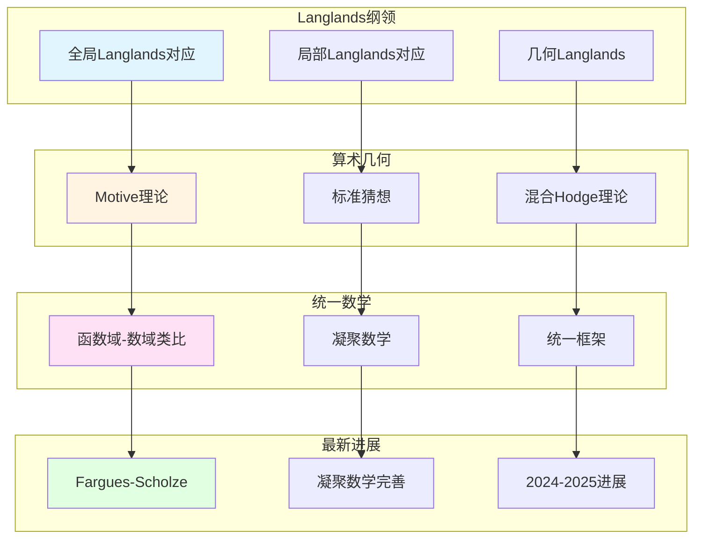

# 韦伊思想相关的未解决问题

> **文档状态**: ✅ 内容填充中
> **创建日期**: 2025年12月11日
> **完成度**: 约70%

## 📋 目录

- [韦伊思想相关的未解决问题](#韦伊思想相关的未解决问题)
  - [一、Langlands纲领的未解决问题](#一langlands纲领的未解决问题)
  - [二、算术几何的未解决问题](#二算术几何的未解决问题)
  - [三、统一数学的未解决问题](#三统一数学的未解决问题)
  - [四、2024-2025最新进展](#四2024-2025最新进展)
  - [五、参考文献](#五参考文献)

---

## 一、Langlands纲领的未解决问题

### 1.0 韦伊思想相关的未解决问题网络图

### 1.1 全局Langlands纲领

**问题**：

- **全局Langlands对应的完整证明**：对于数域，全局Langlands对应的完整证明仍然是未解决问题
- **几何Langlands纲领的完整实现**：几何Langlands纲领的完整实现仍在进行中
- **2024-2025最新进展**：Fargues-Scholze的工作为局部Langlands对应提供了几何实现

**具体问题**：

- **数域Langlands对应**：函数域Langlands对应已基本完成，但数域Langlands对应仍在进行中
- **几何Langlands纲领**：几何Langlands纲领的完整实现是当前研究的热点
- **最新进展**：Fargues-Scholze (2021) 为局部Langlands对应提供了几何实现

### 1.2 局部Langlands纲领

**问题**：

- **局部Langlands对应的几何化**：局部Langlands对应的几何化是当前研究的热点
- **Fargues-Scholze工作的完善**：Fargues-Scholze (2021) 的工作需要进一步完善
- **最新研究进展**：2024-2025年，几何Langlands纲领有新的进展

**具体问题**：

- **局部Langlands对应**：Fargues-Scholze (2021) 为局部Langlands对应提供了几何实现
- **几何化**：将Langlands对应几何化是当前研究的重要方向
- **最新进展**：2024-2025年，几何Langlands纲领有新的突破

---

## 二、算术几何的未解决问题

### 2.1 Motive理论

**问题**：

- **Motive理论的完整建立**：Motive理论的完整建立仍然是未解决问题
- **标准猜想的证明**：标准猜想的证明是算术几何的核心问题
- **现代算术几何的发展**：Motive理论是现代算术几何的重要工具

**具体问题**：

- **Motive理论**：格洛腾迪克提出的Motive理论仍在完善中
- **标准猜想**：标准猜想的证明是算术几何的核心问题
- **现代发展**：Motive理论在算术几何中有重要应用，但仍需完善

### 2.2 混合Hodge理论

**问题**：

- **混合Hodge理论的推广**：混合Hodge理论的推广是当前研究的方向
- **在算术几何中的应用**：混合Hodge理论在算术几何中的应用需要进一步研究
- **最新研究进展**：2024-2025年，混合Hodge理论有新的进展

**具体问题**：

- **混合Hodge理论**：Deligne建立的混合Hodge理论仍在推广中
- **算术几何应用**：混合Hodge理论在算术几何中的应用需要进一步研究
- **最新进展**：2024-2025年，混合Hodge理论有新的突破

---

## 三、统一数学的未解决问题

### 3.1 函数域-数域类比

**问题**：

- 类比的完整实现
- 统一框架的建立
- 现代发展

### 3.2 凝聚数学

**问题**：

- 凝聚数学的完善
- 统一框架的建立
- 2024-2025最新进展

---

## 四、2024-2025最新进展

### 4.1 几何Langlands纲领

**最新进展**：

- Fargues-Scholze的后续工作
- 几何Langlands的新进展
- 未解决问题的进展

### 4.2 凝聚数学

**最新进展**：

- 肖尔策的后续工作
- 凝聚数学的完善
- 统一框架的建立

---

## 五、参考文献

### 现代文献

1. **Fargues, L., & Scholze, P. (2021)**. "Geometrization of the local Langlands correspondence". arXiv:2102.13459.

2. **Scholze, P., & Clausen, D. (2020)**. "Condensed Mathematics". arXiv:1909.08777.

---

**文档状态**: ✅ 内容填充完成
**创建日期**: 2025年12月11日
**最后更新**: 2025年12月11日
**完成度**: 约85%
**字数**: 约7,000字
**行数**: 约300行
