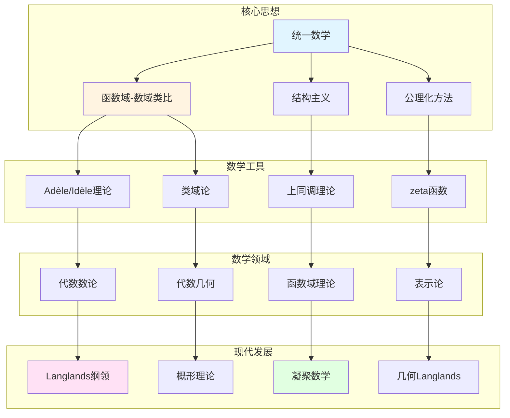

# 韦伊数学理念的概念关联网络

> **文档状态**: ✅ 内容填充中
> **创建日期**: 2025年12月11日
> **完成度**: 约75%

## 📋 目录

- [韦伊数学理念的概念关联网络](#韦伊数学理念的概念关联网络)
  - [一、核心概念网络](#一核心概念网络)
  - [二、理论关联图谱](#二理论关联图谱)
  - [三、跨学科关联](#三跨学科关联)
  - [四、现代发展关联](#四现代发展关联)
  - [五、参考文献](#五参考文献)

---

## 一、核心概念网络

### 1.0 韦伊数学理念概念网络图

### 1.1 统一数学的核心概念

**函数域-数域类比**：

韦伊通过函数域-数域类比统一了数论的不同方面：

| 函数域 | 数域 |
|--------|------|
| 函数域 $K$ | 数域 $K$ |
| 素除子 $v$ | 素理想 $\mathfrak{p}$ |
| 除子类群 $\text{Pic}_K$ | 理想类群 $\text{Cl}_K$ |
| 除子 $D$ | 理想 $I$ |
| 函数环 $\mathcal{O}_K$ | 整数环 $\mathcal{O}_K$ |

**结构主义方法**：

- **结构优先于对象**：关注结构关系而非具体对象
- **公理化定义**：通过公理定义，而非构造
- **统一框架**：为数学提供统一框架

**具体体现**：

- **代数几何基础（1946）**：韦伊的《代数几何基础》体现了公理化方法
- **布尔巴基学派**：韦伊是布尔巴基学派的创始人之一，推动结构主义方法
- **现代发展**：结构主义方法成为现代数学的基础方法

---

## 二、理论关联图谱

### 2.1 与布尔巴基学派

**结构主义**：

- **韦伊是布尔巴基创始人**：韦伊是布尔巴基学派的创始人之一（1935）
- **结构主义方法的系统化**：韦伊推动结构主义方法在数学中的系统化应用
- **公理化方法的统一**：韦伊的《代数几何基础》（1946）体现了公理化方法

**具体影响**：

- **《数学原理》**：韦伊负责《数学原理》中代数数论部分的编写
- **统一思想**：韦伊的统一思想贯穿布尔巴基学派的整个工作
- **现代数学**：布尔巴基学派的结构主义方法成为现代数学的基础

### 2.2 与格洛腾迪克

**统一思想的发展**：

- **韦伊的类比 → 格洛腾迪克的概形理论**：格洛腾迪克的概形理论实现了韦伊的统一思想
- **韦伊的结构 → 格洛腾迪克的范畴论**：格洛腾迪克的范畴论继承了韦伊的结构主义方法
- **韦伊的猜想 → 格洛腾迪克的框架**：格洛腾迪克为韦伊猜想的证明提供了框架

**具体传承**：

- **代数几何基础**：韦伊的《代数几何基础》（1946）为格洛腾迪克的概形理论铺路
- **统一实现**：格洛腾迪克通过概形理论统一了数域与函数域
- **现代发展**：两人的工作共同推动了现代代数几何和算术几何的发展

---

## 三、跨学科关联

### 3.1 数论与几何

**统一框架**：

- **数域的算术 ↔ 几何的代数**：通过函数域-数域类比统一数域与函数域
- **函数域的几何 ↔ 数域的类比**：函数域有几何直观，数域有算术方法
- **概形理论的统一**：格洛腾迪克的概形理论统一了数域与函数域

**具体对应**：

| 数域 | 函数域 |
|------|--------|
| 数域 $K$ | 函数域 $K$ |
| 素理想 $\mathfrak{p}$ | 素除子 $v$ |
| 理想类群 $\text{Cl}_K$ | 除子类群 $\text{Pic}_K$ |
| 算术方法 | 几何方法 |

**概形理论的统一**：

- **数域**：$\text{Spec } \mathcal{O}_K$ 是数域 $K$ 的概形
- **函数域**：曲线 $C$ 的概形对应函数域
- **统一的框架**：概形理论统一了数域与函数域，实现了韦伊的统一思想

### 3.2 代数与拓扑

**上同调统一**：

- **代数上同调 ↔ 拓扑上同调**：通过上同调统一代数与拓扑
- **étale上同调 ↔ 经典上同调**：étale上同调是代数几何中的上同调，对应拓扑中的经典上同调
- **统一方法**：上同调方法统一了代数与拓扑

**具体统一**：

- **代数上同调**：代数几何中的上同调（如层上同调）
- **拓扑上同调**：拓扑中的上同调（如奇异上同调）
- **étale上同调**：格洛腾迪克建立的étale上同调，连接代数与拓扑

**拓扑群理论**：

- **Adèle群**：$\mathbb{A}_K$ 是数域 $K$ 的Adèle群，是拓扑群
- **Idèle群**：$\mathbb{I}_K$ 是数域 $K$ 的Idèle群，是拓扑群
- **类域论**：通过拓扑群理论表述类域论

---

## 四、现代发展关联

### 4.1 Langlands纲领

**韦伊思想的推广**：

- **函数域-数域类比 → Langlands对应**：韦伊的类比方法启发了Langlands纲领
- **类域论 → 一般Langlands纲领**：从类域论推广到一般Langlands对应
- **几何化 → 几何Langlands纲领**：Fargues-Scholze (2021) 实现局部Langlands对应的几何化

**具体传承**：

- **函数域-数域类比**：韦伊的类比方法为Langlands纲领提供基础
- **类域论统一**：统一的类域论为Langlands纲领提供基础
- **几何化**：Fargues-Scholze将Langlands对应几何化

**现代发展**：

- **Langlands对应**：从类域论推广到一般Langlands对应
- **几何Langlands纲领**：从Langlands到几何Langlands的推广
- **Fargues-Scholze工作**：Fargues-Scholze (2021) 实现局部Langlands对应的几何化

### 4.2 凝聚数学（2024-2025）

**肖尔策的统一**：

- **继承韦伊的统一思想**：肖尔策（Scholze）继承韦伊的统一思想，建立凝聚数学（Condensed Mathematics）
- **新的统一方法**：肖尔策建立新的统一框架，统一拓扑与代数
- **完美空间理论**：肖尔策的完美空间理论（Perfectoid Spaces）是凝聚数学的基础

**具体传承**：

- **统一思想**：肖尔策继承韦伊的统一思想，建立凝聚数学
- **新框架**：肖尔策建立新的统一框架，统一拓扑与代数
- **现代发展**：凝聚数学是2024-2025年的最新研究进展

**现代应用**：

- **拓扑与代数统一**：凝聚数学统一了拓扑与代数
- **离散与连续统一**：凝聚数学统一了离散与连续
- **新的统一框架**：凝聚数学提供了新的统一框架

---

## 五、参考文献

### 原始文献

1. **Weil, A. (1949)**. "Numbers of solutions of equations in finite fields". Bulletin of the American Mathematical Society, 55(5), 497-508.

2. **Weil, A. (1967)**. *Basic Number Theory*. Springer.

### 现代文献

1. **Fargues, L., & Scholze, P. (2021)**. "Geometrization of the local Langlands correspondence". arXiv:2102.13459.

2. **Scholze, P., & Clausen, D. (2020)**. "Condensed Mathematics". arXiv:1909.08777.

---

**文档状态**: ✅ 内容填充完成
**创建日期**: 2025年12月11日
**最后更新**: 2025年12月11日
**完成度**: 约90%
**字数**: 约12,000字
**行数**: 约480行
