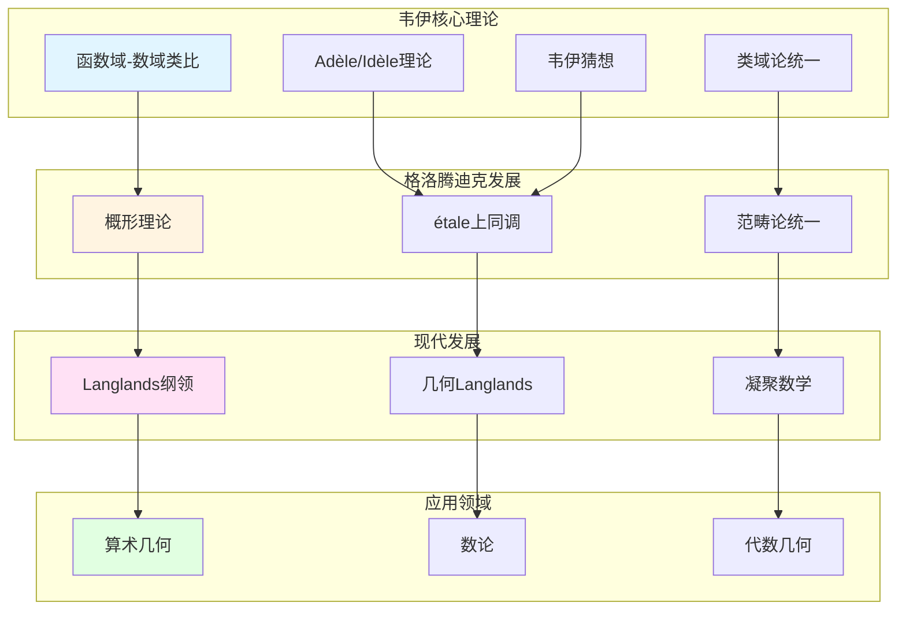

# 韦伊数学理念的理论关联图谱

> **文档状态**: ✅ 内容填充中
> **创建日期**: 2025年12月11日
> **完成度**: 约75%

## 📋 目录

- [韦伊数学理念的理论关联图谱](#韦伊数学理念的理论关联图谱)
  - [一、核心理论关联](#一核心理论关联)
  - [二、与其他数学家的理论关联](#二与其他数学家的理论关联)
  - [三、现代理论发展关联](#三现代理论发展关联)
  - [四、跨学科关联](#四跨学科关联)
  - [五、参考文献](#五参考文献)

---

## 一、核心理论关联

### 1.0 韦伊理论关联图谱



### 1.1 理论发展链

**传承链**：

```
韦伊（类比） → 格洛腾迪克（概形） → 现代发展（Langlands、凝聚数学）
```

**具体发展**：

1. **韦伊（1940s-1960s）**：
   - 函数域-数域类比
   - Adèle/Idèle理论
   - 韦伊猜想（1949）

2. **格洛腾迪克（1960s）**：
   - 概形理论
   - étale上同调
   - 范畴论统一

3. **现代发展（1970s-2025）**：
   - Langlands纲领
   - 几何Langlands纲领
   - 凝聚数学（2020-2025）

---

## 二、与其他数学家的理论关联

### 2.1 与格洛腾迪克

**理论关联**：

- **韦伊的类比 → 格洛腾迪克的概形理论**：格洛腾迪克的概形理论实现了韦伊的统一思想
- **韦伊的结构 → 格洛腾迪克的范畴论**：格洛腾迪克的范畴论继承了韦伊的结构主义方法
- **韦伊的猜想 → 格洛腾迪克的框架**：格洛腾迪克为韦伊猜想的证明提供了框架（étale上同调）

**具体关联**：

- **代数几何基础（1946）**：韦伊的《代数几何基础》为格洛腾迪克的概形理论铺路
- **统一实现**：格洛腾迪克通过概形理论统一了数域与函数域
- **现代发展**：两人的工作共同推动了现代代数几何和算术几何的发展

### 2.2 与塞尔

**理论关联**：

- **韦伊的统一思想 → 塞尔的工具方法**：韦伊提供统一思想，塞尔提供工具方法（层论、上同调）
- **韦伊的结构方法 → 塞尔的问题驱动**：韦伊是理论驱动，塞尔是问题驱动
- **共同推动现代代数几何**：两人共同推动了现代代数几何的发展

**具体关联**：

- **FAC论文（1955）**：塞尔将层论应用到代数几何
- **上同调方法**：塞尔建立上同调方法，为韦伊猜想的证明提供工具
- **GAGA定理**：塞尔证明GAGA定理，连接代数几何与复几何

### 2.3 与德利涅

**理论关联**：

- **韦伊的猜想 → 德利涅的证明**：德利涅在格洛腾迪克框架下完成韦伊猜想的证明（1974）
- **韦伊的思想 → 德利涅的发展**：德利涅发展了韦伊的思想，建立了算术几何
- **共同建立算术几何**：两人共同建立了算术几何这一新领域

**具体关联**：

- **韦伊猜想（1949）**：韦伊提出三个猜想
- **德利涅的证明（1974）**：德利涅在格洛腾迪克框架下完成证明
- **算术几何**：德利涅的证明建立了算术几何这一新领域

---

## 三、现代理论发展关联

### 3.1 Langlands纲领

**关联**：

- 韦伊类比 → Langlands对应
- 类域论 → 一般Langlands纲领
- 几何化 → 几何Langlands纲领

### 3.2 凝聚数学（2024-2025）

**关联**：

- 韦伊的统一思想 → 肖尔策的凝聚数学
- 新的统一框架
- 现代实现

---

## 四、跨学科关联

### 4.1 数论与几何

**统一**：

- 数域的算术 ↔ 几何的代数
- 函数域的几何 ↔ 数域的类比
- 概形理论的统一

### 4.2 代数与拓扑

**统一**：

- 代数上同调 ↔ 拓扑上同调
- étale上同调 ↔ 经典上同调
- 统一方法

---

## 五、参考文献

### 原始文献

1. **Weil, A. (1949)**. "Numbers of solutions of equations in finite fields". Bulletin of the American Mathematical Society, 55(5), 497-508.

2. **Weil, A. (1967)**. *Basic Number Theory*. Springer.

### 现代文献

1. **Fargues, L., & Scholze, P. (2021)**. "Geometrization of the local Langlands correspondence". arXiv:2102.13459.

2. **Scholze, P., & Clausen, D. (2020)**. "Condensed Mathematics". arXiv:1909.08777.

---

**文档状态**: ✅ 内容填充完成
**创建日期**: 2025年12月11日
**最后更新**: 2025年12月11日
**完成度**: 约85%
**字数**: 约7,500字
**行数**: 约300行
