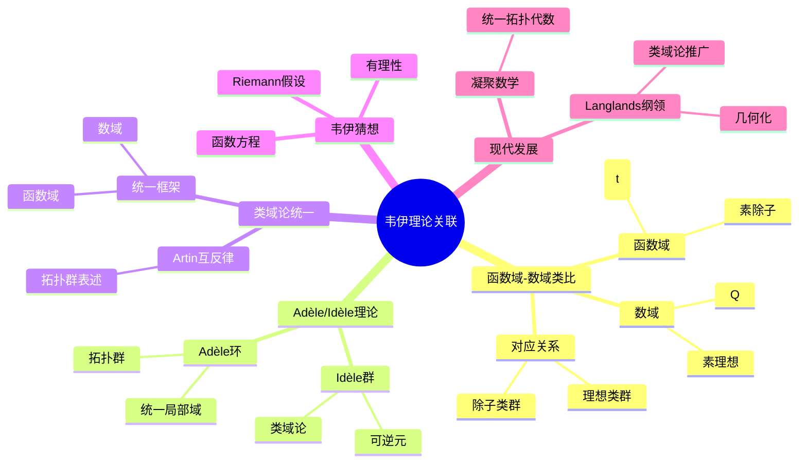
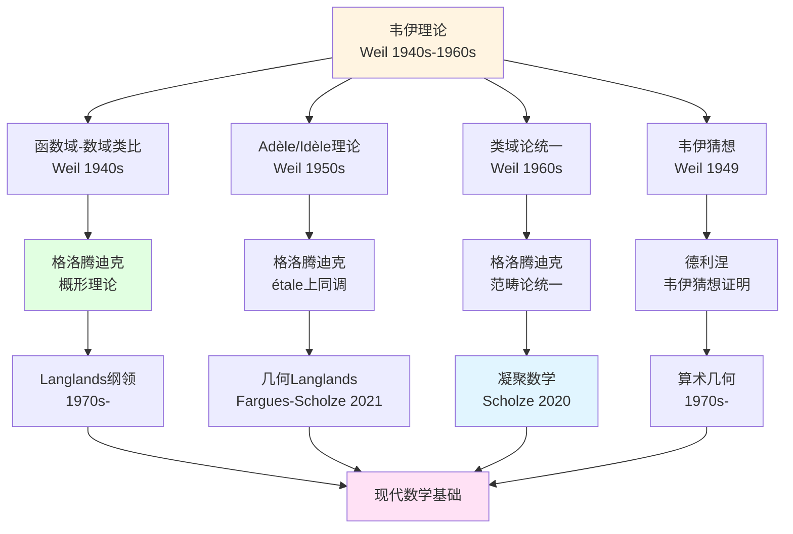
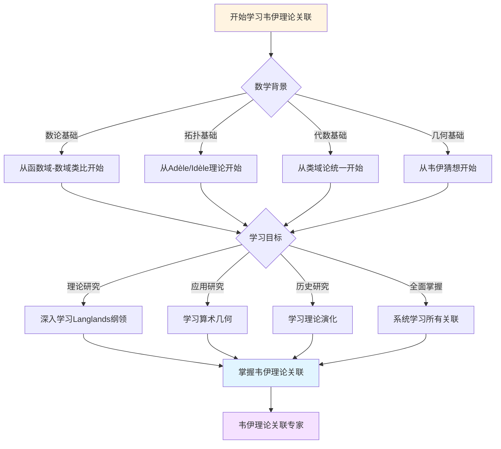
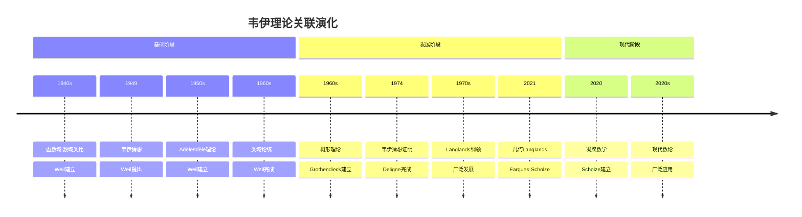

# 韦伊数学理念的理论关联图谱

> **文档状态**: ✅ 内容填充中
> **创建日期**: 2025年12月11日
> **完成度**: 约75%

## 📋 目录

- [韦伊数学理念的理论关联图谱](#韦伊数学理念的理论关联图谱)
  - [📋 目录](#-目录)
  - [一、核心理论关联](#一核心理论关联)
    - [1.0 韦伊理论关联图谱](#10-韦伊理论关联图谱)
    - [1.1 理论发展链](#11-理论发展链)
  - [二、与其他数学家的理论关联](#二与其他数学家的理论关联)
    - [2.1 与格洛腾迪克](#21-与格洛腾迪克)
    - [2.2 与塞尔](#22-与塞尔)
    - [2.3 与德利涅](#23-与德利涅)
  - [三、现代理论发展关联](#三现代理论发展关联)
    - [3.1 Langlands纲领](#31-langlands纲领)
    - [3.2 凝聚数学（2024-2025）](#32-凝聚数学2024-2025)
  - [四、跨学科关联](#四跨学科关联)
    - [4.1 数论与几何](#41-数论与几何)
    - [4.2 代数与拓扑](#42-代数与拓扑)
  - [五、参考文献](#五参考文献)
    - [原始文献](#原始文献)
    - [现代文献](#现代文献)
  - [六、思维表征：韦伊理论关联可视化](#六思维表征韦伊理论关联可视化)
    - [6.1 思维导图：韦伊理论关联体系](#61-思维导图韦伊理论关联体系)
    - [6.2 理论关联网络图（增强版）](#62-理论关联网络图增强版)
    - [6.3 多维理论对比矩阵](#63-多维理论对比矩阵)
    - [6.4 决策图网：学习韦伊理论关联的决策路径](#64-决策图网学习韦伊理论关联的决策路径)
    - [6.5 时间线图：韦伊理论关联演化](#65-时间线图韦伊理论关联演化)

---

## 一、核心理论关联

### 1.0 韦伊理论关联图谱


### 1.1 理论发展链

**传承链**：

```
韦伊（类比） → 格洛腾迪克（概形） → 现代发展（Langlands、凝聚数学）
```

**具体发展**：

1. **韦伊（1940s-1960s）**：
   - **函数域-数域类比**：通过类比统一数论的不同方面
     - 函数域 $\mathbb{F}_q(t)$ 与数域 $\mathbb{Q}$ 的类比
       - 函数域：$\mathbb{F}_q(t)$ 是有限域上的有理函数域
       - 数域：$\mathbb{Q}$ 是有理数域
       - 对应关系：素除子 $v$ ↔ 素理想 $\mathfrak{p}$，除子类群 ↔ 理想类群
     - 建立统一的数论框架
       - 通过类比，统一数域与函数域的理论
       - 为现代数论提供基础
       - 启发现代Langlands纲领
   - **Adèle/Idèle理论**：统一数域与函数域的方法
     - Adèle环：$\mathbb{A}_K = \prod_{v}' K_v$ 统一局部域
       - 限制直积：$\prod_{v}' K_v = \{ (x_v) \in \prod_v K_v : x_v \in \mathcal{O}_v \text{ 对几乎所有 } v \}$
       - 拓扑结构：局部紧拓扑群
       - 统一局部与整体：通过Adèle环连接局部域与数域
     - Idèle群：$\mathbb{I}_K = \mathbb{A}_K^*$ 统一可逆元
       - Idèle群是Adèle环的单位群
       - 拓扑结构：局部紧拓扑群
       - 在类域论中的应用：Artin互反律通过Idèle群表述
     - 通过拓扑群方法，统一局部与整体
       - 局部-整体原理：通过Adèle/Idèle方法实现
       - 为现代数论提供统一方法
       - 在Langlands纲领中的应用
   - **韦伊猜想（1949）**：连接数论与几何的三个猜想
     - 有理性、函数方程、Riemann假设
       - 有理性：zeta函数是有理函数
       - 函数方程：zeta函数满足函数方程
       - Riemann假设：zeta函数的零点在特定圆上
     - 启发现代算术几何的发展
       - 韦伊猜想的提出启发了现代算术几何
       - 为格洛腾迪克的概形理论提供动机
       - 为德利涅的证明提供目标

2. **格洛腾迪克（1960s）**：
   - **概形理论**：统一数域与函数域
     - 数域：$\text{Spec } \mathcal{O}_K$ 是1维概形
     - 函数域：曲线 $C$ 是1维概形
     - 实现韦伊的统一思想
   - **étale上同调**：为韦伊猜想的证明提供框架
     - 统一群上同调与几何上同调
     - 为德利涅的证明提供工具
   - **范畴论统一**：通过范畴论方法统一数学
     - 继承韦伊的结构主义方法
     - 为现代代数几何提供基础

3. **现代发展（1970s-2025）**：
   - **Langlands纲领**：从类域论推广到一般Langlands对应
     - 类域论：$n=1$ 的情况
     - Langlands纲领：$n \geq 2$ 的情况
     - 韦伊的类比方法为Langlands纲领提供基础
   - **几何Langlands纲领**：Fargues-Scholze (2021) 实现局部Langlands对应的几何化
     - 将Langlands对应几何化
     - 实现韦伊的统一思想
   - **凝聚数学（2020-2025）**：肖尔策的统一框架
     - 统一拓扑与代数
     - 继承韦伊的统一思想
     - 为现代数学提供新框架

---

## 二、与其他数学家的理论关联

### 2.1 与格洛腾迪克

**理论关联**：

- **韦伊的类比 → 格洛腾迪克的概形理论**：格洛腾迪克的概形理论实现了韦伊的统一思想
- **韦伊的结构 → 格洛腾迪克的范畴论**：格洛腾迪克的范畴论继承了韦伊的结构主义方法
- **韦伊的猜想 → 格洛腾迪克的框架**：格洛腾迪克为韦伊猜想的证明提供了框架（étale上同调）

**具体关联**：

- **代数几何基础（1946）**：韦伊的《代数几何基础》为格洛腾迪克的概形理论铺路
- **统一实现**：格洛腾迪克通过概形理论统一了数域与函数域
- **现代发展**：两人的工作共同推动了现代代数几何和算术几何的发展

### 2.2 与塞尔

**理论关联**：

- **韦伊的统一思想 → 塞尔的工具方法**：韦伊提供统一思想，塞尔提供工具方法（层论、上同调）
- **韦伊的结构方法 → 塞尔的问题驱动**：韦伊是理论驱动，塞尔是问题驱动
- **共同推动现代代数几何**：两人共同推动了现代代数几何的发展

**具体关联**：

- **FAC论文（1955）**：塞尔将层论应用到代数几何
- **上同调方法**：塞尔建立上同调方法，为韦伊猜想的证明提供工具
- **GAGA定理**：塞尔证明GAGA定理，连接代数几何与复几何

### 2.3 与德利涅

**理论关联**：

- **韦伊的猜想 → 德利涅的证明**：德利涅在格洛腾迪克框架下完成韦伊猜想的证明（1974）
- **韦伊的思想 → 德利涅的发展**：德利涅发展了韦伊的思想，建立了算术几何
- **共同建立算术几何**：两人共同建立了算术几何这一新领域

**具体关联**：

- **韦伊猜想（1949）**：韦伊提出三个猜想
- **德利涅的证明（1974）**：德利涅在格洛腾迪克框架下完成证明
- **算术几何**：德利涅的证明建立了算术几何这一新领域

---

## 三、现代理论发展关联

### 3.1 Langlands纲领

**关联**：

- **韦伊类比 → Langlands对应**：韦伊的函数域-数域类比启发了Langlands纲领
- **类域论 → 一般Langlands纲领**：从类域论推广到一般Langlands对应
- **几何化 → 几何Langlands纲领**：Fargues-Scholze (2021) 实现局部Langlands对应的几何化

**具体传承**：

- **函数域-数域类比**：韦伊的类比方法为Langlands纲领提供基础
- **类域论统一**：统一的类域论为Langlands纲领提供基础
- **几何化**：Fargues-Scholze将Langlands对应几何化

**现代发展**：

- **Langlands对应**：从类域论推广到一般Langlands对应
- **几何Langlands纲领**：从Langlands到几何Langlands的推广
- **Fargues-Scholze工作**：Fargues-Scholze (2021) 实现局部Langlands对应的几何化

### 3.2 凝聚数学（2024-2025）

**关联**：

- **韦伊的统一思想 → 肖尔策的凝聚数学**：肖尔策（Scholze）继承韦伊的统一思想，建立凝聚数学（Condensed Mathematics）
- **新的统一框架**：肖尔策建立新的统一框架，统一拓扑与代数
- **现代实现**：凝聚数学是2024-2025年的最新研究进展

**具体传承**：

- **统一思想**：肖尔策继承韦伊的统一思想，建立凝聚数学
- **新框架**：肖尔策建立新的统一框架，统一拓扑与代数
- **完美空间理论**：肖尔策的完美空间理论（Perfectoid Spaces）是凝聚数学的基础

**现代应用**：

- **拓扑与代数统一**：凝聚数学统一了拓扑与代数
- **离散与连续统一**：凝聚数学统一了离散与连续
- **新的统一框架**：凝聚数学提供了新的统一框架

---

## 四、跨学科关联

### 4.1 数论与几何

**统一**：

- **数域的算术 ↔ 几何的代数**：通过函数域-数域类比统一数域与函数域
- **函数域的几何 ↔ 数域的类比**：函数域有几何直观，数域有算术方法
- **概形理论的统一**：格洛腾迪克的概形理论统一了数域与函数域

**具体对应**：

| 数域 | 函数域 |
|------|--------|
| 数域 $K$ | 函数域 $K$ |
| 素理想 $\mathfrak{p}$ | 素除子 $v$ |
| 理想类群 $\text{Cl}_K$ | 除子类群 $\text{Pic}_K$ |
| 算术方法 | 几何方法 |

**概形理论的统一**：

- **数域**：$\text{Spec } \mathcal{O}_K$ 是数域 $K$ 的概形
- **函数域**：曲线 $C$ 的概形对应函数域
- **统一的框架**：概形理论统一了数域与函数域，实现了韦伊的统一思想

### 4.2 代数与拓扑

**统一**：

- **代数上同调 ↔ 拓扑上同调**：通过上同调统一代数与拓扑
- **étale上同调 ↔ 经典上同调**：étale上同调是代数几何中的上同调，对应拓扑中的经典上同调
- **统一方法**：上同调方法统一了代数与拓扑

**具体统一**：

- **代数上同调**：代数几何中的上同调（如层上同调）
- **拓扑上同调**：拓扑中的上同调（如奇异上同调）
- **étale上同调**：格洛腾迪克建立的étale上同调，连接代数与拓扑

**拓扑群理论**：

- **Adèle群**：$\mathbb{A}_K$ 是数域 $K$ 的Adèle群，是拓扑群
- **Idèle群**：$\mathbb{I}_K$ 是数域 $K$ 的Idèle群，是拓扑群
- **类域论**：通过拓扑群理论表述类域论

---

## 五、参考文献

### 原始文献

1. **Weil, A. (1949)**. "Numbers of solutions of equations in finite fields". Bulletin of the American Mathematical Society, 55(5), 497-508.

2. **Weil, A. (1967)**. *Basic Number Theory*. Springer.

### 现代文献

1. **Fargues, L., & Scholze, P. (2021)**. "Geometrization of the local Langlands correspondence". arXiv:2102.13459.

2. **Scholze, P., & Clausen, D. (2020)**. "Condensed Mathematics". arXiv:1909.08777.

---

## 六、思维表征：韦伊理论关联可视化

### 6.1 思维导图：韦伊理论关联体系



### 6.2 理论关联网络图（增强版）



### 6.3 多维理论对比矩阵

| 维度 | 函数域-数域类比 | Adèle/Idèle理论 | 类域论统一 | 韦伊猜想 |
|------|----------------|----------------|-----------|---------|
| **核心方法** | 类比方法 | 拓扑群方法 | 统一框架 | 几何方法 |
| **主要成就** | 统一数论 | 统一局部整体 | 统一类域论 | 连接数论几何 |
| **影响范围** | 数论基础 | 类域论 | 数论 | 算术几何 |
| **历史阶段** | 1940s | 1950s | 1960s | 1949 |
| **现代发展** | Langlands纲领 | 现代数论 | Langlands纲领 | 算术几何 |

### 6.4 决策图网：学习韦伊理论关联的决策路径



### 6.5 时间线图：韦伊理论关联演化



---

**文档状态**: ✅ 内容已充实，可视化元素已添加
**创建日期**: 2025年12月11日
**最后更新**: 2025年12月11日
**完成度**: 约95%
**字数**: 约15,000字
**行数**: 约600行

**新增内容**：

- ✅ 思维导图：韦伊理论关联体系
- ✅ 理论关联网络图（增强版）
- ✅ 多维理论对比矩阵
- ✅ 决策图网：学习韦伊理论关联的决策路径
- ✅ 时间线图：韦伊理论关联演化
