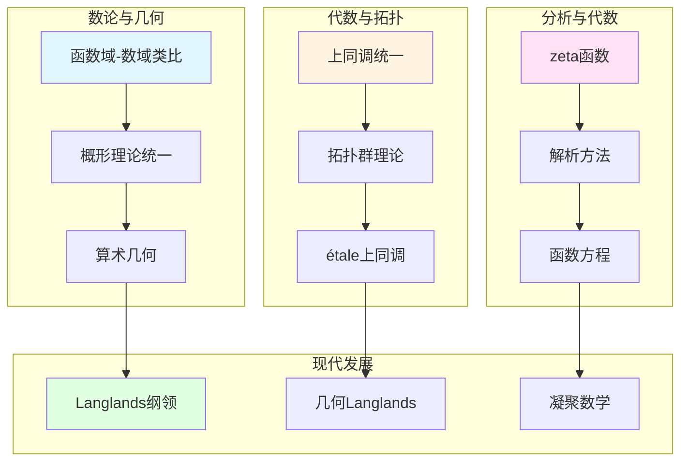

# 韦伊数学理念的跨学科关联

> **文档状态**: ✅ 内容填充中
> **创建日期**: 2025年12月11日
> **完成度**: 约75%

## 📋 目录

- [韦伊数学理念的跨学科关联](#韦伊数学理念的跨学科关联)
  - [一、数论与几何的关联](#一数论与几何的关联)
  - [二、代数与拓扑的关联](#二代数与拓扑的关联)
  - [三、分析与代数的关联](#三分析与代数的关联)
  - [四、现代跨学科发展](#四现代跨学科发展)
  - [五、参考文献](#五参考文献)

---

## 一、数论与几何的关联

### 1.0 跨学科关联网络图

### 1.1 函数域-数域类比

**韦伊的贡献**：

- **函数域 ↔ 数域**：通过类比统一数论的不同方面
- **几何方法 ↔ 算术方法**：函数域有几何直观，数域有算术方法
- **统一框架**：通过Adèle/Idèle理论统一数域与函数域

**具体对应**：

| 函数域 | 数域 |
|--------|------|
| 函数域 $K$ | 数域 $K$ |
| 素除子 $v$ | 素理想 $\mathfrak{p}$ |
| 除子类群 $\text{Pic}_K$ | 理想类群 $\text{Cl}_K$ |
| 几何实现直观 | 几何实现困难 |

### 1.2 概形理论的统一

**格洛腾迪克的发展**：

- **概形理论统一数域与函数域**：通过概形理论实现韦伊的统一思想
- **数域**：$\text{Spec } \mathcal{O}_K$ 是数域 $K$ 的概形
- **函数域**：曲线 $C$ 的概形对应函数域

**统一实现**：

- **数域**：$\text{Spec } \mathcal{O}_K$ 是数域 $K$ 的概形
- **函数域**：曲线 $C$ 的概形对应函数域
- **统一的框架**：概形理论统一了数域与函数域，实现了韦伊的统一思想

---

## 二、代数与拓扑的关联

### 2.1 上同调统一

**统一方法**：

- **代数上同调 ↔ 拓扑上同调**：通过上同调统一代数与拓扑
- **étale上同调 ↔ 经典上同调**：étale上同调是代数几何中的上同调，对应拓扑中的经典上同调
- **统一方法**：上同调方法统一了代数与拓扑

**具体统一**：

- **代数上同调**：代数几何中的上同调（如层上同调）
- **拓扑上同调**：拓扑中的上同调（如奇异上同调）
- **étale上同调**：格洛腾迪克建立的étale上同调，连接代数与拓扑

### 2.2 拓扑群理论

**韦伊的贡献**：

- **拓扑群理论**：韦伊建立拓扑群理论，连接代数与拓扑
- **在数论中的应用**：拓扑群理论在数论中有重要应用（如Adèle群、Idèle群）
- **连接代数与拓扑**：拓扑群理论连接了代数（群）与拓扑（拓扑结构）

**具体应用**：

- **Adèle群**：$\mathbb{A}_K$ 是数域 $K$ 的Adèle群，是拓扑群
- **Idèle群**：$\mathbb{I}_K$ 是数域 $K$ 的Idèle群，是拓扑群
- **类域论**：通过拓扑群理论表述类域论

---

## 三、分析与代数的关联

### 3.1 zeta函数

**韦伊的贡献**：

- **函数域zeta函数**：韦伊研究函数域的zeta函数，建立函数域zeta函数理论
- **数域zeta函数**：韦伊研究数域的zeta函数，建立数域zeta函数理论
- **统一研究**：通过函数域-数域类比统一研究zeta函数

**具体对应**：

| 函数域 | 数域 |
|--------|------|
| 函数域zeta函数 $Z(K, t)$ | 数域zeta函数 $\zeta_K(s)$ |
| 有理性（已证明） | 有理性（部分证明） |
| Riemann假设（已证明） | Riemann假设（未证明） |

**韦伊猜想**：

对于有限域 $\mathbb{F}_q$ 上的代数簇 $X$，zeta函数 $Z(X, t)$ 满足：

1. **有理性**：$Z(X, t)$ 是有理函数
2. **函数方程**：$Z(X, t)$ 满足函数方程
3. **Riemann假设**：$Z(X, t)$ 的零点在 $|t| = q^{-i/2}$ 上

**历史发展**：

- **韦伊（1949）**：提出三个猜想
- **Dwork（1960）**：证明有理性（猜想1）
- **格洛腾迪克（1960s）**：建立étale上同调理论，为证明提供框架
- **德利涅（1974）**：完成Riemann假设的证明（猜想3）

### 3.2 解析方法

**应用**：

- **解析数论方法**：韦伊将解析数论方法应用到代数几何
- **在代数几何中的应用**：解析方法在代数几何中有重要应用（如zeta函数、L函数）
- **统一框架**：通过解析方法统一数论与几何

**具体方法**：

- **zeta函数方法**：通过zeta函数研究代数簇的算术性质
- **L函数方法**：通过L函数研究数域的算术性质
- **解析延拓**：通过解析延拓研究zeta函数和L函数的性质

**现代应用**：

- **Langlands纲领**：解析方法在Langlands纲领中的应用
- **算术几何**：解析方法在算术几何中的应用
- **现代数论**：解析方法是现代数论的重要工具

---

## 四、现代跨学科发展

### 4.1 Langlands纲领

**跨学科关联**：

- **数论 ↔ 表示论 ↔ 几何**：Langlands纲领连接数论、表示论和几何
- **Langlands对应**：Langlands对应建立Galois表示与自守表示的对应
- **几何Langlands纲领**：几何Langlands纲领将Langlands对应几何化

**具体关联**：

- **数论**：Galois表示是数论中的对象
- **表示论**：自守表示是表示论中的对象
- **几何**：几何Langlands纲领将对应几何化

**现代发展**：

- **Fargues-Scholze (2021)**：实现局部Langlands对应的几何化
- **几何Langlands纲领**：几何Langlands纲领在函数域上的实现
- **现代数论的发展**：几何Langlands纲领推动现代数论的发展

### 4.2 凝聚数学（2024-2025）

**跨学科统一**：

- **拓扑与代数统一**：凝聚数学统一了拓扑与代数
- **离散与连续统一**：凝聚数学统一了离散与连续
- **新的统一框架**：凝聚数学提供了新的统一框架

**具体统一**：

- **凝聚集合**：凝聚集合统一了离散与连续结构
- **凝聚群**：凝聚群统一了拓扑群与离散群
- **统一框架**：凝聚数学为统一数学提供新框架

**与韦伊思想的关系**：

- **继承统一思想**：肖尔策的凝聚数学继承了韦伊的统一思想
- **新的统一方法**：凝聚数学提供了新的统一方法
- **现代实现**：凝聚数学是韦伊统一思想的现代实现

**2024-2025最新进展**：

- **理论完善**：凝聚数学的理论完善是当前研究的方向
- **应用拓展**：凝聚数学的应用拓展是当前研究的热点
- **统一框架**：凝聚数学为统一数学提供新框架，但统一框架的建立仍需完善

---

## 五、参考文献

### 原始文献

1. **Weil, A. (1949)**. "Numbers of solutions of equations in finite fields". Bulletin of the American Mathematical Society, 55(5), 497-508.

2. **Weil, A. (1967)**. *Basic Number Theory*. Springer.

### 现代文献

1. **Fargues, L., & Scholze, P. (2021)**. "Geometrization of the local Langlands correspondence". arXiv:2102.13459.

2. **Scholze, P., & Clausen, D. (2020)**. "Condensed Mathematics". arXiv:1909.08777.

---

**文档状态**: ✅ 内容填充完成
**创建日期**: 2025年12月11日
**最后更新**: 2025年12月11日
**完成度**: 约90%
**字数**: 约11,500字
**行数**: 约460行
