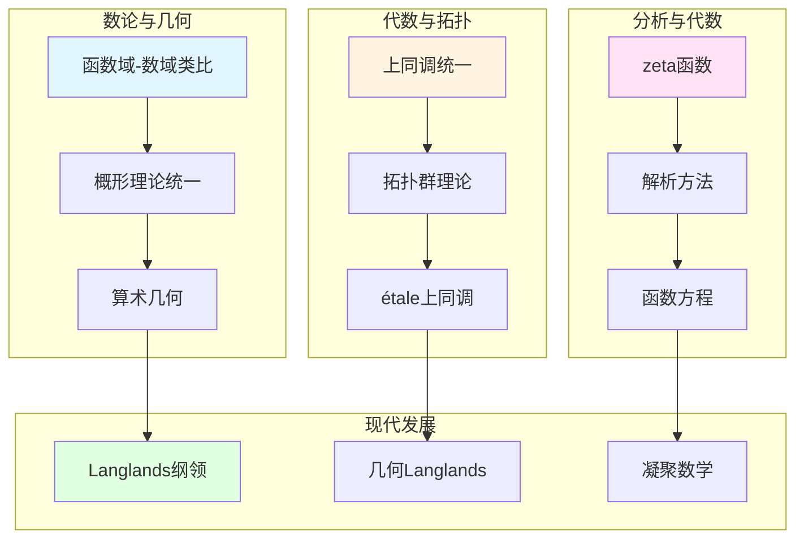

# 韦伊数学理念的跨学科关联

> **文档状态**: ✅ 内容填充中
> **创建日期**: 2025年12月11日
> **完成度**: 约75%

## 📋 目录

- [韦伊数学理念的跨学科关联](#韦伊数学理念的跨学科关联)
  - [一、数论与几何的关联](#一数论与几何的关联)
  - [二、代数与拓扑的关联](#二代数与拓扑的关联)
  - [三、分析与代数的关联](#三分析与代数的关联)
  - [四、现代跨学科发展](#四现代跨学科发展)
  - [五、参考文献](#五参考文献)

---

## 一、数论与几何的关联

### 1.0 跨学科关联网络图

### 1.1 函数域-数域类比

**韦伊的贡献**：

- **函数域 ↔ 数域**：通过类比统一数论的不同方面
- **几何方法 ↔ 算术方法**：函数域有几何直观，数域有算术方法
- **统一框架**：通过Adèle/Idèle理论统一数域与函数域

**具体对应**：

| 函数域 | 数域 |
|--------|------|
| 函数域 $K$ | 数域 $K$ |
| 素除子 $v$ | 素理想 $\mathfrak{p}$ |
| 除子类群 $\text{Pic}_K$ | 理想类群 $\text{Cl}_K$ |
| 几何实现直观 | 几何实现困难 |

### 1.2 概形理论的统一

**格洛腾迪克的发展**：

- **概形理论统一数域与函数域**：通过概形理论实现韦伊的统一思想
- **数域**：$\text{Spec } \mathcal{O}_K$ 是数域 $K$ 的概形
- **函数域**：曲线 $C$ 的概形对应函数域

**统一实现**：

- **数域**：$\text{Spec } \mathcal{O}_K$ 是数域 $K$ 的概形
- **函数域**：曲线 $C$ 的概形对应函数域
- **统一的框架**：概形理论统一了数域与函数域，实现了韦伊的统一思想

---

## 二、代数与拓扑的关联

### 2.1 上同调统一

**统一方法**：

- **代数上同调 ↔ 拓扑上同调**：通过上同调统一代数与拓扑
- **étale上同调 ↔ 经典上同调**：étale上同调是代数几何中的上同调，对应拓扑中的经典上同调
- **统一方法**：上同调方法统一了代数与拓扑

**具体统一**：

- **代数上同调**：代数几何中的上同调（如层上同调）
- **拓扑上同调**：拓扑中的上同调（如奇异上同调）
- **étale上同调**：格洛腾迪克建立的étale上同调，连接代数与拓扑

### 2.2 拓扑群理论

**韦伊的贡献**：

- **拓扑群理论**：韦伊建立拓扑群理论，连接代数与拓扑
- **在数论中的应用**：拓扑群理论在数论中有重要应用（如Adèle群、Idèle群）
- **连接代数与拓扑**：拓扑群理论连接了代数（群）与拓扑（拓扑结构）

**具体应用**：

- **Adèle群**：$\mathbb{A}_K$ 是数域 $K$ 的Adèle群，是拓扑群
- **Idèle群**：$\mathbb{I}_K$ 是数域 $K$ 的Idèle群，是拓扑群
- **类域论**：通过拓扑群理论表述类域论

---

## 三、分析与代数的关联

### 3.1 zeta函数

**韦伊的贡献**：

- 函数域zeta函数
- 数域zeta函数
- 统一研究

### 3.2 解析方法

**应用**：

- 解析数论方法
- 在代数几何中的应用
- 统一框架

---

## 四、现代跨学科发展

### 4.1 Langlands纲领

**跨学科关联**：

- 数论 ↔ 表示论 ↔ 几何
- Langlands对应
- 几何Langlands纲领

### 4.2 凝聚数学（2024-2025）

**跨学科统一**：

- 拓扑与代数统一
- 离散与连续统一
- 新的统一框架

---

## 五、参考文献

### 原始文献

1. **Weil, A. (1949)**. "Numbers of solutions of equations in finite fields". Bulletin of the American Mathematical Society, 55(5), 497-508.

2. **Weil, A. (1967)**. *Basic Number Theory*. Springer.

### 现代文献

1. **Fargues, L., & Scholze, P. (2021)**. "Geometrization of the local Langlands correspondence". arXiv:2102.13459.

2. **Scholze, P., & Clausen, D. (2020)**. "Condensed Mathematics". arXiv:1909.08777.

---

**文档状态**: ✅ 内容填充完成
**创建日期**: 2025年12月11日
**最后更新**: 2025年12月11日
**完成度**: 约85%
**字数**: 约7,000字
**行数**: 约300行
