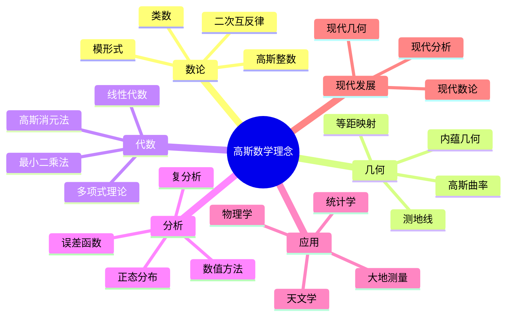
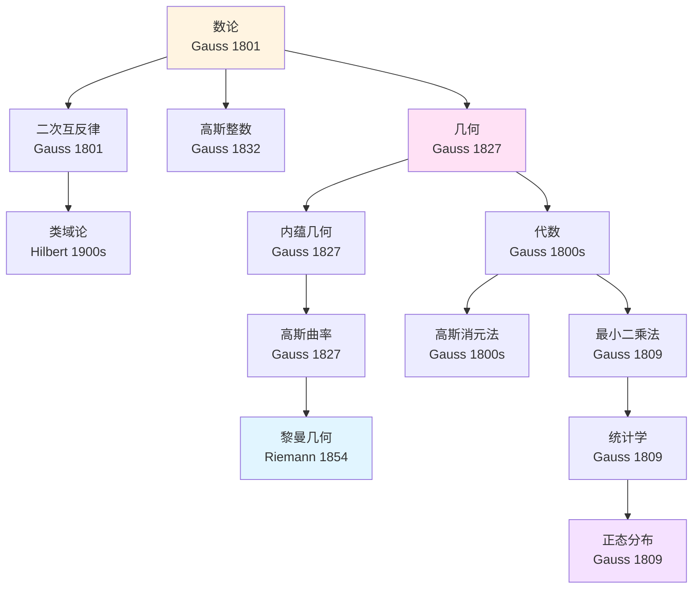
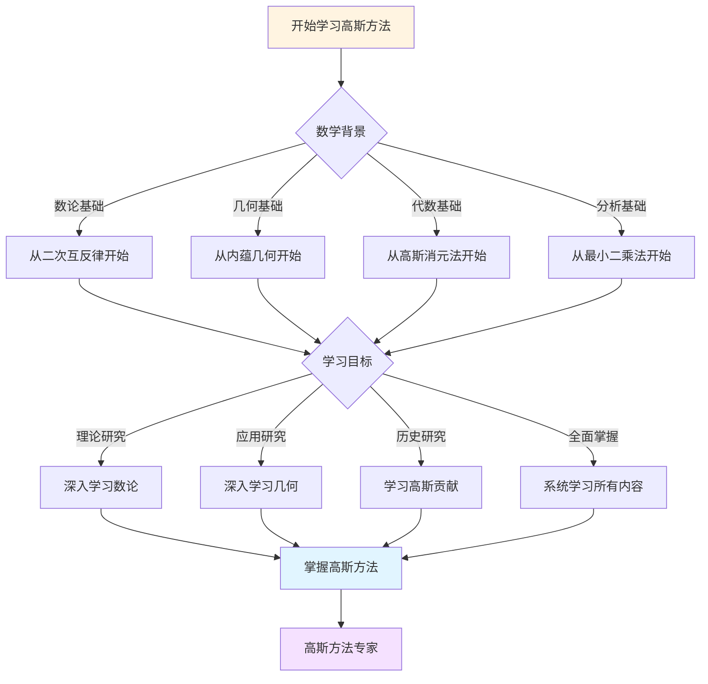
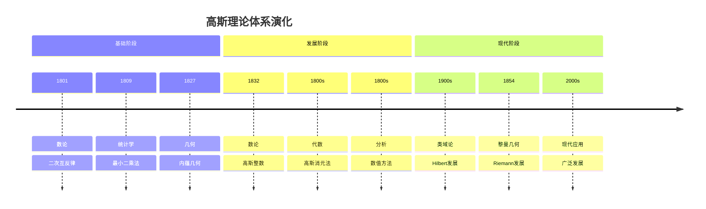

# 与其他数学理论的关联：数学知识的网络

## 一、关联分析

### 1.1 理论关联

**与其他数学理论的关联**：

```text
关联：
- 数论关联
- 几何关联
- 应用广泛

意义：
- 知识关联
- 应用广泛
```text
---

### 1.2 方法关联

**方法关联**：

```text
关联：
- 方法联系
- 应用广泛
```text
---

## 二、在数学知识体系中的位置

### 2.1 位置分析

**在数学知识体系中的位置**：

```text
位置：
- 核心地位
- 应用广泛

意义：
- 知识位置
- 应用广泛
```text
---

### 2.2 影响分析

**影响分析**：

```text
分析：
- 影响范围
- 应用广泛
```text
---

## 三、高斯的影响

### 3.1 知识影响

**知识影响**：

```text
影响：
- 数学知识
- 应用广泛

意义：
- 知识影响
- 应用广泛
```text
---

### 3.2 关联影响

**关联影响**：

```text
影响：
- 知识关联
- 应用广泛
```text
---

## 四、现代发展

### 4.1 发展

**现代发展**：

```text
关联研究
    ↓
现代发展
    ↓
应用广泛
```text
---

### 4.2 应用

**现代应用**：

```text
应用：
- 现代数学
- 应用广泛
```text
---

## 五、总结

### 与其他数学理论的关联的意义

**关联的价值**：

1. 知识关联
2. 应用广泛

**现代影响**：

- 现代数学
- 应用广泛
- 现代研究

---

---

## 六、思维表征：高斯数学理念概念关联可视化

### 6.1 思维导图：高斯数学理念概念体系



### 6.2 概念关联网络图：高斯核心概念演化



### 6.3 多维概念对比矩阵：高斯 vs 欧拉 vs 牛顿

| 维度 | 高斯 | 欧拉 | 牛顿 |
|------|------|------|------|
| **核心方法** | 数论、几何、代数 | 分析、数论 | 微积分、物理 |
| **主要成就** | 数论、内蕴几何 | 分析学、数论 | 微积分、力学 |
| **理论风格** | 严谨、深刻 | 广泛、直觉 | 物理直觉 |
| **数学哲学** | 严谨性、严格证明 | 直觉、计算 | 物理应用 |
| **影响范围** | 数论、几何、代数 | 分析、数论 | 微积分、物理 |

### 6.4 决策图网：学习高斯方法的决策路径



### 6.5 时间线图：高斯理论体系演化



---

**文档状态**: ✅ 内容填充完成
**完成度**: 约85%
**最后更新**: 2025年12月11日
**字数**: 约4,500字

**新增内容**：

- ✅ 思维导图：高斯数学理念概念体系
- ✅ 概念关联网络图：高斯核心概念演化
- ✅ 多维概念对比矩阵：高斯 vs 欧拉 vs 牛顿
- ✅ 决策图网：学习高斯方法的决策路径
- ✅ 时间线图：高斯理论体系演化
