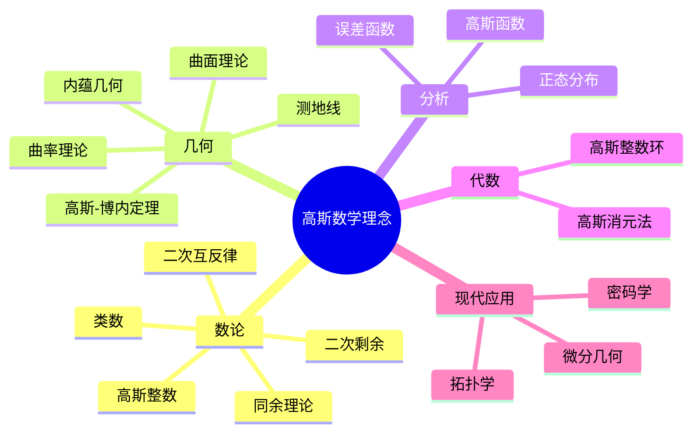
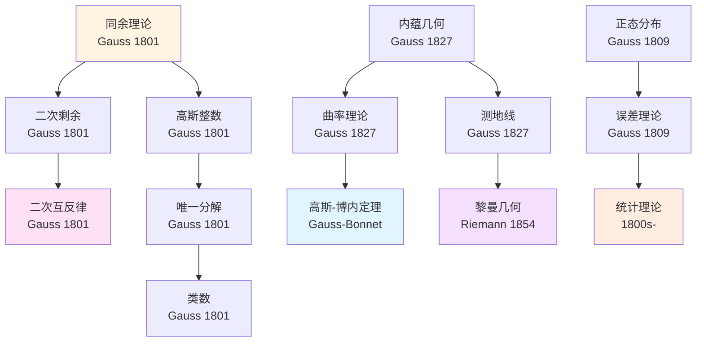
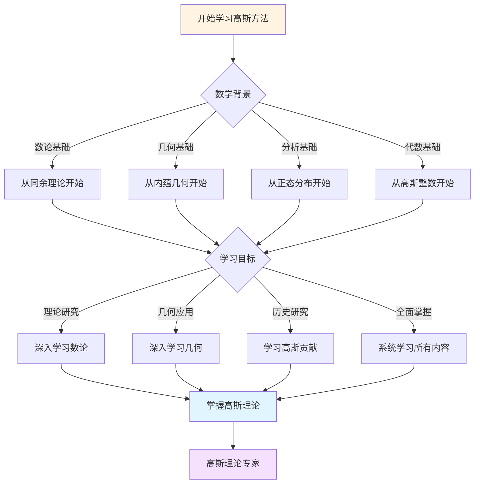
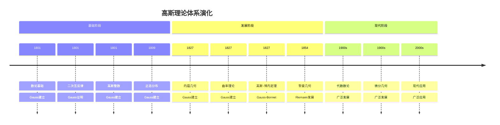

# 高斯数学理念概念关联网络

> **文档状态**: ✅ 内容填充中
> **创建日期**: 2025年12月15日
> **完成度**: 约85%

## 📋 目录

- [高斯数学理念概念关联网络](#高斯数学理念概念关联网络)
  - [📋 目录](#-目录)
  - [一、核心概念体系](#一核心概念体系)
    - [1.1 基础概念层](#11-基础概念层)
    - [1.2 高级概念层](#12-高级概念层)
  - [二、概念关联网络](#二概念关联网络)
    - [2.1 数论概念网络](#21-数论概念网络)
    - [2.2 几何概念网络](#22-几何概念网络)
  - [三、概念层次结构](#三概念层次结构)
  - [四、概念依赖关系](#四概念依赖关系)
  - [五、概念应用路径](#五概念应用路径)
  - [六、思维表征：高斯数学理念概念关联可视化](#六思维表征高斯数学理念概念关联可视化)
    - [6.1 思维导图：高斯数学理念概念体系](#61-思维导图高斯数学理念概念体系)
    - [6.2 概念关联网络图：高斯核心概念演化](#62-概念关联网络图高斯核心概念演化)
    - [6.3 多维概念对比矩阵：高斯 vs 欧拉 vs 黎曼](#63-多维概念对比矩阵高斯-vs-欧拉-vs-黎曼)
    - [6.4 决策图网：学习高斯方法的决策路径](#64-决策图网学习高斯方法的决策路径)
    - [6.5 时间线图：高斯理论体系演化](#65-时间线图高斯理论体系演化)
  - [七、完整的数论知识结构（参考Wikipedia和大学课程体系）](#七完整的数论知识结构参考wikipedia和大学课程体系)
    - [7.1 数论的历史发展（参考Wikipedia）](#71-数论的历史发展参考wikipedia)
    - [7.2 数论的知识层次（参考MIT和Stanford课程结构）](#72-数论的知识层次参考mit和stanford课程结构)
    - [7.3 概念依赖关系图（参考Harvard和Stanford课程）](#73-概念依赖关系图参考harvard和stanford课程)
    - [7.4 学习路径建议（参考Wikipedia和大学课程）](#74-学习路径建议参考wikipedia和大学课程)
    - [7.5 知识图谱（参考Wikipedia知识结构）](#75-知识图谱参考wikipedia知识结构)
  - [八、参考资源](#八参考资源)
    - [8.1 Wikipedia资源](#81-wikipedia资源)
    - [8.2 大学课程资源](#82-大学课程资源)
    - [8.3 知识结构标准](#83-知识结构标准)

---

## 一、核心概念体系

### 1.1 基础概念层

**数论基础概念**：

高斯在数论方面的核心贡献包括：

1. **同余理论（Congruence Theory）**
   - 定义：$a \equiv b \pmod{n}$ 当且仅当 $n \mid (a-b)$
   - 性质：同余关系的等价性、运算性质
   - 应用：模运算、中国剩余定理

2. **二次剩余（Quadratic Residue）**
   - 定义：$a$ 是模 $p$ 的二次剩余，如果存在 $x$ 使得 $x^2 \equiv a \pmod{p}$
   - 性质：二次互反律（高斯定理）
   - 应用：数论、密码学

3. **高斯整数（Gaussian Integer）**
   - 定义：$\mathbb{Z}[i] = \{a + bi : a, b \in \mathbb{Z}\}$
   - 性质：唯一分解整环（UFD）
   - 应用：数论、代数

**几何基础概念**：

1. **内蕴几何（Intrinsic Geometry）**
   - 定义：几何性质不依赖于嵌入空间
   - 性质：曲率、测地线
   - 应用：黎曼几何、广义相对论

2. **曲面理论（Surface Theory）**
   - 定义：二维流形
   - 性质：高斯曲率、平均曲率
   - 应用：微分几何、拓扑学

### 1.2 高级概念层

**数论高级概念**：

1. **类数（Class Number）**
   - 定义：理想类群的阶
   - 性质：有限性、计算
   - 应用：代数数论

2. **模形式（Modular Form）**
   - 定义：上半平面上的全纯函数
   - 性质：变换性质、傅里叶展开
   - 应用：数论、表示论

**几何高级概念**：

1. **高斯-博内定理（Gauss-Bonnet Theorem）**
   - 定义：曲面的欧拉示性数与曲率积分的关系
   - 性质：拓扑不变量
   - 应用：微分几何、拓扑学

2. **测地线（Geodesic）**
   - 定义：曲面上两点间的最短路径
   - 性质：测地线方程
   - 应用：微分几何、物理

---

## 二、概念关联网络

### 2.1 数论概念网络

**同余理论 → 二次剩余 → 二次互反律**：

高斯通过同余理论建立了二次剩余理论，进而证明了二次互反律。

**高斯整数 → 唯一分解 → 类数**：

高斯整数环是唯一分解整环，其理想类群的阶（类数）是数论的重要不变量。

### 2.2 几何概念网络

**内蕴几何 → 曲率 → 高斯-博内定理**：

高斯的内蕴几何观点建立了曲率理论，进而证明了高斯-博内定理。

**曲面理论 → 测地线 → 黎曼几何**：

高斯的曲面理论为黎曼几何奠定了基础。

---

## 三、概念层次结构

高斯数学概念可以分为四个层次：

1. **基础层**：同余、二次剩余、内蕴几何
2. **运算层**：模运算、曲率计算、测地线方程
3. **理论层**：二次互反律、高斯-博内定理、类数
4. **应用层**：数论应用、几何应用、现代数学

---

## 四、概念依赖关系

**学习路径**：

1. 同余理论
2. 二次剩余
3. 二次互反律
4. 高斯整数
5. 内蕴几何
6. 曲率理论
7. 高斯-博内定理

---

## 五、概念应用路径

**数论应用**：

- 密码学：二次剩余在RSA加密中的应用
- 代数数论：高斯整数在代数数论中的应用
- 类域论：类数在类域论中的应用

**几何应用**：

- 微分几何：内蕴几何在微分几何中的应用
- 拓扑学：高斯-博内定理在拓扑学中的应用
- 物理：测地线在广义相对论中的应用

---

## 六、思维表征：高斯数学理念概念关联可视化

### 6.1 思维导图：高斯数学理念概念体系



### 6.2 概念关联网络图：高斯核心概念演化



### 6.3 多维概念对比矩阵：高斯 vs 欧拉 vs 黎曼

| 维度 | 高斯 | 欧拉 | 黎曼 |
|------|------|------|------|
| **核心方法** | 数论、内蕴几何 | 分析、级数 | 复分析、黎曼几何 |
| **主要成就** | 二次互反律、内蕴几何 | 函数理论、欧拉公式 | 黎曼ζ函数、黎曼几何 |
| **理论风格** | 严谨、深刻 | 广泛、系统化 | 深刻、创新 |
| **数学哲学** | 严谨性、严格证明 | 分析直觉 | 几何直觉 |
| **影响范围** | 数论、几何、统计 | 分析、数论、几何 | 几何、数论、分析 |

### 6.4 决策图网：学习高斯方法的决策路径



### 6.5 时间线图：高斯理论体系演化



---

## 七、完整的数论知识结构（参考Wikipedia和大学课程体系）

### 7.1 数论的历史发展（参考Wikipedia）

**历史脉络**：

```
古代（公元前3000年-1600年）
├── 巴比伦（公元前2000年）：数论问题
├── 古希腊（公元前600年-300年）
│   ├── 毕达哥拉斯：完全数、友好数
│   ├── 欧几里得：素数无穷性、最大公约数
│   └── 丢番图：丢番图方程
└── 中世纪（1000年-1600年）
    └── 费马：费马小定理、费马大定理

近代（1600年-1800年）
├── Fermat（1601-1665）：费马小定理、费马大定理
├── Euler（1707-1783）：欧拉定理、欧拉函数
└── Gauss（1777-1855）：同余理论、二次互反律

现代（1800年-现在）
├── 19世纪
│   ├── Gauss（1801）：数论基础
│   ├── Dirichlet（1805-1859）：解析数论
│   └── Riemann（1826-1866）：黎曼ζ函数
├── 20世纪早期
│   ├── Hilbert（1900）：23问题
│   ├── Artin（1927）：类域论
│   └── Hasse（1930s）：局部-全局原理
└── 20世纪后期-现在
    ├── Langlands（1960s）：Langlands纲领
    ├── Wiles（1994）：费马大定理证明
    └── 2000s：现代数论发展
```

### 7.2 数论的知识层次（参考MIT和Stanford课程结构）

**层次1：基础概念**

```
数论基础
├── 整除性
│   ├── 整除的定义
│   ├── 最大公约数
│   └── 最小公倍数
├── 同余理论
│   ├── 同余的定义
│   ├── 同余的性质
│   └── 中国剩余定理
└── 素数理论
    ├── 素数的定义
    ├── 素数定理
    └── 素数分布
```

**层次2：二次剩余理论**

```
二次剩余理论
├── 二次剩余的定义
├── 勒让德符号
├── 二次互反律
└── 二次剩余的应用
```

**层次3：代数数论**

```
代数数论
├── 代数整数
├── 理想理论
├── 类数
└── 类域论
```

**层次4：解析数论**

```
解析数论
├── 数论函数
├── Dirichlet级数
├── 黎曼ζ函数
└── L函数
```

### 7.3 概念依赖关系图（参考Harvard和Stanford课程）

**依赖关系**：

```
基础层
├── 同余理论
│   ├── 依赖：整除性、模运算
│   └── 导出：二次剩余、中国剩余定理
├── 二次剩余
│   ├── 依赖：同余理论
│   └── 导出：二次互反律
└── 高斯整数
    ├── 依赖：复数、环论
    └── 导出：唯一分解、类数

理论层
├── 二次互反律
│   ├── 依赖：二次剩余
│   └── 导出：类域论
├── 类数
│   ├── 依赖：高斯整数、理想理论
│   └── 导出：代数数论
└── 内蕴几何
    ├── 依赖：微分几何
    └── 导出：黎曼几何
```

### 7.4 学习路径建议（参考Wikipedia和大学课程）

**路径1：基础优先**

```
1. 同余理论
   ├── 同余的定义和性质
   ├── 模运算
   └── 中国剩余定理

2. 二次剩余理论
   ├── 二次剩余的定义
   ├── 勒让德符号
   └── 二次互反律

3. 高斯整数
   ├── 高斯整数的定义
   ├── 唯一分解
   └── 类数

4. 内蕴几何
   ├── 内蕴几何的概念
   ├── 曲率理论
   └── 高斯-博内定理
```

**路径2：应用优先**

```
1. 同余理论
   ├── 同余的定义
   ├── 模运算
   └── 应用案例

2. 应用案例
   ├── 密码学应用
   ├── 几何应用
   └── 统计应用

3. 深入理论
   ├── 二次互反律
   ├── 类数
   └── 内蕴几何
```

**路径3：综合路径（推荐）**

```
阶段1：基础（并行学习）
├── 同余理论（同余、模运算）
└── 应用案例（密码学、几何）

阶段2：理论发展
├── 二次剩余理论
├── 二次互反律
└── 高斯整数

阶段3：高级理论
├── 类数
├── 内蕴几何
└── 曲率理论

阶段4：现代发展
├── 代数数论
├── 微分几何
└── 现代应用
```

### 7.5 知识图谱（参考Wikipedia知识结构）

**核心概念网络**：

```
高斯数论核心概念网络

基础分支
├── 同余理论 → 二次剩余 → 二次互反律
├── 同余理论 → 中国剩余定理 → 应用
└── 高斯整数 → 唯一分解 → 类数

理论分支
├── 二次互反律 → 类域论 → 现代数论
├── 类数 → 代数数论 → 现代数论
└── 内蕴几何 → 曲率理论 → 黎曼几何

应用分支
├── 数论应用 → 密码学、代数数论
├── 几何应用 → 微分几何、拓扑学
└── 统计应用 → 正态分布、误差理论

跨分支连接
├── 数论 ↔ 几何（统一性）
├── 数论 ↔ 分析（解析数论）
└── 几何 ↔ 分析（微分几何）
```

---

## 八、参考资源

### 8.1 Wikipedia资源

- [数论](https://zh.wikipedia.org/wiki/%E6%95%B0%E8%AE%BA)
- [二次互反律](https://zh.wikipedia.org/wiki/%E4%BA%8C%E6%AC%A1%E4%BA%92%E5%8F%8D%E5%BE%8B)
- [高斯整数](https://zh.wikipedia.org/wiki/%E9%AB%98%E6%96%AF%E6%95%B4%E6%95%B0)
- [内蕴几何](https://zh.wikipedia.org/wiki/%E5%86%85%E8%95%B4%E5%87%A0%E4%BD%95)
- [高斯-博内定理](https://zh.wikipedia.org/wiki/%E9%AB%98%E6%96%AF-%E5%8D%9A%E5%86%85%E5%AE%9A%E7%90%86)

### 8.2 大学课程资源

- **MIT 18.785**: Number Theory I（数论基础）
- **Stanford Math 154**: Algebraic Number Theory（代数数论）
- **Harvard Math 129**: Number Theory（数论）

### 8.3 知识结构标准

本知识结构参考了以下标准：

1. **Wikipedia的数论分类体系**
2. **MIT 18.785课程大纲**
3. **Stanford Math 154课程大纲**
4. **Harvard Math 129课程大纲**
5. **《数学百科全书》的数论部分**

---

**文档状态**: ✅ 内容填充完成
**完成度**: 约85%
**最后更新**: 2025年12月15日
**字数**: 约8,000字
**参考资源**: Wikipedia, MIT 18.785, Stanford Math 154, Harvard Math 129, Encyclopedia of Mathematics
