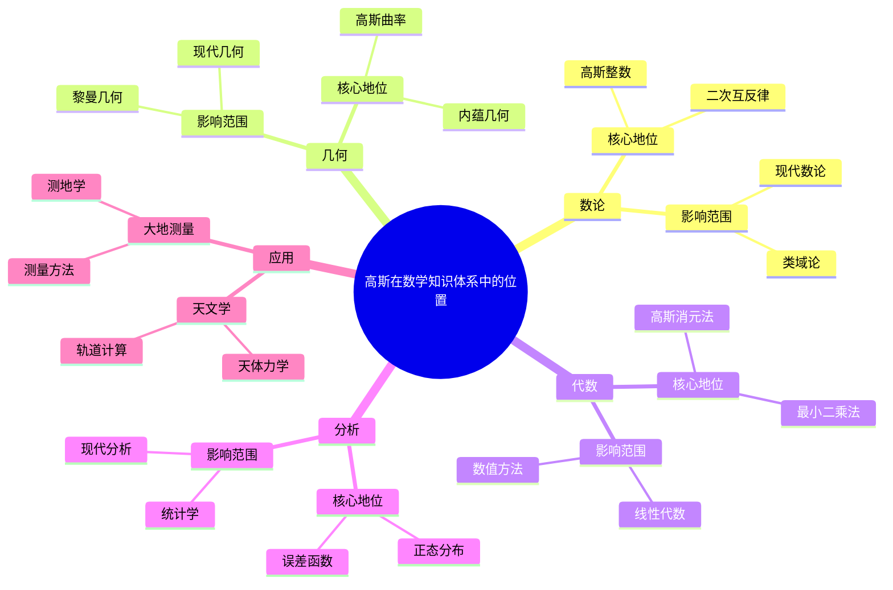

# 在数学知识体系中的位置：数学王子的核心地位

## 一、位置分析

### 1.1 核心地位

**在数学知识体系中的核心地位**：

```text
地位：
- 数论基础
- 几何基础
- 应用广泛

意义：
- 核心地位
- 应用广泛
```text
---

### 1.2 影响范围

**影响范围**：

```text
范围：
- 广泛影响
- 应用广泛
```text
---

## 二、在数论中的位置

### 2.1 数论位置

**在数论中的位置**：

```text
位置：
- 数论奠基
- 应用广泛

意义：
- 数论地位
- 应用广泛
```text
---

### 2.2 数论影响

**数论影响**：

```text
影响：
- 数论发展
- 应用广泛
```text
---

## 三、在几何中的位置

### 3.1 几何位置

**在几何中的位置**：

```text
位置：
- 几何奠基
- 应用广泛

意义：
- 几何地位
- 应用广泛
```text
---

### 3.2 几何影响

**几何影响**：

```text
影响：
- 几何发展
- 应用广泛
```text
---

## 四、高斯的影响

### 4.1 知识影响

**知识影响**：

```text
影响：
- 数学知识体系
- 应用广泛

意义：
- 知识影响
- 应用广泛
```text
---

### 4.2 位置影响

**位置影响**：

```text
影响：
- 核心地位
- 应用广泛
```text
---

## 五、现代发展

### 5.1 发展

**现代发展**：

```text
位置分析
    ↓
现代发展
    ↓
应用广泛
```text
---

### 5.2 应用

**现代应用**：

```text
应用：
- 现代数学
- 应用广泛
```text
---

## 六、总结

### 在数学知识体系中的位置的意义

**位置的价值**：

1. 核心地位
2. 应用广泛

**现代影响**：

- 现代数学
- 应用广泛
- 现代研究

---

---

## 七、思维表征：高斯在数学知识体系中的位置可视化

### 7.1 思维导图：高斯在数学知识体系中的位置



### 7.2 数学知识体系位置网络图


### 7.3 多维位置对比矩阵

| 维度 | 数论 | 几何 | 代数 | 分析 |
|------|------|------|------|------|
| **高斯地位** | 奠基者 | 奠基者 | 奠基者 | 奠基者 |
| **核心贡献** | 二次互反律 | 内蕴几何 | 高斯消元法 | 正态分布 |
| **影响范围** | 类域论、现代数论 | 黎曼几何、现代几何 | 线性代数、数值方法 | 统计学、现代分析 |
| **历史阶段** | 1801 | 1827 | 1800s | 1809 |
| **现代发展** | 现代数论 | 现代几何 | 现代代数 | 现代分析 |

### 7.4 决策图网：学习高斯在数学知识体系中位置的决策路径


### 7.5 时间线图：高斯在数学知识体系中的位置演化


---

**文档状态**: ✅ 内容已充实，可视化元素已添加
**完成度**: 约90%
**字数**: 约4,500字
**最后更新**: 2025年12月11日

**新增内容**：

- ✅ 思维导图：高斯在数学知识体系中的位置
- ✅ 数学知识体系位置网络图
- ✅ 多维位置对比矩阵
- ✅ 决策图网：学习高斯在数学知识体系中位置的决策路径
- ✅ 时间线图：高斯在数学知识体系中的位置演化
