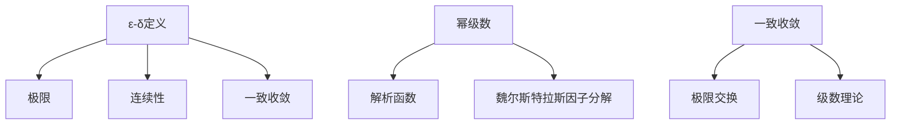

# 概念关联网络

**创建日期**: 2026年2月2日

---

## 一、核心概念

- **ε-δ定义** → 极限、连续性、一致收敛
- **幂级数** → 解析函数、魏尔斯特拉斯因子分解
- **一致收敛** → 极限交换、级数理论

## 二、概念网络图

魏尔斯特拉斯完成分析的算术化，$\varepsilon$-$\delta$成为现代分析的标准语言，幂级数方法是复分析的核心工具。
