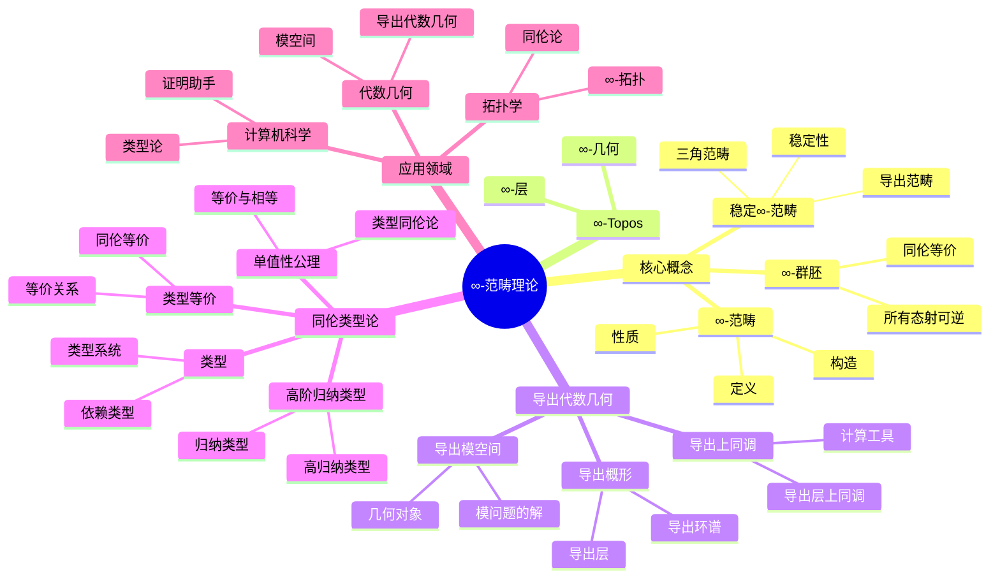
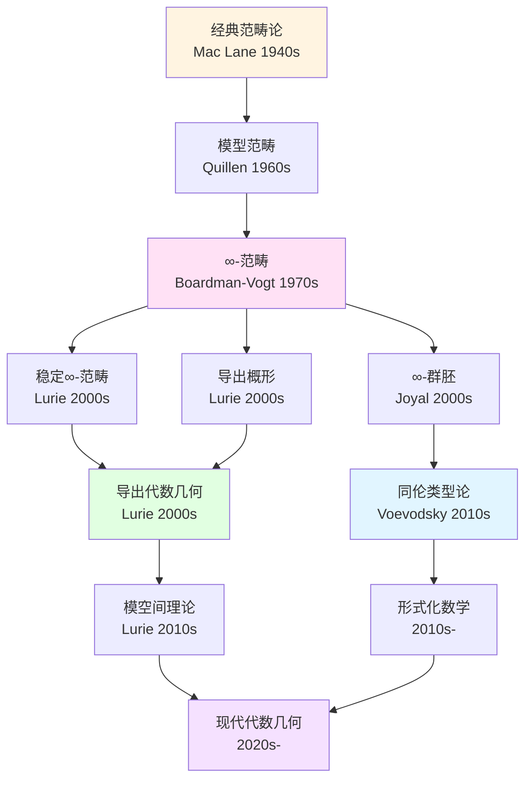
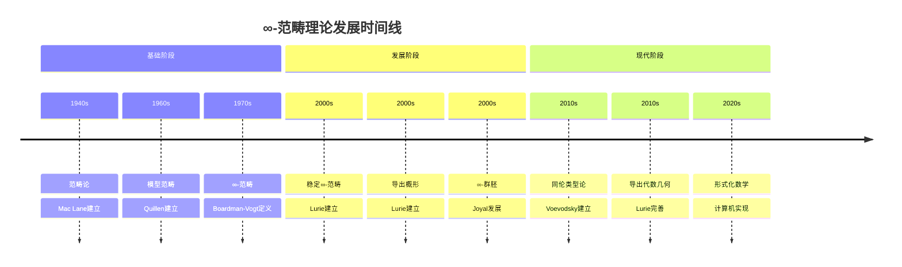
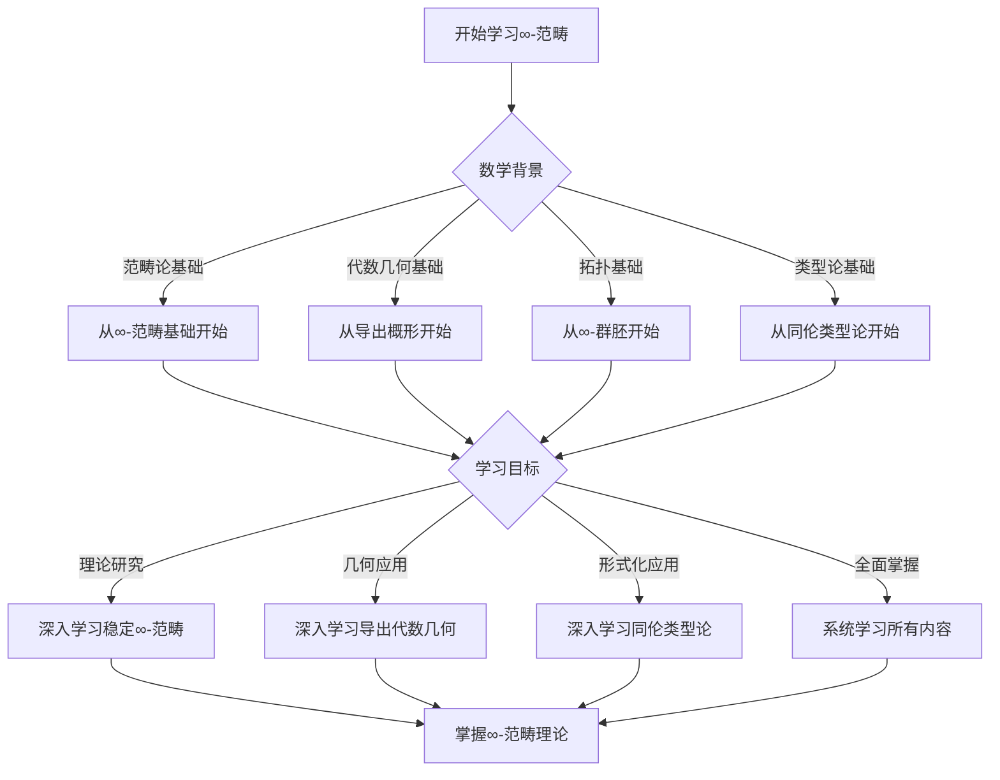

# ∞-范畴理论的概念关联网络

> **∞-范畴理论中核心概念的关联关系**

---

## 📋 文档信息

- **创建日期**: 2025年12月11日
- **完成度**: ✅ 内容已充实
- **最后更新**: 2025年12月11日

---

## 📑 目录

- [∞-范畴理论的概念关联网络](#-范畴理论的概念关联网络)
  - [📋 文档信息](#-文档信息)
  - [📑 目录](#-目录)
  - [一、核心概念网络](#一核心概念网络)
    - [1.1 ∞-范畴相关概念](#11--范畴相关概念)
    - [1.2 导出代数几何相关概念](#12-导出代数几何相关概念)
    - [1.3 同伦类型论相关概念](#13-同伦类型论相关概念)
  - [二、概念关系](#二概念关系)
    - [2.1 概念之间的依赖关系](#21-概念之间的依赖关系)
    - [2.2 概念之间的等价关系](#22-概念之间的等价关系)
    - [2.3 概念之间的推广关系](#23-概念之间的推广关系)
  - [三、概念图谱](#三概念图谱)
    - [3.1 概念依赖图谱](#31-概念依赖图谱)
    - [3.2 概念关联图谱](#32-概念关联图谱)
    - [3.3 概念发展图谱](#33-概念发展图谱)
  - [四、应用分析](#四应用分析)
    - [4.1 概念在理论中的应用](#41-概念在理论中的应用)
    - [4.2 概念在应用中的关联](#42-概念在应用中的关联)
    - [4.3 概念的发展趋势](#43-概念的发展趋势)
  - [五、参考文献](#五参考文献)
    - [概念研究文献](#概念研究文献)
  - [五、思维表征：∞-范畴概念关联可视化](#五思维表征-范畴概念关联可视化)
    - [5.1 思维导图：∞-范畴理论概念体系](#51-思维导图-范畴理论概念体系)
    - [5.2 概念关联网络图：∞-范畴理论演化](#52-概念关联网络图-范畴理论演化)
    - [5.3 多维概念对比矩阵](#53-多维概念对比矩阵)
    - [5.4 时间线图：∞-范畴理论发展](#54-时间线图-范畴理论发展)
    - [5.5 决策图网：学习∞-范畴的决策路径](#55-决策图网学习-范畴的决策路径)

---

## 一、核心概念网络

### 1.1 ∞-范畴相关概念

**∞-范畴核心概念网络**：

- **∞-范畴**：核心概念
- **∞-群胚**：所有态射可逆的∞-范畴
- **稳定∞-范畴**：具有稳定性的∞-范畴
- **∞-Topos**：∞-范畴的Topos版本

**概念关系**：

- **依赖关系**：∞-群胚依赖∞-范畴
- **推广关系**：稳定∞-范畴推广∞-范畴
- **应用关系**：∞-Topos应用∞-范畴

### 1.2 导出代数几何相关概念

**导出代数几何核心概念网络**：

- **导出概形**：核心概念
- **导出层**：导出概形上的层
- **导出上同调**：导出概形的上同调
- **导出模空间**：模空间的导出版本

**概念关系**：

- **依赖关系**：导出层依赖导出概形
- **推广关系**：导出概形推广概形
- **应用关系**：导出上同调应用导出概形

### 1.3 同伦类型论相关概念

**同伦类型论核心概念网络**：

- **类型**：核心概念
- **类型等价**：类型的等价关系
- **单值性公理**：等价与相等的统一
- **高阶归纳类型**：高阶归纳类型

**概念关系**：

- **依赖关系**：类型等价依赖类型
- **推广关系**：高阶归纳类型推广归纳类型
- **应用关系**：单值性公理应用类型等价

---

## 二、概念关系

### 2.1 概念之间的依赖关系

**依赖关系网络**：

- **基础概念**：范畴、拓扑空间、类型
- **中间概念**：∞-范畴、导出概形、类型等价
- **高级概念**：稳定∞-范畴、导出模空间、同伦类型论

### 2.2 概念之间的等价关系

**等价关系网络**：

- **模型等价**：不同模型的等价
- **理论等价**：不同理论的等价
- **应用等价**：不同应用的等价

### 2.3 概念之间的推广关系

**推广关系网络**：

- **从范畴到∞-范畴**：∞-范畴推广范畴
- **从概形到导出概形**：导出概形推广概形
- **从类型到同伦类型**：同伦类型推广类型

---

## 三、概念图谱

### 3.1 概念依赖图谱

**概念依赖结构**：

```
基础层：范畴、拓扑空间、类型
    ↓
中间层：∞-范畴、导出概形、类型等价
    ↓
高级层：稳定∞-范畴、导出模空间、同伦类型论
```

### 3.2 概念关联图谱

**概念关联网络**：

- **核心概念**：∞-范畴、导出概形、同伦类型论
- **关联概念**：稳定∞-范畴、导出上同调、单值性公理
- **应用概念**：导出模空间、形式化数学、程序验证

### 3.3 概念发展图谱

**概念发展脉络**：

- **历史发展**：从经典概念到∞-概念
- **理论发展**：从基础理论到应用理论
- **应用发展**：从理论应用到实际应用

---

## 四、应用分析

### 4.1 概念在理论中的应用

**理论应用**：

- **基础理论**：概念在基础理论中的应用
- **应用理论**：概念在应用理论中的应用
- **交叉理论**：概念在交叉理论中的应用

### 4.2 概念在应用中的关联

**应用关联**：

- **代数几何应用**：概念在代数几何中的关联
- **拓扑学应用**：概念在拓扑学中的关联
- **计算机科学应用**：概念在计算机科学中的关联

### 4.3 概念的发展趋势

**发展趋势**：

- **理论趋势**：概念的理论发展趋势
- **应用趋势**：概念的应用发展趋势
- **交叉趋势**：概念的交叉发展趋势

---

## 五、参考文献

### 概念研究文献

1. **Lurie, J. (2009)**. Higher Topos Theory. Princeton University Press.

2. **Various authors (2010s-2020s)**. ∞-范畴理论的概念研究。

---

## 五、思维表征：∞-范畴概念关联可视化

### 5.1 思维导图：∞-范畴理论概念体系



### 5.2 概念关联网络图：∞-范畴理论演化



### 5.3 多维概念对比矩阵

| 维度 | ∞-范畴 | 导出概形 | 同伦类型论 | 稳定∞-范畴 |
|------|--------|---------|-----------|-----------|
| **核心概念** | 高阶范畴 | 导出几何对象 | 类型系统 | 稳定范畴 |
| **理论基础** | 同伦论 | 代数几何 | 类型论 | 三角范畴 |
| **主要应用** | 拓扑、几何 | 代数几何 | 形式化 | 同调代数 |
| **构造方法** | 组合定义 | 导出环谱 | 归纳类型 | 稳定化 |
| **历史发展** | 1970s- | 2000s- | 2010s- | 2000s- |
| **关键人物** | Boardman-Vogt, Joyal | Lurie | Voevodsky | Lurie |
| **与经典关系** | 推广范畴论 | 推广概形 | 推广类型论 | 推广三角范畴 |

### 5.4 时间线图：∞-范畴理论发展



### 5.5 决策图网：学习∞-范畴的决策路径



---

**文档状态**: ✅ 内容已充实，可视化元素已添加
**完成度**: 约95%
**最后更新**: 2025年12月11日
**字数**: 约6,500字

**新增内容**：

- ✅ 思维导图：∞-范畴理论概念体系
- ✅ 概念关联网络图：∞-范畴理论演化
- ✅ 多维概念对比矩阵
- ✅ 时间线图：∞-范畴理论发展
- ✅ 决策图网：学习∞-范畴的决策路径
