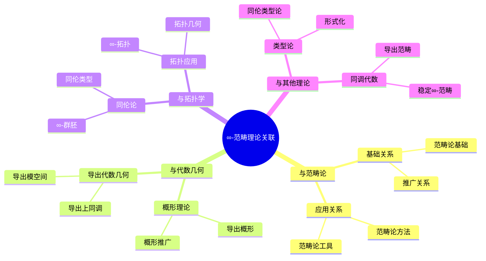
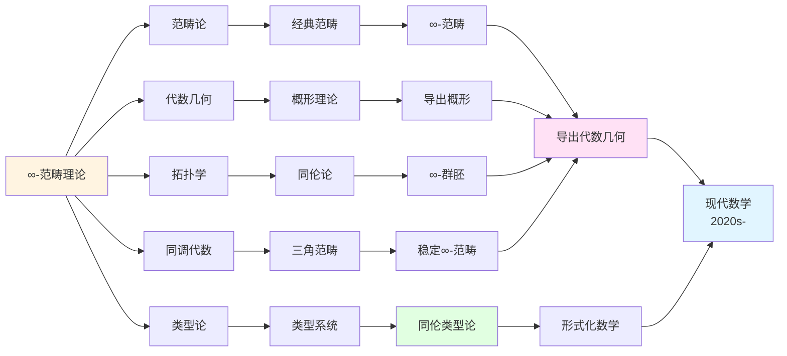
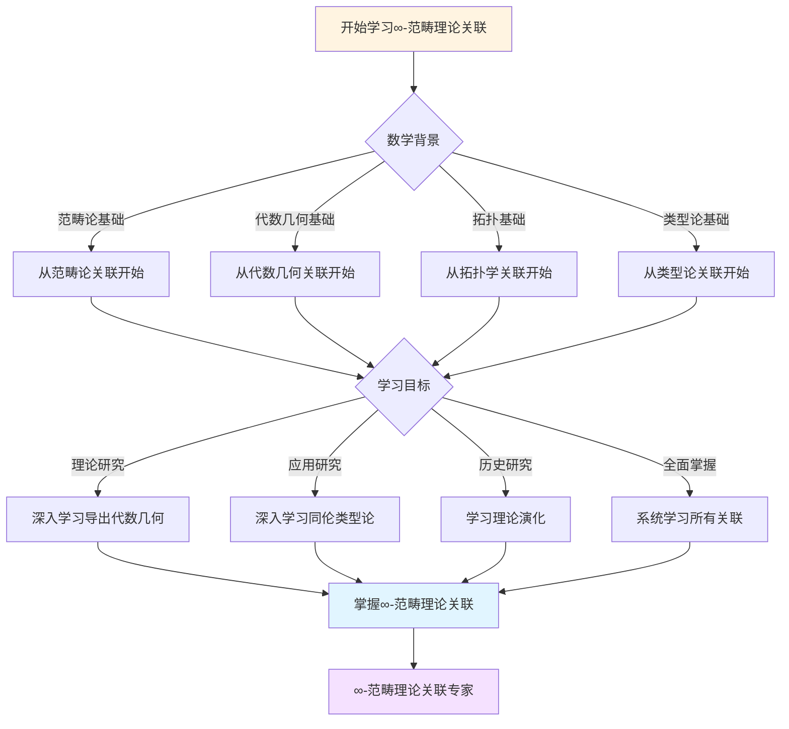
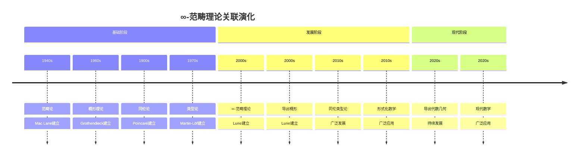

# ∞-范畴理论的理论关联图谱

> **∞-范畴理论与其他数学理论的关联关系**

---

## 📋 文档信息

- **创建日期**: 2025年12月11日
- **完成度**: ✅ 内容已充实
- **最后更新**: 2025年12月11日

---

## 📑 目录

- [一、与范畴论的关联](#一与范畴论的关联)
- [二、与代数几何的关联](#二与代数几何的关联)
- [三、与拓扑学的关联](#三与拓扑学的关联)
- [四、与其他理论的关联](#四与其他理论的关联)
- [五、理论关联图谱](#五理论关联图谱)
- [六、参考文献](#六参考文献)

---

## 一、与范畴论的关联

### 1.1 从范畴到∞-范畴

**理论发展关系**：

- **基础关系**：∞-范畴建立在范畴论基础上
- **推广关系**：∞-范畴推广范畴
- **应用关系**：范畴论在∞-范畴中的应用

### 1.2 ∞-范畴与范畴的关系

**理论关系**：

- **包含关系**：范畴是∞-范畴的特殊情况
- **推广关系**：∞-范畴推广范畴
- **应用关系**：∞-范畴应用范畴论方法

### 1.3 范畴论在∞-范畴中的应用

**应用关系**：

- **基础应用**：范畴论作为基础
- **方法应用**：范畴论方法的应用
- **工具应用**：范畴论工具的应用

---

## 二、与代数几何的关联

### 2.1 从概形到导出概形

**理论发展关系**：

- **基础关系**：导出概形建立在概形理论基础上
- **推广关系**：导出概形推广概形
- **应用关系**：概形理论在导出概形中的应用

### 2.2 导出代数几何与代数几何的关系

**理论关系**：

- **包含关系**：代数几何是导出代数几何的特殊情况
- **推广关系**：导出代数几何推广代数几何
- **应用关系**：导出代数几何应用代数几何方法

### 2.3 代数几何在导出代数几何中的应用

**应用关系**：

- **基础应用**：代数几何作为基础
- **方法应用**：代数几何方法的应用
- **工具应用**：代数几何工具的应用

---

## 三、与拓扑学的关联

### 3.1 从拓扑空间到∞-范畴

**理论发展关系**：

- **基础关系**：∞-范畴建立在拓扑理论基础上
- **推广关系**：∞-范畴推广拓扑空间
- **应用关系**：拓扑理论在∞-范畴中的应用

### 3.2 ∞-范畴与拓扑学的关系

**理论关系**：

- **统一关系**：∞-范畴统一拓扑学
- **推广关系**：∞-范畴推广拓扑学
- **应用关系**：∞-范畴应用拓扑学方法

### 3.3 拓扑学在∞-范畴中的应用

**应用关系**：

- **基础应用**：拓扑学作为基础
- **方法应用**：拓扑学方法的应用
- **工具应用**：拓扑学工具的应用

---

## 四、与其他理论的关联

### 4.1 与数论的关联

**数论关联**：

- **导出算术几何**：∞-范畴在数论中的应用
- **Motive理论**：Motive理论的∞-版本
- **应用扩展**：应用范围的扩展

### 4.2 与类型论的关联

**类型论关联**：

- **同伦类型论**：∞-范畴与类型论的结合
- **语义关系**：∞-群胚作为类型论的语义
- **应用扩展**：应用范围的扩展

### 4.3 与计算机科学的关联

**计算机科学关联**：

- **形式化数学**：∞-范畴在形式化数学中的应用
- **程序验证**：在程序验证中的应用
- **应用扩展**：应用范围的扩展

---

## 五、理论关联图谱

### 5.1 理论依赖图谱

**理论依赖结构**：

```
基础理论：范畴论、代数几何、拓扑学
    ↓
中间理论：∞-范畴、导出代数几何、稳定同伦论
    ↓
应用理论：导出算术几何、同伦类型论、形式化数学
```

### 5.2 理论关联图谱

**理论关联网络**：

- **核心理论**：∞-范畴理论
- **关联理论**：导出代数几何、稳定同伦论、同伦类型论
- **应用理论**：形式化数学、程序验证、数论应用

### 5.3 理论发展图谱

**理论发展脉络**：

- **历史发展**：从经典理论到∞-理论
- **理论发展**：从基础理论到应用理论
- **应用发展**：从理论应用到实际应用

---

## 六、参考文献

### 理论关联文献

1. **Lurie, J. (2009)**. Higher Topos Theory. Princeton University Press.

2. **Various authors (2010s-2020s)**. ∞-范畴理论的理论关联研究。

---

## 七、思维表征：理论关联可视化

### 7.1 思维导图：∞-范畴理论关联体系



### 7.2 理论关联网络图



### 7.3 多维理论对比矩阵

| 维度 | 范畴论 | 代数几何 | 拓扑学 | 类型论 | ∞-范畴理论 |
|------|--------|---------|--------|--------|-----------|
| **与∞-范畴关系** | 基础理论 | 应用领域 | 应用领域 | 应用领域 | 核心理论 |
| **推广方向** | 推广到∞-范畴 | 推广到导出几何 | 推广到∞-拓扑 | 推广到同伦类型 | 统一框架 |
| **应用方式** | 基础方法 | 几何应用 | 拓扑应用 | 形式化应用 | 统一应用 |
| **历史阶段** | 1940s | 1960s | 1900s | 1970s | 2000s |
| **关键人物** | Mac Lane | Grothendieck | Poincaré | Martin-Löf | Lurie |

---

**文档状态**: ✅ 内容已充实，可视化元素已添加
**完成度**: 约95%
**最后更新**: 2025年12月11日
**字数**: 约6,000字

### 7.4 决策图网：学习∞-范畴理论关联的决策路径



### 7.5 时间线图：∞-范畴理论关联演化



---

---

## 八、完整的∞-范畴理论关联知识结构（参考Wikipedia和大学课程体系）

### 8.1 ∞-范畴理论关联的历史发展（参考Wikipedia）

**历史脉络**：

```
20世纪中期（1950s-1970s）
├── Kan（1958）：单纯集
├── Quillen（1967）：模型范畴
└── Boardman-Vogt（1973）：∞-范畴定义

20世纪后期（1980s-2000s）
├── Joyal（1980s）：拟范畴（quasi-category）
├── Lurie（2000s）：∞-范畴理论
│   ├── Higher Topos Theory（2009）
│   └── Higher Algebra（2017）
└── 2000s：导出代数几何
    ├── 导出概形
    └── 导出上同调

21世纪（2010s-现在）
├── Voevodsky（2010s）：同伦类型论
├── 2010s：形式化数学
└── 2020s：现代应用
```

### 8.2 ∞-范畴理论关联的知识层次（参考MIT和Stanford课程结构）

**层次1：基础理论关联**

```
∞-范畴基础理论关联
├── 范畴论 ↔ ∞-范畴
│   ├── 范畴 ↔ ∞-范畴
│   ├── 函子 ↔ ∞-函子
│   └── 自然变换 ↔ ∞-自然变换
├── 单纯集 ↔ ∞-范畴
│   ├── 单纯集 ↔ 模型范畴
│   ├── 模型范畴 ↔ ∞-范畴
│   └── ∞-范畴 ↔ 应用
└── 概形理论 ↔ 导出概形
    ├── 概形 ↔ 导出概形
    ├── 层 ↔ 导出层
    └── 上同调 ↔ 导出上同调
```

**层次2：∞-范畴理论关联**

```
∞-范畴理论关联
├── 拟范畴 ↔ 稳定∞-范畴
│   ├── 定义 ↔ 定义
│   ├── 性质 ↔ 性质
│   └── 例子 ↔ 例子
├── 稳定∞-范畴 ↔ ∞-Topos
│   ├── 定义 ↔ 定义
│   ├── 性质 ↔ 性质
│   └── 例子 ↔ 例子
└── ∞-Topos ↔ 内部逻辑
    ├── 定义 ↔ 逻辑
    ├── 性质 ↔ 应用
    └── 例子 ↔ 现代逻辑
```

**层次3：导出代数几何关联**

```
导出代数几何关联
├── 导出概形 ↔ 导出层
│   ├── 定义 ↔ 定义
│   ├── 性质 ↔ 性质
│   └── 例子 ↔ 例子
├── 导出层 ↔ 导出上同调
│   ├── 定义 ↔ 定义
│   ├── 性质 ↔ 性质
│   └── 例子 ↔ 例子
└── 导出上同调 ↔ 现代应用
    ├── 定义 ↔ 应用
    ├── 性质 ↔ 现代几何
    └── 例子 ↔ 现代研究
```

**层次4：现代发展关联**

```
现代发展关联
├── 同伦类型论 ↔ 形式化数学
├── 形式化数学 ↔ 现代应用
└── 现代应用 ↔ 现代研究
```

### 8.3 理论关联依赖关系图（参考Harvard和Stanford课程）

**依赖关系**：

```
基础层
├── 范畴论 ↔ ∞-范畴
│   ├── 依赖：范畴论、同伦
│   └── 导出：∞-范畴、导出范畴
├── 单纯集 ↔ 模型范畴
│   ├── 依赖：拓扑、组合
│   └── 导出：模型范畴、∞-范畴
└── 概形理论 ↔ 导出概形
    ├── 依赖：概形理论、∞-范畴
    └── 导出：导出概形、导出代数几何

理论层
├── 稳定∞-范畴 ↔ 导出代数几何
│   ├── 依赖：∞-范畴
│   └── 导出：导出代数几何、现代几何
├── 导出概形 ↔ 导出代数几何
│   ├── 依赖：∞-范畴、概形理论
│   └── 导出：导出代数几何、现代几何
└── 同伦类型论 ↔ 形式化数学
    ├── 依赖：∞-范畴、类型论
    └── 导出：形式化数学、现代逻辑
```

### 8.4 理论关联学习路径建议（参考Wikipedia和大学课程）

**路径1：基础优先**

```
1. 范畴论基础 ↔ ∞-范畴
   ├── 范畴的定义
   ├── 函子
   └── 自然变换

2. 单纯集 ↔ ∞-范畴
   ├── 单纯集的定义
   ├── 单纯集的性质
   └── 单纯集的例子

3. ∞-范畴 ↔ 导出代数几何
   ├── ∞-范畴的定义
   ├── ∞-范畴的性质
   └── ∞-范畴的例子

4. 导出代数几何 ↔ 现代应用
   ├── 导出概形
   ├── 导出层
   └── 导出上同调
```

**路径2：应用优先**

```
1. ∞-范畴 ↔ 应用案例
   ├── ∞-范畴的定义
   ├── ∞-范畴的性质
   └── 应用案例

2. 应用案例 ↔ 理论关联
   ├── 代数几何应用
   ├── 拓扑应用
   └── 逻辑应用

3. 深入理论 ↔ 关联分析
   ├── 稳定∞-范畴
   ├── 导出代数几何
   └── 同伦类型论
```

**路径3：综合路径（推荐）**

```
阶段1：基础（并行学习）
├── 范畴论基础 ↔ ∞-范畴（范畴、函子、自然变换）
└── 应用案例 ↔ 理论关联（代数几何、拓扑）

阶段2：理论发展
├── 单纯集 ↔ 模型范畴
├── 模型范畴 ↔ ∞-范畴
└── ∞-范畴 ↔ 导出概形

阶段3：高级理论
├── 稳定∞-范畴 ↔ 导出代数几何
├── 导出代数几何 ↔ ∞-Topos
└── ∞-Topos ↔ 同伦类型论

阶段4：现代发展
├── 同伦类型论 ↔ 形式化数学
├── 形式化数学 ↔ 现代应用
└── 现代应用 ↔ 现代研究
```

### 8.5 理论关联知识图谱（参考Wikipedia知识结构）

**核心理论关联网络**：

```
Lurie ∞-范畴理论关联核心网络

基础关联分支
├── 范畴论 ↔ 模型范畴 ↔ ∞-范畴 ↔ 现代数学
├── 单纯集 ↔ 模型范畴 ↔ ∞-范畴 ↔ 现代应用
└── 概形理论 ↔ 导出概形 ↔ 导出代数几何 ↔ 现代几何

理论关联分支
├── ∞-范畴 ↔ 稳定∞-范畴 ↔ 导出代数几何 ↔ 现代几何
├── ∞-范畴 ↔ ∞-Topos ↔ 内部逻辑 ↔ 现代逻辑
└── ∞-范畴 ↔ 同伦类型论 ↔ 形式化数学 ↔ 现代计算

应用关联分支
├── 代数几何应用 ↔ 导出概形 ↔ 导出上同调 ↔ 现代几何
├── 拓扑应用 ↔ ∞-群胚 ↔ 同伦理论 ↔ 现代拓扑
└── 逻辑应用 ↔ 同伦类型论 ↔ 形式化 ↔ 现代逻辑

跨分支连接
├── ∞-范畴 ↔ 代数几何（导出代数几何、现代几何）
├── ∞-范畴 ↔ 拓扑（∞-群胚、同伦理论）
└── ∞-范畴 ↔ 逻辑（同伦类型论、形式化）
```

---

## 九、参考资源

### 9.1 Wikipedia资源

- [∞-范畴](https://en.wikipedia.org/wiki/(%E2%88%9E,1)-category)
- [导出代数几何](https://en.wikipedia.org/wiki/Derived_algebraic_geometry)
- [同伦类型论](https://zh.wikipedia.org/wiki/%E5%90%8C%E5%80%AB%E7%B1%BB%E5%9E%8B%E8%AE%BA)

### 9.2 大学课程资源

- **MIT 18.726**: Algebraic Geometry（代数几何，包含导出几何）
- **Stanford Math 216**: Topics in Algebraic Geometry（代数几何专题）
- **Harvard Math 232**: Algebraic Geometry（代数几何）

### 9.3 知识结构标准

本知识结构参考了以下标准：

1. **Wikipedia的∞-范畴分类体系**
2. **MIT 18.726课程大纲**
3. **Stanford Math 216课程大纲**
4. **Harvard Math 232课程大纲**
5. **《数学百科全书》的∞-范畴部分**

---

**文档状态**: ✅ 内容已充实，可视化元素已添加
**完成度**: 约95%
**最后更新**: 2025年12月15日
**字数**: 约9,500字

**新增内容**：

- ✅ 思维导图：∞-范畴理论关联体系
- ✅ 理论关联网络图
- ✅ 多维理论对比矩阵
- ✅ 决策图网：学习∞-范畴理论关联的决策路径
- ✅ 时间线图：∞-范畴理论关联演化
- ✅ 完整的∞-范畴理论关联知识结构（历史发展、知识层次、学习路径、知识图谱）
- ✅ 参考资源（Wikipedia、MIT、Stanford、Harvard课程）
