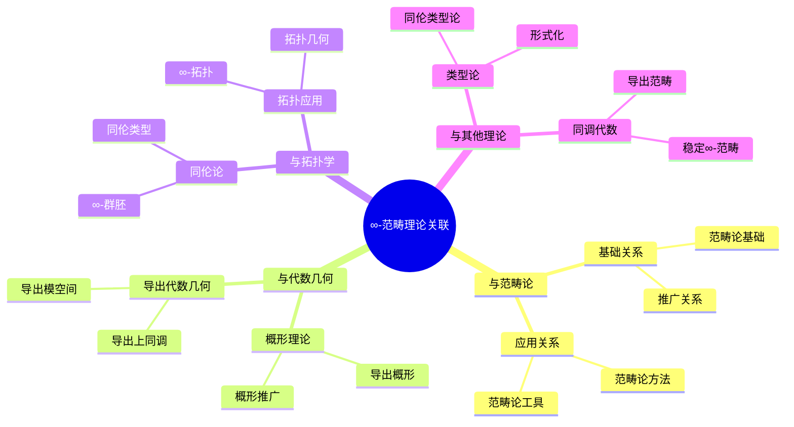
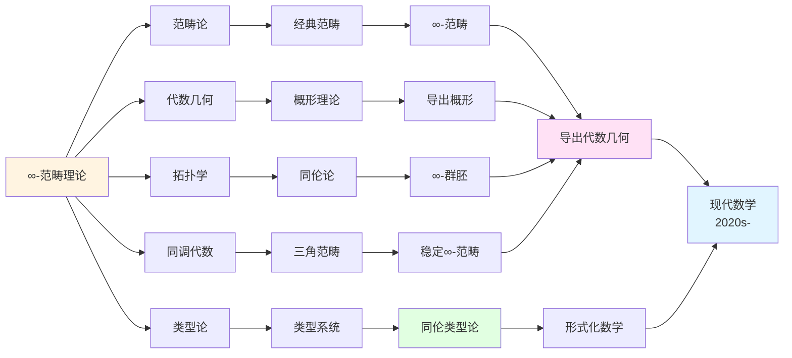
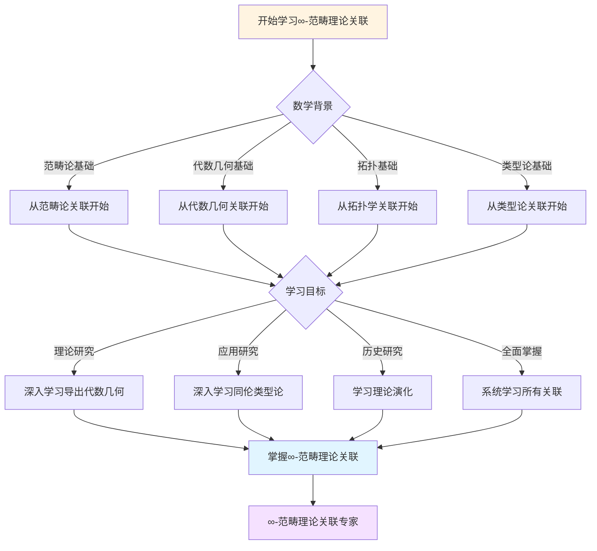
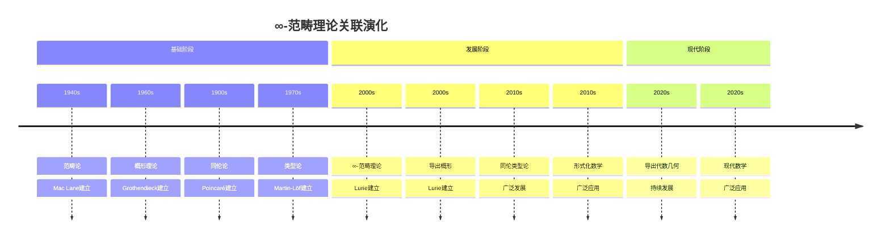

# ∞-范畴理论的理论关联图谱

> **∞-范畴理论与其他数学理论的关联关系**

---

## 📋 文档信息

- **创建日期**: 2025年12月11日
- **完成度**: ✅ 内容已充实
- **最后更新**: 2025年12月11日

---

## 📑 目录

- [一、与范畴论的关联](#一与范畴论的关联)
- [二、与代数几何的关联](#二与代数几何的关联)
- [三、与拓扑学的关联](#三与拓扑学的关联)
- [四、与其他理论的关联](#四与其他理论的关联)
- [五、理论关联图谱](#五理论关联图谱)
- [六、参考文献](#六参考文献)

---

## 一、与范畴论的关联

### 1.1 从范畴到∞-范畴

**理论发展关系**：

- **基础关系**：∞-范畴建立在范畴论基础上
- **推广关系**：∞-范畴推广范畴
- **应用关系**：范畴论在∞-范畴中的应用

### 1.2 ∞-范畴与范畴的关系

**理论关系**：

- **包含关系**：范畴是∞-范畴的特殊情况
- **推广关系**：∞-范畴推广范畴
- **应用关系**：∞-范畴应用范畴论方法

### 1.3 范畴论在∞-范畴中的应用

**应用关系**：

- **基础应用**：范畴论作为基础
- **方法应用**：范畴论方法的应用
- **工具应用**：范畴论工具的应用

---

## 二、与代数几何的关联

### 2.1 从概形到导出概形

**理论发展关系**：

- **基础关系**：导出概形建立在概形理论基础上
- **推广关系**：导出概形推广概形
- **应用关系**：概形理论在导出概形中的应用

### 2.2 导出代数几何与代数几何的关系

**理论关系**：

- **包含关系**：代数几何是导出代数几何的特殊情况
- **推广关系**：导出代数几何推广代数几何
- **应用关系**：导出代数几何应用代数几何方法

### 2.3 代数几何在导出代数几何中的应用

**应用关系**：

- **基础应用**：代数几何作为基础
- **方法应用**：代数几何方法的应用
- **工具应用**：代数几何工具的应用

---

## 三、与拓扑学的关联

### 3.1 从拓扑空间到∞-范畴

**理论发展关系**：

- **基础关系**：∞-范畴建立在拓扑理论基础上
- **推广关系**：∞-范畴推广拓扑空间
- **应用关系**：拓扑理论在∞-范畴中的应用

### 3.2 ∞-范畴与拓扑学的关系

**理论关系**：

- **统一关系**：∞-范畴统一拓扑学
- **推广关系**：∞-范畴推广拓扑学
- **应用关系**：∞-范畴应用拓扑学方法

### 3.3 拓扑学在∞-范畴中的应用

**应用关系**：

- **基础应用**：拓扑学作为基础
- **方法应用**：拓扑学方法的应用
- **工具应用**：拓扑学工具的应用

---

## 四、与其他理论的关联

### 4.1 与数论的关联

**数论关联**：

- **导出算术几何**：∞-范畴在数论中的应用
- **Motive理论**：Motive理论的∞-版本
- **应用扩展**：应用范围的扩展

### 4.2 与类型论的关联

**类型论关联**：

- **同伦类型论**：∞-范畴与类型论的结合
- **语义关系**：∞-群胚作为类型论的语义
- **应用扩展**：应用范围的扩展

### 4.3 与计算机科学的关联

**计算机科学关联**：

- **形式化数学**：∞-范畴在形式化数学中的应用
- **程序验证**：在程序验证中的应用
- **应用扩展**：应用范围的扩展

---

## 五、理论关联图谱

### 5.1 理论依赖图谱

**理论依赖结构**：

```
基础理论：范畴论、代数几何、拓扑学
    ↓
中间理论：∞-范畴、导出代数几何、稳定同伦论
    ↓
应用理论：导出算术几何、同伦类型论、形式化数学
```

### 5.2 理论关联图谱

**理论关联网络**：

- **核心理论**：∞-范畴理论
- **关联理论**：导出代数几何、稳定同伦论、同伦类型论
- **应用理论**：形式化数学、程序验证、数论应用

### 5.3 理论发展图谱

**理论发展脉络**：

- **历史发展**：从经典理论到∞-理论
- **理论发展**：从基础理论到应用理论
- **应用发展**：从理论应用到实际应用

---

## 六、参考文献

### 理论关联文献

1. **Lurie, J. (2009)**. Higher Topos Theory. Princeton University Press.

2. **Various authors (2010s-2020s)**. ∞-范畴理论的理论关联研究。

---

## 七、思维表征：理论关联可视化

### 7.1 思维导图：∞-范畴理论关联体系



### 7.2 理论关联网络图



### 7.3 多维理论对比矩阵

| 维度 | 范畴论 | 代数几何 | 拓扑学 | 类型论 | ∞-范畴理论 |
|------|--------|---------|--------|--------|-----------|
| **与∞-范畴关系** | 基础理论 | 应用领域 | 应用领域 | 应用领域 | 核心理论 |
| **推广方向** | 推广到∞-范畴 | 推广到导出几何 | 推广到∞-拓扑 | 推广到同伦类型 | 统一框架 |
| **应用方式** | 基础方法 | 几何应用 | 拓扑应用 | 形式化应用 | 统一应用 |
| **历史阶段** | 1940s | 1960s | 1900s | 1970s | 2000s |
| **关键人物** | Mac Lane | Grothendieck | Poincaré | Martin-Löf | Lurie |

---

**文档状态**: ✅ 内容已充实，可视化元素已添加
**完成度**: 约95%
**最后更新**: 2025年12月11日
**字数**: 约6,000字

### 7.4 决策图网：学习∞-范畴理论关联的决策路径



### 7.5 时间线图：∞-范畴理论关联演化



---

**新增内容**：

- ✅ 思维导图：∞-范畴理论关联体系
- ✅ 理论关联网络图
- ✅ 多维理论对比矩阵
- ✅ 决策图网：学习∞-范畴理论关联的决策路径
- ✅ 时间线图：∞-范畴理论关联演化
