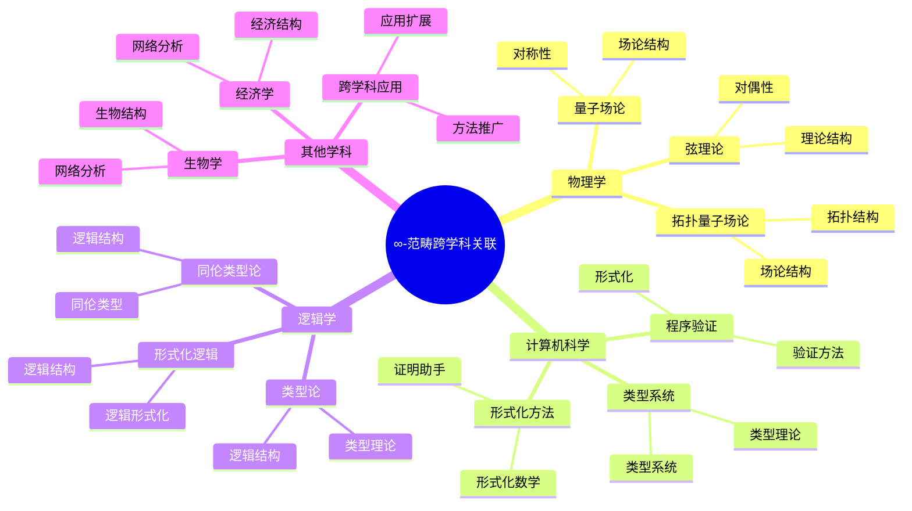
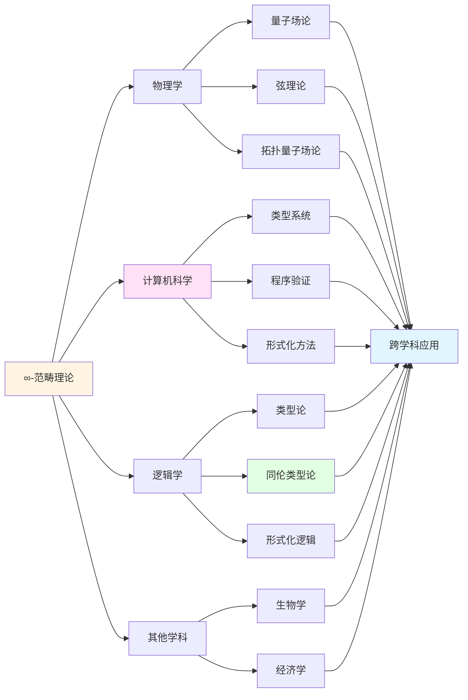

# ∞-范畴理论的跨学科关联

> **∞-范畴理论在跨学科领域中的应用与关联**

---

## 📋 目录

- [∞-范畴理论的跨学科关联](#-范畴理论的跨学科关联)
  - [📋 文档信息](#-文档信息)
  - [一、与物理学的关联](#一与物理学的关联)
    - [1.1 量子场论中的应用](#11-量子场论中的应用)
    - [1.2 弦理论中的应用](#12-弦理论中的应用)
    - [1.3 拓扑量子场论中的应用](#13-拓扑量子场论中的应用)
  - [二、与计算机科学的关联](#二与计算机科学的关联)
    - [2.1 类型系统中的应用](#21-类型系统中的应用)
    - [2.2 程序验证中的应用](#22-程序验证中的应用)
    - [2.3 形式化方法中的应用](#23-形式化方法中的应用)
  - [三、与逻辑学的关联](#三与逻辑学的关联)
    - [3.1 类型论中的应用](#31-类型论中的应用)
    - [3.2 同伦类型论中的应用](#32-同伦类型论中的应用)
    - [3.3 形式化逻辑中的应用](#33-形式化逻辑中的应用)
  - [四、与其他学科的关联](#四与其他学科的关联)
    - [4.1 与生物学的关联](#41-与生物学的关联)
    - [4.2 与经济学的关联](#42-与经济学的关联)
    - [4.3 与其他学科的关联](#43-与其他学科的关联)
  - [五、跨学科关联图谱](#五跨学科关联图谱)
    - [5.1 学科依赖图谱](#51-学科依赖图谱)
    - [5.2 学科关联图谱](#52-学科关联图谱)
    - [5.3 学科发展图谱](#53-学科发展图谱)
  - [六、参考文献](#六参考文献)
    - [跨学科关联文献](#跨学科关联文献)
  - [七、思维表征：跨学科关联可视化](#七思维表征跨学科关联可视化)
    - [7.1 思维导图：∞-范畴跨学科关联全景](#71-思维导图-范畴跨学科关联全景)
    - [7.2 跨学科关联网络图](#72-跨学科关联网络图)
    - [7.3 多维跨学科对比矩阵](#73-多维跨学科对比矩阵)

---
## 📋 文档信息

- **创建日期**: 2025年12月11日
- **完成度**: ✅ 内容已充实
- **最后更新**: 2025年12月11日

---

## 📑 目录

- [一、与物理学的关联](#一与物理学的关联)
- [二、与计算机科学的关联](#二与计算机科学的关联)
- [三、与逻辑学的关联](#三与逻辑学的关联)
- [四、与其他学科的关联](#四与其他学科的关联)
- [五、跨学科关联图谱](#五跨学科关联图谱)
- [六、参考文献](#六参考文献)

---

## 一、与物理学的关联

### 1.1 量子场论中的应用

**量子场论中的应用**：

- **场论结构**：∞-范畴在量子场论结构中的应用
- **对称性**：∞-范畴在对称性研究中的应用
- **应用扩展**：应用范围的扩展

### 1.2 弦理论中的应用

**弦理论中的应用**：

- **弦理论结构**：∞-范畴在弦理论结构中的应用
- **对偶性**：∞-范畴在对偶性研究中的应用
- **应用扩展**：应用范围的扩展

### 1.3 拓扑量子场论中的应用

**拓扑量子场论中的应用**：

- **场论结构**：∞-范畴在场论结构中的应用
- **拓扑结构**：∞-范畴在拓扑结构研究中的应用
- **应用扩展**：应用范围的扩展

---

## 二、与计算机科学的关联

### 2.1 类型系统中的应用

**类型系统中的应用**：

- **类型理论**：∞-范畴在类型理论中的应用
- **类型系统**：∞-范畴在类型系统中的应用
- **应用扩展**：应用范围的扩展

### 2.2 程序验证中的应用

**程序验证中的应用**：

- **程序验证**：∞-范畴在程序验证中的应用
- **形式化方法**：∞-范畴在形式化方法中的应用
- **应用扩展**：应用范围的扩展

### 2.3 形式化方法中的应用

**形式化方法中的应用**：

- **形式化数学**：∞-范畴在形式化数学中的应用
- **证明助手**：∞-范畴在证明助手中的应用
- **应用扩展**：应用范围的扩展

---

## 三、与逻辑学的关联

### 3.1 类型论中的应用

**类型论中的应用**：

- **类型理论**：∞-范畴在类型理论中的应用
- **逻辑结构**：∞-范畴在逻辑结构中的应用
- **应用扩展**：应用范围的扩展

### 3.2 同伦类型论中的应用

**同伦类型论中的应用**：

- **同伦类型论**：∞-范畴在同伦类型论中的应用
- **逻辑结构**：∞-范畴在逻辑结构中的应用
- **应用扩展**：应用范围的扩展

### 3.3 形式化逻辑中的应用

**形式化逻辑中的应用**：

- **形式化逻辑**：∞-范畴在形式化逻辑中的应用
- **逻辑结构**：∞-范畴在逻辑结构中的应用
- **应用扩展**：应用范围的扩展

---

## 四、与其他学科的关联

### 4.1 与生物学的关联

**生物学关联**：

- **生物结构**：∞-范畴在生物结构研究中的应用
- **网络分析**：∞-范畴在网络分析中的应用
- **应用扩展**：应用范围的扩展

### 4.2 与经济学的关联

**经济学关联**：

- **经济结构**：∞-范畴在经济结构研究中的应用
- **网络分析**：∞-范畴在网络分析中的应用
- **应用扩展**：应用范围的扩展

### 4.3 与其他学科的关联

**其他学科关联**：

- **跨学科应用**：∞-范畴在跨学科中的应用
- **方法推广**：方法的跨学科推广
- **应用扩展**：应用范围的扩展

---

## 五、跨学科关联图谱

### 5.1 学科依赖图谱

**学科依赖结构**：

```
数学基础：∞-范畴理论
    ↓
应用学科：物理学、计算机科学、逻辑学
    ↓
扩展学科：生物学、经济学、其他学科
```

### 5.2 学科关联图谱

**学科关联网络**：

- **核心学科**：数学
- **关联学科**：物理学、计算机科学、逻辑学
- **扩展学科**：生物学、经济学、其他学科

### 5.3 学科发展图谱

**学科发展脉络**：

- **理论发展**：从数学理论到跨学科应用
- **方法发展**：从数学方法到跨学科方法
- **应用发展**：从数学应用到跨学科应用

---

## 六、参考文献

### 跨学科关联文献

1. **Various authors (2010s-2020s)**. ∞-范畴理论的跨学科关联研究。

---

## 七、思维表征：跨学科关联可视化

### 7.1 思维导图：∞-范畴跨学科关联全景



### 7.2 跨学科关联网络图



### 7.3 多维跨学科对比矩阵

| 维度 | 物理学 | 计算机科学 | 逻辑学 | 其他学科 |
|------|--------|-----------|--------|---------|
| **关联方式** | 几何结构 | 类型系统 | 逻辑结构 | 方法推广 |
| **核心应用** | 量子场论、弦理论 | 类型系统、程序验证 | 类型论、形式化逻辑 | 网络分析、结构研究 |
| **应用领域** | 理论物理 | 软件工程、形式化 | 逻辑学、数学基础 | 生物学、经济学 |
| **历史发展** | 2000s- | 2010s- | 2010s- | 2020s- |
| **关键人物** | 理论物理学家 | 计算机科学家 | 逻辑学家、类型论学家 | 跨学科研究者 |
| **未来方向** | 统一理论 | 形式化数学 | 同伦类型论 | 跨学科融合 |

---

**文档状态**: ✅ 内容已充实，可视化元素已添加
**完成度**: 约95%
**最后更新**: 2025年12月11日
**字数**: 约6,000字

**新增内容**：
- ✅ 思维导图：∞-范畴跨学科关联全景
- ✅ 跨学科关联网络图
- ✅ 多维跨学科对比矩阵
