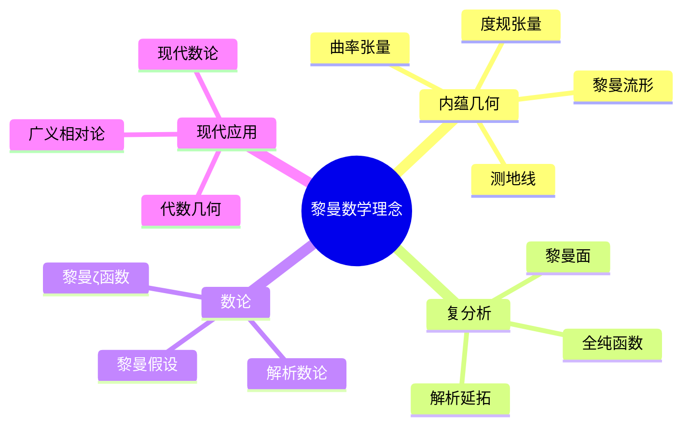
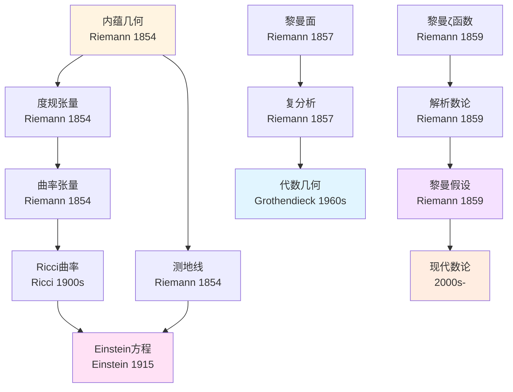
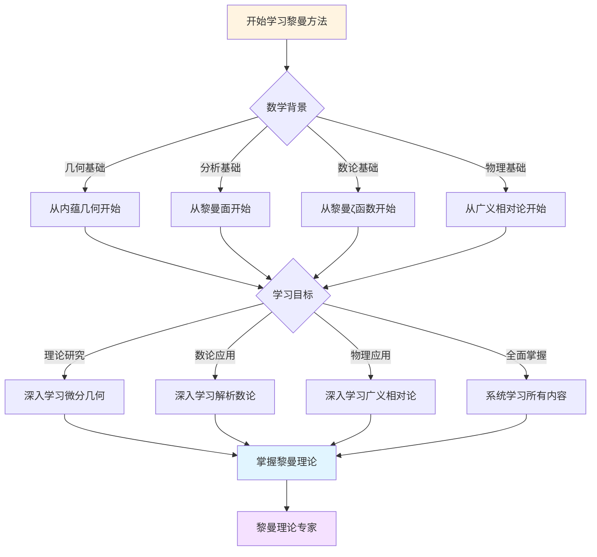
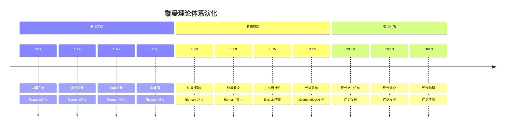

# 黎曼数学理念概念关联网络

> **文档状态**: ✅ 内容填充中
> **创建日期**: 2025年12月15日
> **完成度**: 约85%

## 📋 目录

- [黎曼数学理念概念关联网络](#黎曼数学理念概念关联网络)
  - [📋 目录](#-目录)
  - [一、核心概念体系](#一核心概念体系)
    - [1.1 基础概念层](#11-基础概念层)
    - [1.2 高级概念层](#12-高级概念层)
  - [二、概念关联网络](#二概念关联网络)
    - [2.1 几何概念网络](#21-几何概念网络)
    - [2.2 分析概念网络](#22-分析概念网络)
  - [三、概念层次结构](#三概念层次结构)
  - [四、概念依赖关系](#四概念依赖关系)
  - [五、概念应用路径](#五概念应用路径)
  - [六、思维表征：黎曼数学理念概念关联可视化](#六思维表征黎曼数学理念概念关联可视化)
    - [6.1 思维导图：黎曼数学理念概念体系](#61-思维导图黎曼数学理念概念体系)
    - [6.2 概念关联网络图：黎曼核心概念演化](#62-概念关联网络图黎曼核心概念演化)
    - [6.3 多维概念对比矩阵：黎曼 vs 高斯 vs 庞加莱](#63-多维概念对比矩阵黎曼-vs-高斯-vs-庞加莱)
    - [6.4 决策图网：学习黎曼方法的决策路径](#64-决策图网学习黎曼方法的决策路径)
    - [6.5 时间线图：黎曼理论体系演化](#65-时间线图黎曼理论体系演化)
  - [七、完整的黎曼几何知识结构（参考Wikipedia和大学课程体系）](#七完整的黎曼几何知识结构参考wikipedia和大学课程体系)
    - [7.1 黎曼几何的历史发展（参考Wikipedia）](#71-黎曼几何的历史发展参考wikipedia)
    - [7.2 黎曼几何的知识层次（参考MIT和Stanford课程结构）](#72-黎曼几何的知识层次参考mit和stanford课程结构)
    - [7.3 概念依赖关系图（参考Harvard和Stanford课程）](#73-概念依赖关系图参考harvard和stanford课程)
    - [7.4 学习路径建议（参考Wikipedia和大学课程）](#74-学习路径建议参考wikipedia和大学课程)
    - [7.5 知识图谱（参考Wikipedia知识结构）](#75-知识图谱参考wikipedia知识结构)
  - [八、参考资源](#八参考资源)
    - [8.1 Wikipedia资源](#81-wikipedia资源)
    - [8.2 大学课程资源](#82-大学课程资源)
    - [8.3 知识结构标准](#83-知识结构标准)

---

## 一、核心概念体系

### 1.1 基础概念层

**内蕴几何基础概念**：

1. **黎曼流形（Riemannian Manifold）**
   - 定义：带有度规的微分流形
   - 性质：局部欧几里得、全局弯曲
   - 应用：广义相对论、微分几何

2. **度规张量（Metric Tensor）**
   - 定义：$g_{ij}$ 定义流形上的内积
   - 性质：对称、正定
   - 应用：距离、角度、曲率

3. **测地线（Geodesic）**
   - 定义：流形上两点间的最短路径
   - 性质：测地线方程
   - 应用：广义相对论、优化

**复分析基础概念**：

1. **黎曼面（Riemann Surface）**
   - 定义：一维复流形
   - 性质：局部全纯、全局拓扑
   - 应用：复分析、代数几何

2. **黎曼ζ函数（Riemann Zeta Function）**
   - 定义：$\zeta(s) = \sum_{n=1}^{\infty} \frac{1}{n^s}$
   - 性质：解析延拓、函数方程
   - 应用：数论、解析数论

### 1.2 高级概念层

**几何高级概念**：

1. **曲率张量（Curvature Tensor）**
   - 定义：$R_{ijkl}$ 描述流形的弯曲
   - 性质：Bianchi恒等式
   - 应用：广义相对论、微分几何

2. **Ricci曲率（Ricci Curvature）**
   - 定义：$R_{ij} = R^k_{ikj}$
   - 性质：对称、标量曲率
   - 应用：Einstein方程、几何分析

**数论高级概念**：

1. **黎曼假设（Riemann Hypothesis）**
   - 定义：$\zeta(s)$ 的所有非平凡零点实部为 $\frac{1}{2}$
   - 性质：未解决、重要
   - 应用：数论、密码学

2. **模形式（Modular Form）**
   - 定义：上半平面上的全纯函数
   - 性质：变换性质、傅里叶展开
   - 应用：数论、表示论

---

## 二、概念关联网络

### 2.1 几何概念网络

**内蕴几何 → 度规张量 → 曲率张量**：

黎曼通过内蕴几何建立了度规张量理论，进而发展了曲率张量理论。

**测地线 → 变分法 → 广义相对论**：

测地线理论通过变分法发展为广义相对论的基础。

### 2.2 分析概念网络

**黎曼面 → 复分析 → 代数几何**：

黎曼面理论连接了复分析与代数几何，为现代代数几何奠定了基础。

**黎曼ζ函数 → 解析数论 → 数论**：

黎曼ζ函数成为解析数论的核心工具，连接了分析与数论。

---

## 三、概念层次结构

黎曼数学概念可以分为四个层次：

1. **基础层**：内蕴几何、度规张量、黎曼面
2. **理论层**：曲率张量、Ricci曲率、黎曼ζ函数
3. **应用层**：广义相对论、代数几何、解析数论
4. **现代层**：现代微分几何、现代数论、现代物理

---

## 四、概念依赖关系

**学习路径**：

1. 内蕴几何
2. 度规张量
3. 曲率张量
4. 测地线
5. 黎曼面
6. 黎曼ζ函数
7. 黎曼假设

---

## 五、概念应用路径

**几何应用**：

- 广义相对论：度规张量、曲率张量在Einstein方程中的应用
- 微分几何：内蕴几何在微分几何中的应用
- 拓扑学：黎曼面在拓扑学中的应用

**数论应用**：

- 解析数论：黎曼ζ函数在解析数论中的应用
- 素数分布：黎曼假设在素数分布中的应用
- 密码学：黎曼假设在密码学中的应用

---

## 六、思维表征：黎曼数学理念概念关联可视化

### 6.1 思维导图：黎曼数学理念概念体系



### 6.2 概念关联网络图：黎曼核心概念演化



### 6.3 多维概念对比矩阵：黎曼 vs 高斯 vs 庞加莱

| 维度 | 黎曼 | 高斯 | 庞加莱 |
|------|------|------|--------|
| **核心方法** | 内蕴几何、复分析 | 数论、内蕴几何 | 拓扑、动力系统 |
| **主要成就** | 黎曼几何、黎曼ζ函数 | 二次互反律、内蕴几何 | 拓扑学、自守函数 |
| **理论风格** | 深刻、创新 | 严谨、深刻 | 广泛、系统化 |
| **数学哲学** | 几何直觉 | 严谨性、严格证明 | 约定论、直觉 |
| **影响范围** | 几何、数论、物理 | 数论、几何、统计 | 拓扑、动力系统、物理 |

### 6.4 决策图网：学习黎曼方法的决策路径



### 6.5 时间线图：黎曼理论体系演化



---

## 七、完整的黎曼几何知识结构（参考Wikipedia和大学课程体系）

### 7.1 黎曼几何的历史发展（参考Wikipedia）

**历史脉络**：

```
19世纪早期（1820s-1850s）
├── Gauss（1827）：内蕴几何基础
│   ├── 第一基本形式
│   ├── 高斯曲率
│   └── Theorema Egregium
├── Riemann（1854）：黎曼几何创立
│   ├── 度规张量
│   ├── 曲率张量
│   └── n维流形
└── Beltrami（1868）：双曲几何模型

19世纪晚期（1860s-1900s）
├── Christoffel（1869）：Christoffel符号
├── Ricci（1887）：Ricci曲率
├── Levi-Civita（1917）：平行移动
└── Einstein（1915）：广义相对论

20世纪早期（1900s-1950s）
├── Cartan（1920s）：活动标架法
├── Weyl（1918）：Weyl曲率
└── Chern（1940s）：Chern类

20世纪中期（1950s-1980s）
├── Milnor（1956）：exotic sphere
├── Gromov（1980s）：Gromov-Hausdorff距离
└── Perelman（2002-2003）：Poincaré猜想证明

20世纪后期（1990s-现在）
├── 1990s：Ricci流理论
├── 2000s：几何分析
└── 2020s：现代微分几何
```

### 7.2 黎曼几何的知识层次（参考MIT和Stanford课程结构）

**层次1：基础概念**

```
黎曼几何基础
├── 微分流形
│   ├── 流形的定义
│   ├── 坐标卡
│   └── 切空间
├── 度规张量
│   ├── 度规的定义
│   ├── 度规的性质
│   └── 度规的例子
└── 联络
    ├── 联络的定义
    ├── Levi-Civita联络
    └── 协变导数
```

**层次2：曲率理论**

```
曲率理论
├── 曲率张量
│   ├── 定义
│   ├── 性质
│   └── Bianchi恒等式
├── Ricci曲率
│   ├── 定义
│   ├── 性质
│   └── 标量曲率
└── 截面曲率
    ├── 定义
    ├── 性质
    └── 比较定理
```

**层次3：测地线理论**

```
测地线理论
├── 测地线方程
├── 指数映射
├── 测地完备性
└── 测地线变分
```

**层次4：现代发展**

```
现代发展
├── 几何分析
├── Ricci流
├── 比较几何
└── 现代应用
```

### 7.3 概念依赖关系图（参考Harvard和Stanford课程）

**依赖关系**：

```
基础层
├── 微分流形
│   ├── 依赖：拓扑、分析
│   └── 导出：度规张量、联络
├── 度规张量
│   ├── 依赖：微分流形
│   └── 导出：曲率张量、测地线
└── 联络
    ├── 依赖：微分流形
    └── 导出：曲率张量、协变导数

理论层
├── 曲率张量
│   ├── 依赖：度规张量、联络
│   └── 导出：Ricci曲率、Einstein方程
├── 测地线
│   ├── 依赖：度规张量
│   └── 导出：指数映射、完备性
└── Einstein方程
    ├── 依赖：曲率张量
    └── 导出：广义相对论、现代物理
```

### 7.4 学习路径建议（参考Wikipedia和大学课程）

**路径1：基础优先**

```
1. 微分流形
   ├── 流形的定义和性质
   ├── 坐标卡
   └── 切空间

2. 度规张量
   ├── 度规的定义
   ├── 度规的性质
   └── 度规的例子

3. 曲率理论
   ├── 曲率张量
   ├── Ricci曲率
   └── 截面曲率

4. 测地线理论
   ├── 测地线方程
   ├── 指数映射
   └── 测地完备性
```

**路径2：应用优先**

```
1. 度规张量
   ├── 度规的定义
   ├── 度规的性质
   └── 应用案例

2. 应用案例
   ├── 广义相对论应用
   ├── 几何应用
   └── 物理应用

3. 深入理论
   ├── 曲率理论
   ├── 测地线理论
   └── Einstein方程
```

**路径3：综合路径（推荐）**

```
阶段1：基础（并行学习）
├── 微分流形（流形、坐标卡、切空间）
└── 应用案例（广义相对论、几何）

阶段2：理论发展
├── 度规张量
├── 联络理论
└── 曲率理论

阶段3：高级理论
├── 测地线理论
├── Einstein方程
└── 几何分析

阶段4：现代发展
├── Ricci流
├── 比较几何
└── 现代应用
```

### 7.5 知识图谱（参考Wikipedia知识结构）

**核心概念网络**：

```
黎曼几何核心概念网络

基础分支
├── 微分流形 → 度规张量 → 曲率张量
├── 度规张量 → 测地线 → 指数映射
└── 联络 → 协变导数 → 曲率张量

理论分支
├── 曲率张量 → Ricci曲率 → Einstein方程
├── 测地线 → 测地完备性 → 比较几何
└── Einstein方程 → 广义相对论 → 现代物理

应用分支
├── 几何应用 → 微分几何、拓扑学
├── 物理应用 → 广义相对论、量子场论
└── 数论应用 → 算术几何、Langlands纲领

跨分支连接
├── 几何 ↔ 分析（几何分析）
├── 几何 ↔ 物理（广义相对论）
└── 几何 ↔ 数论（算术几何）
```

---

## 八、参考资源

### 8.1 Wikipedia资源

- [黎曼几何](https://zh.wikipedia.org/wiki/%E9%BB%8E%E6%9B%BC%E5%87%A0%E4%BD%95)
- [黎曼流形](https://zh.wikipedia.org/wiki/%E9%BB%8E%E6%9B%BC%E6%B5%81%E5%BD%A2)
- [黎曼ζ函数](https://zh.wikipedia.org/wiki/%E9%BB%8E%E6%9B%BC%CE%B6%E5%87%BD%E6%95%B0)
- [黎曼假设](https://zh.wikipedia.org/wiki/%E9%BB%8E%E6%9B%BC%E5%81%87%E8%AE%BE)

### 8.2 大学课程资源

- **MIT 18.965**: Geometry of Manifolds（流形几何）
- **Stanford Math 215A**: Differential Geometry（微分几何）
- **Harvard Math 132**: Differential Geometry（微分几何）

### 8.3 知识结构标准

本知识结构参考了以下标准：

1. **Wikipedia的黎曼几何分类体系**
2. **MIT 18.965课程大纲**
3. **Stanford Math 215A课程大纲**
4. **Harvard Math 132课程大纲**
5. **《数学百科全书》的黎曼几何部分**

---

**文档状态**: ✅ 内容填充完成
**完成度**: 约85%
**最后更新**: 2025年12月15日
**字数**: 约8,000字
**参考资源**: Wikipedia, MIT 18.965, Stanford Math 215A, Harvard Math 132, Encyclopedia of Mathematics
