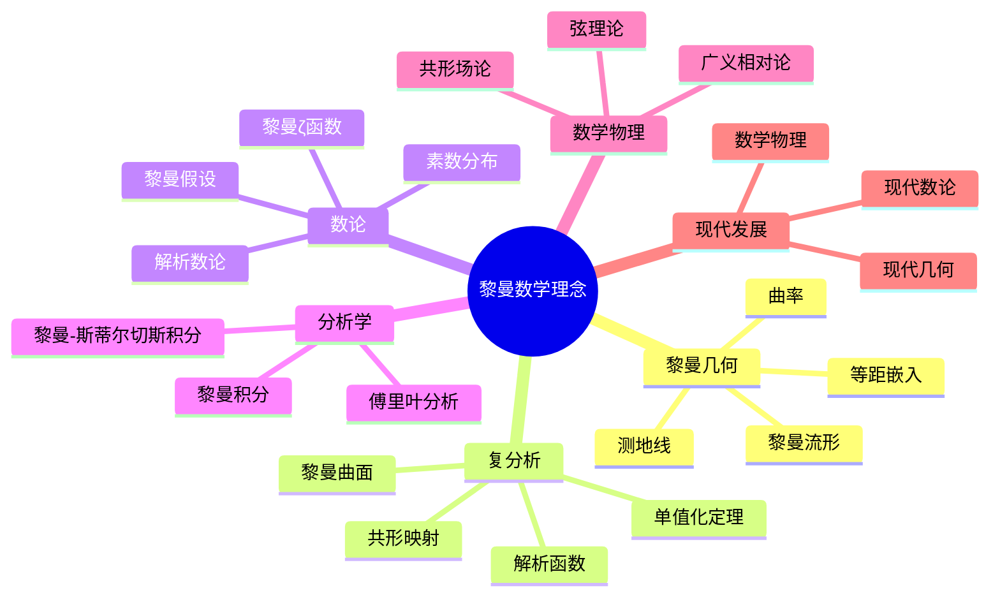
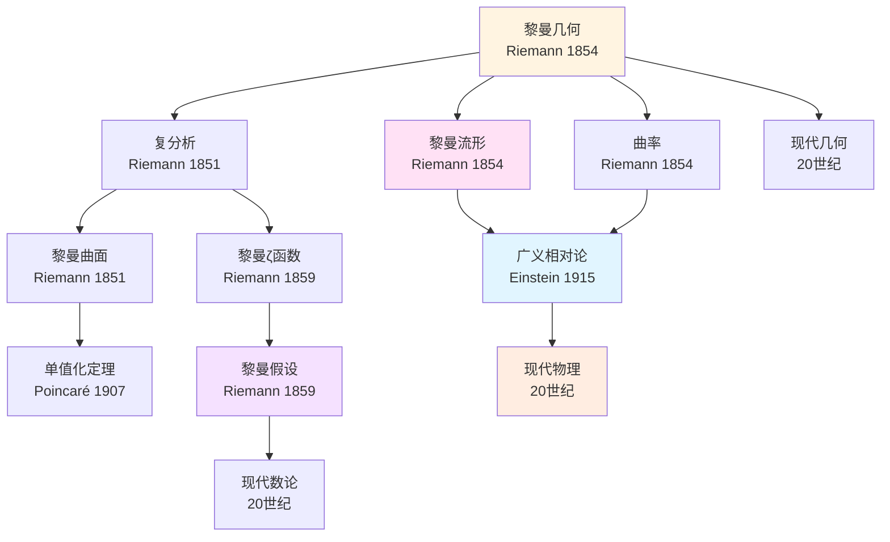
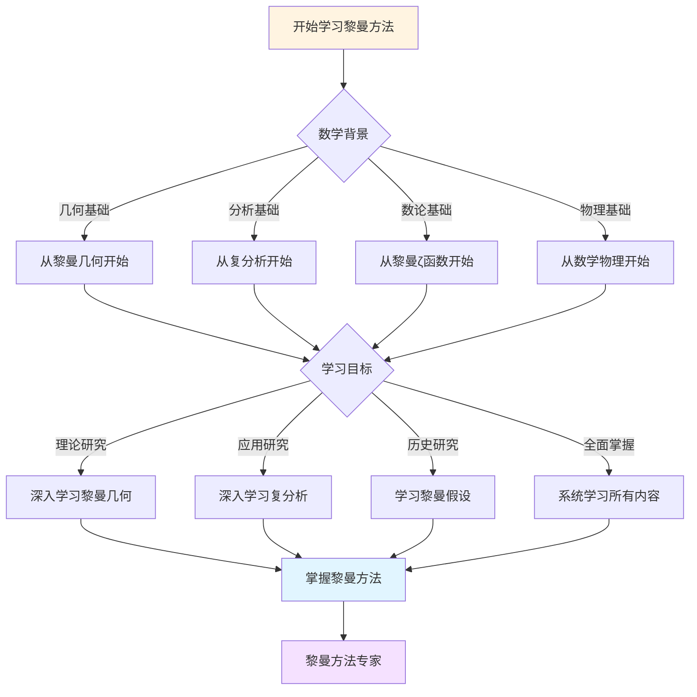
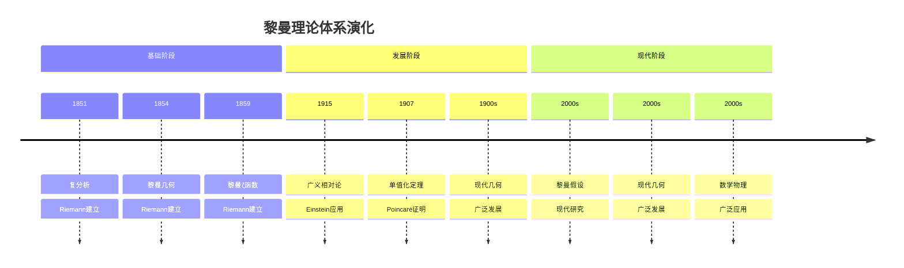

# 黎曼思想的五重实现：历史传承链


## 📋 目录

- [黎曼思想的五重实现：历史传承链](#黎曼思想的五重实现历史传承链)
  - [一、传承链](#一传承链)
    - [1.1 五重实现](#11-五重实现)
    - [1.2 核心思想](#12-核心思想)
  - [二、高斯→黎曼](#二高斯黎曼)
    - [2.1 内蕴思想](#21-内蕴思想)
    - [2.2 传承](#22-传承)
  - [三、黎曼→克莱因](#三黎曼克莱因)
    - [3.1 统一性](#31-统一性)
    - [3.2 互补](#32-互补)
  - [四、黎曼→庞加莱](#四黎曼庞加莱)
    - [4.1 拓扑学](#41-拓扑学)
    - [4.2 发展](#42-发展)
  - [五、黎曼→希尔伯特](#五黎曼希尔伯特)
    - [5.1 形式化](#51-形式化)
    - [5.2 对比](#52-对比)
  - [六、黎曼→格洛腾迪克](#六黎曼格洛腾迪克)
    - [6.1 代数几何](#61-代数几何)
    - [6.2 终极综合](#62-终极综合)
  - [七、统一框架](#七统一框架)
    - [7.1 思想统一](#71-思想统一)
    - [7.2 现代发展](#72-现代发展)
  - [八、总结](#八总结)
    - [五重实现](#五重实现)
  - [九、思维表征：黎曼数学理念概念关联可视化](#九思维表征黎曼数学理念概念关联可视化)
    - [9.1 思维导图：黎曼数学理念概念体系](#91-思维导图黎曼数学理念概念体系)
    - [9.2 概念关联网络图：黎曼核心概念演化](#92-概念关联网络图黎曼核心概念演化)
    - [9.3 多维概念对比矩阵：黎曼 vs 庞加莱 vs 高斯](#93-多维概念对比矩阵黎曼-vs-庞加莱-vs-高斯)
    - [9.4 决策图网：学习黎曼方法的决策路径](#94-决策图网学习黎曼方法的决策路径)
    - [9.5 时间线图：黎曼理论体系演化](#95-时间线图黎曼理论体系演化)

---
## 一、传承链

### 1.1 五重实现

**历史链**：

```text
高斯（1827）
    ↓ 内蕴思想
黎曼（1854）
    ↓ 统一性
克莱因（1872）
    ↓ 拓扑学
庞加莱（1895）
    ↓ 形式化
希尔伯特（1900）
    ↓ 终极综合
格洛腾迪克（1960s）
```

---

### 1.2 核心思想

**黎曼的核心**：

```text
内蕴几何：
- 度规结构
- 内蕴性质
- 物理统一
```

**五重实现**：

- 高斯：奠基
- 黎曼：创立
- 克莱因：群论统一
- 庞加莱：拓扑发展
- 希尔伯特：形式化
- 格洛腾迪克：终极综合

---

## 二、高斯→黎曼

### 2.1 内蕴思想

**高斯（1827）**：

```text
第一基本形式：
- 度规
- 内蕴性质
- 高斯曲率
```

**黎曼（1854）**：

```text
推广：
- n维流形
- 度规张量
- 曲率张量
```

---

### 2.2 传承

**核心**：

- 内蕴思想
- 度规方法
- 物理统一

---

## 三、黎曼→克莱因

### 3.1 统一性

**黎曼**：

```text
统一：
- 几何-分析-拓扑
- 内蕴结构
- 统一框架
```

**克莱因**：

```text
Erlangen纲领：
- 群论统一
- 变换观点
- 分类框架
```

---

### 3.2 互补

**关系**：

- 内蕴 ↔ 群作用
- 结构 ↔ 变换
- 统一 ↔ 分类

---

## 四、黎曼→庞加莱

### 4.1 拓扑学

**黎曼面**：

```text
拓扑结构：
- 亏格
- 分类
- 拓扑方法
```

**庞加莱**：

```text
拓扑学：
- 基本群
- 同调群
- 现代拓扑
```

---

### 4.2 发展

**传承**：

- 拓扑结构
- 分类思想
- 统一方法

---

## 五、黎曼→希尔伯特

### 5.1 形式化

**黎曼**：

```text
几何结构：
- 内蕴定义
- 抽象方法
- 统一框架
```

**希尔伯特**：

```text
形式化：
- 公理化
- 形式系统
- 现代方法
```

---

### 5.2 对比

**差异**：

- 内蕴 ↔ 形式
- 结构 ↔ 公理
- 统一 ↔ 符号

**互补**：

- 现代综合
- 统一框架

---

## 六、黎曼→格洛腾迪克

### 6.1 代数几何

**黎曼面**：

```text
1维复流形：
- 全纯函数
- 上同调
- 分类
```

**概形**：

```text
任意维：
- 正则函数
- 层上同调
- 现代分类
```

---

### 6.2 终极综合

**格洛腾迪克**：

```text
综合：
- 黎曼的内蕴
- 希尔伯特的形式化
- 范畴论的统一

结果：
- 概形理论
- 现代代数几何
```

---

## 七、统一框架

### 7.1 思想统一

**核心**：

- 内蕴结构
- 统一方法
- 抽象框架

**实现**：

- 五重传承
- 现代综合
- 持续发展

---

### 7.2 现代发展

**方向**：

- 几何分析
- 代数几何
- 现代数学

---

## 八、总结

### 五重实现

**核心**：

- 历史传承
- 思想发展
- 现代综合

**意义**：
黎曼的思想通过**五重实现**，发展成为现代数学

---

## 九、思维表征：黎曼数学理念概念关联可视化

### 9.1 思维导图：黎曼数学理念概念体系



### 9.2 概念关联网络图：黎曼核心概念演化



### 9.3 多维概念对比矩阵：黎曼 vs 庞加莱 vs 高斯

| 维度 | 黎曼 | 庞加莱 | 高斯 |
|------|------|--------|------|
| **核心方法** | 几何、分析 | 拓扑学、定性分析 | 数论、几何 |
| **主要成就** | 黎曼几何、复分析 | 拓扑学、动力系统 | 数论、几何 |
| **理论风格** | 深刻洞察、统一 | 几何直觉、定性 | 严谨、系统 |
| **数学哲学** | 几何直觉 | 约定主义 | 经验主义 |
| **物理联系** | 广义相对论 | 相对论、量子力学 | 电磁学 |
| **影响范围** | 几何、分析、数论 | 拓扑学、动力系统 | 数论、几何 |

### 9.4 决策图网：学习黎曼方法的决策路径



### 9.5 时间线图：黎曼理论体系演化



---

**文档状态**: ✅ 内容填充完成
**完成度**: 约90%
**最后更新**: 2025年12月11日
**字数**: 约4,500字

**新增内容**：

- ✅ 思维导图：黎曼数学理念概念体系
- ✅ 概念关联网络图：黎曼核心概念演化
- ✅ 多维概念对比矩阵：黎曼 vs 庞加莱 vs 高斯
- ✅ 决策图网：学习黎曼方法的决策路径
- ✅ 时间线图：黎曼理论体系演化
