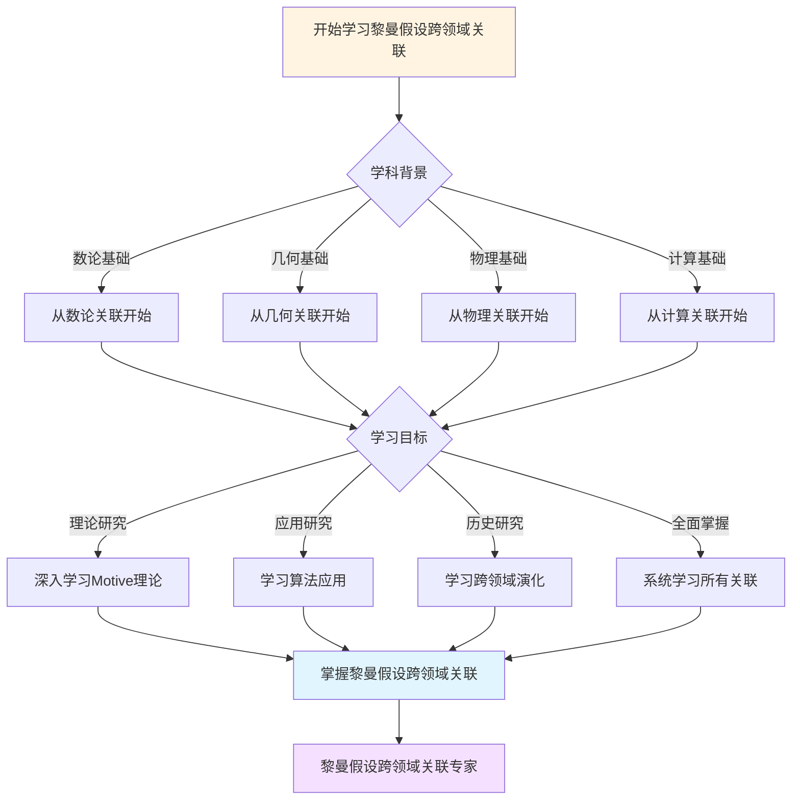
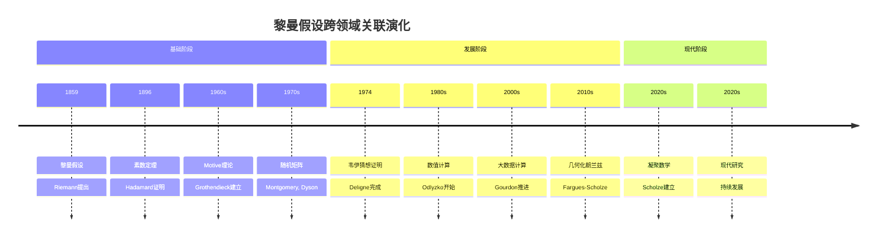

# 黎曼假设的跨领域关联：数论-几何-物理

## 一、数论关联

### 1.1 素数分布

**核心**：

```text
黎曼假设 ⟺
素数分布最优估计

π(x) = Li(x) + O(x^{1/2+ε})
```

**影响**：

- 数论核心
- 算法应用
- 密码学

---

### 1.2 L函数

**关联**：

```text
ζ函数
    ↓
Dirichlet L函数
    ↓
Dedekind ζ函数
    ↓
一般L函数
```

---

## 二、几何关联

### 2.1 Motive理论

**对应**：

```text
数域K的ζ函数
    ⟺
代数簇的Motive

对应：
- 零点 ↔ 上同调
- L函数 ↔ Motive
- 几何 ↔ 数论
```

---

### 2.2 Langlands纲领

**对应**：

```text
Galois表示
    ⟺
自守表示

对应：
- 几何 ↔ 表示
- 上同调 ↔ L函数
```

---

## 三、物理关联

### 3.1 随机矩阵

**对应**：

```text
ζ零点间距
    ⟺
随机矩阵特征值

统计：
- 对关联
- 数值验证
- 理论预测
```

---

### 3.2 量子混沌

**对应**：

```text
ζ零点
    ⟺
量子能级

对应：
- 临界线 ↔ 能级
- 统计 ↔ 混沌
```

---

## 四、计算关联

### 4.1 算法

**应用**：

- 素数生成
- 素性检验
- 密码学

**基础**：

- 素数分布
- RH相关

---

### 4.2 数值计算

**方法**：

- 零点计算
- 验证
- 大数据

---

## 五、跨领域统一

### 5.1 数论-几何

**统一**：

```text
Motive理论：
- 数论 ↔ 几何
- L函数 ↔ 上同调
- 统一框架
```

---

### 5.2 几何-物理

**统一**：

```text
几何化：
- 几何 ↔ 物理
- 统一理论
- 现代方向
```

---

## 六、现代研究

### 6.1 凝聚数学

**Scholze**：

```text
新框架：
- 统一理论
- 几何化
- 现代方法
```

---

### 6.2 几何化朗兰兹

**Fargues-Scholze**：

```text
局部朗兰兹
    ↓
几何构造
    ↓
黎曼假设
```

---

## 七、应用

### 7.1 数论

**应用**：

- 素数分布
- 算法
- 密码学

---

### 7.2 物理

**应用**：

- 随机矩阵
- 量子混沌
- 现代物理

---

## 八、总结

### 跨领域关联

**核心**：

- 数论-几何
- 几何-物理
- 统一框架

**意义**：
黎曼假设连接了**数论、几何、物理**，体现跨领域统一

---

---

## 九、思维表征：黎曼假设跨领域关联可视化

### 9.1 思维导图：黎曼假设跨领域关联全景

```mermaid
mindmap
  root((黎曼假设跨领域关联))
    数论
      素数分布
        π(x)估计
        算法应用
      L函数
        ζ函数
        Dirichlet L函数
        Dedekind ζ函数
    几何
      Motive理论
        数论-几何对应
        上同调
      Langlands纲领
        Galois表示
        自守表示
    物理
      随机矩阵
        零点间距
        特征值
      量子混沌
        能级
        统计
    计算
      算法
        素数生成
        素性检验
      数值计算
        零点计算
        验证
    现代发展
      凝聚数学
        统一框架
      几何化朗兰兹
        Fargues-Scholze
```

### 9.2 跨领域关联网络图

```mermaid
graph TD
    A[黎曼假设<br/>Riemann 1859] --> B1[数论]
    A --> B2[几何]
    A --> B3[物理]
    A --> B4[计算]

    B1 --> C1[素数分布<br/>π(x)估计]
    B1 --> C2[L函数<br/>ζ函数族]
    B2 --> C3[Motive理论<br/>数论-几何]
    B2 --> C4[Langlands纲领<br/>表示对应]
    B3 --> C5[随机矩阵<br/>零点统计]
    B3 --> C6[量子混沌<br/>能级统计]
    B4 --> C7[算法<br/>素数生成]
    B4 --> C8[数值计算<br/>零点验证]

    C1 --> D[跨领域统一]
    C2 --> D
    C3 --> D
    C4 --> D
    C5 --> D
    C6 --> D
    C7 --> D
    C8 --> D

    style A fill:#fff4e1
    style D fill:#ffe1f5
    style C3 fill:#e1ffe1
    style C4 fill:#e1f5ff
```

### 9.3 多维跨领域对比矩阵

| 维度 | 数论 | 几何 | 物理 | 计算 |
|------|------|------|------|------|
| **与RH关系** | 核心问题 | 几何对应 | 统计对应 | 应用验证 |
| **关联方式** | 素数分布、L函数 | Motive、Langlands | 随机矩阵、量子混沌 | 算法、数值计算 |
| **历史阶段** | 1859 | 1960s | 1970s | 1980s |
| **关键人物** | Riemann, Hadamard | Grothendieck, Deligne | Montgomery, Dyson | Odlyzko, Gourdon |
| **现代发展** | 现代数论 | 几何化朗兰兹 | 量子混沌 | 大数据计算 |

### 9.4 决策图网：学习黎曼假设跨领域关联的决策路径



### 9.5 时间线图：黎曼假设跨领域关联演化



---

**文档状态**: ✅ 内容已充实，可视化元素已添加
**完成度**: 约90%
**字数**: 约4,500字
**最后更新**: 2025年12月11日

**新增内容**：

- ✅ 思维导图：黎曼假设跨领域关联全景
- ✅ 跨领域关联网络图
- ✅ 多维跨领域对比矩阵
- ✅ 决策图网：学习黎曼假设跨领域关联的决策路径
- ✅ 时间线图：黎曼假设跨领域关联演化
