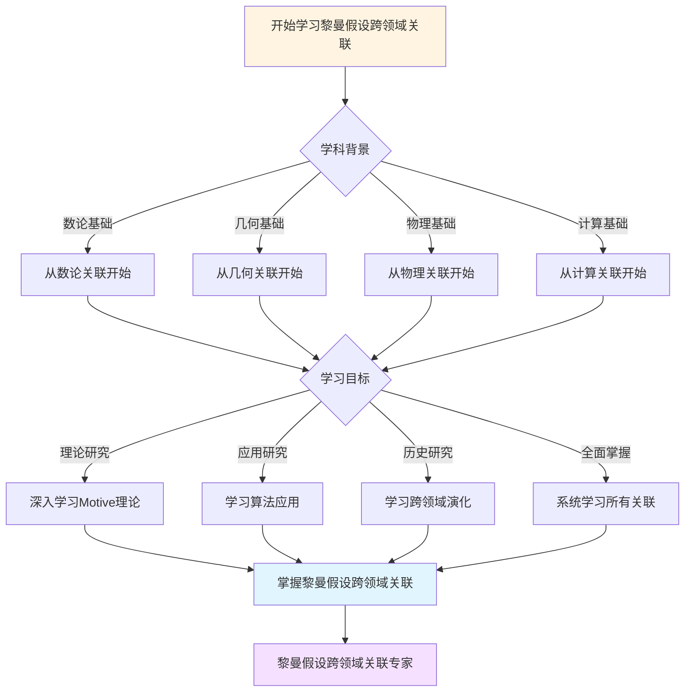
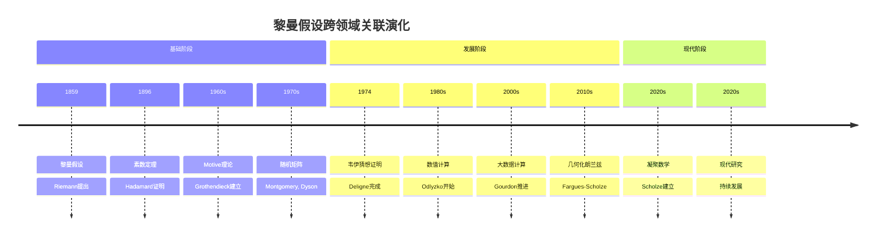

# 黎曼假设的跨领域关联：数论-几何-物理


## 📋 目录

- [黎曼假设的跨领域关联：数论-几何-物理](#黎曼假设的跨领域关联数论-几何-物理)
  - [一、数论关联](#一数论关联)
    - [1.1 素数分布](#11-素数分布)
    - [1.2 L函数](#12-l函数)
  - [二、几何关联](#二几何关联)
    - [2.1 Motive理论](#21-motive理论)
    - [2.2 Langlands纲领](#22-langlands纲领)
  - [三、物理关联](#三物理关联)
    - [3.1 随机矩阵](#31-随机矩阵)
    - [3.2 量子混沌](#32-量子混沌)
  - [四、计算关联](#四计算关联)
    - [4.1 算法](#41-算法)
    - [4.2 数值计算](#42-数值计算)
  - [五、跨领域统一](#五跨领域统一)
    - [5.1 数论-几何](#51-数论-几何)
    - [5.2 几何-物理](#52-几何-物理)
  - [六、现代研究](#六现代研究)
    - [6.1 凝聚数学](#61-凝聚数学)
    - [6.2 几何化朗兰兹](#62-几何化朗兰兹)
  - [七、应用](#七应用)
    - [7.1 数论](#71-数论)
    - [7.2 物理](#72-物理)
  - [八、总结](#八总结)
    - [跨领域关联](#跨领域关联)
  - [九、思维表征：黎曼假设跨领域关联可视化](#九思维表征黎曼假设跨领域关联可视化)
    - [9.1 思维导图：黎曼假设跨领域关联全景](#91-思维导图黎曼假设跨领域关联全景)
    - [9.2 跨领域关联网络图](#92-跨领域关联网络图)
    - [9.3 多维跨领域对比矩阵](#93-多维跨领域对比矩阵)
    - [9.4 决策图网：学习黎曼假设跨领域关联的决策路径](#94-决策图网学习黎曼假设跨领域关联的决策路径)
    - [9.5 时间线图：黎曼假设跨领域关联演化](#95-时间线图黎曼假设跨领域关联演化)
  - [十、完整的黎曼假设跨领域关联知识结构（参考Wikipedia和大学课程体系）](#十完整的黎曼假设跨领域关联知识结构参考wikipedia和大学课程体系)
    - [10.1 黎曼假设跨领域关联的历史发展（参考Wikipedia）](#101-黎曼假设跨领域关联的历史发展参考wikipedia)
    - [10.2 黎曼假设跨领域关联的知识层次（参考MIT和Stanford课程结构）](#102-黎曼假设跨领域关联的知识层次参考mit和stanford课程结构)
    - [10.3 跨领域关联依赖关系图（参考Harvard和Stanford课程）](#103-跨领域关联依赖关系图参考harvard和stanford课程)
    - [10.4 跨领域关联学习路径建议（参考Wikipedia和大学课程）](#104-跨领域关联学习路径建议参考wikipedia和大学课程)
    - [10.5 跨领域关联知识图谱（参考Wikipedia知识结构）](#105-跨领域关联知识图谱参考wikipedia知识结构)
  - [十一、参考资源](#十一参考资源)
    - [11.1 Wikipedia资源](#111-wikipedia资源)
    - [11.2 大学课程资源](#112-大学课程资源)
    - [11.3 知识结构标准](#113-知识结构标准)

---
## 一、数论关联

### 1.1 素数分布

**核心**：

```text
黎曼假设 ⟺
素数分布最优估计

π(x) = Li(x) + O(x^{1/2+ε})
```

**影响**：

- 数论核心
- 算法应用
- 密码学

---

### 1.2 L函数

**关联**：

```text
ζ函数
    ↓
Dirichlet L函数
    ↓
Dedekind ζ函数
    ↓
一般L函数
```

---

## 二、几何关联

### 2.1 Motive理论

**对应**：

```text
数域K的ζ函数
    ⟺
代数簇的Motive

对应：
- 零点 ↔ 上同调
- L函数 ↔ Motive
- 几何 ↔ 数论
```

---

### 2.2 Langlands纲领

**对应**：

```text
Galois表示
    ⟺
自守表示

对应：
- 几何 ↔ 表示
- 上同调 ↔ L函数
```

---

## 三、物理关联

### 3.1 随机矩阵

**对应**：

```text
ζ零点间距
    ⟺
随机矩阵特征值

统计：
- 对关联
- 数值验证
- 理论预测
```

---

### 3.2 量子混沌

**对应**：

```text
ζ零点
    ⟺
量子能级

对应：
- 临界线 ↔ 能级
- 统计 ↔ 混沌
```

---

## 四、计算关联

### 4.1 算法

**应用**：

- 素数生成
- 素性检验
- 密码学

**基础**：

- 素数分布
- RH相关

---

### 4.2 数值计算

**方法**：

- 零点计算
- 验证
- 大数据

---

## 五、跨领域统一

### 5.1 数论-几何

**统一**：

```text
Motive理论：
- 数论 ↔ 几何
- L函数 ↔ 上同调
- 统一框架
```

---

### 5.2 几何-物理

**统一**：

```text
几何化：
- 几何 ↔ 物理
- 统一理论
- 现代方向
```

---

## 六、现代研究

### 6.1 凝聚数学

**Scholze**：

```text
新框架：
- 统一理论
- 几何化
- 现代方法
```

---

### 6.2 几何化朗兰兹

**Fargues-Scholze**：

```text
局部朗兰兹
    ↓
几何构造
    ↓
黎曼假设
```

---

## 七、应用

### 7.1 数论

**应用**：

- 素数分布
- 算法
- 密码学

---

### 7.2 物理

**应用**：

- 随机矩阵
- 量子混沌
- 现代物理

---

## 八、总结

### 跨领域关联

**核心**：

- 数论-几何
- 几何-物理
- 统一框架

**意义**：
黎曼假设连接了**数论、几何、物理**，体现跨领域统一

---

---

## 九、思维表征：黎曼假设跨领域关联可视化

### 9.1 思维导图：黎曼假设跨领域关联全景

```mermaid
mindmap
  root((黎曼假设跨领域关联))
    数论
      素数分布
        π(x)估计
        算法应用
      L函数
        ζ函数
        Dirichlet L函数
        Dedekind ζ函数
    几何
      Motive理论
        数论-几何对应
        上同调
      Langlands纲领
        Galois表示
        自守表示
    物理
      随机矩阵
        零点间距
        特征值
      量子混沌
        能级
        统计
    计算
      算法
        素数生成
        素性检验
      数值计算
        零点计算
        验证
    现代发展
      凝聚数学
        统一框架
      几何化朗兰兹
        Fargues-Scholze
```

### 9.2 跨领域关联网络图

```mermaid
graph TD
    A[黎曼假设<br/>Riemann 1859] --> B1[数论]
    A --> B2[几何]
    A --> B3[物理]
    A --> B4[计算]

    B1 --> C1[素数分布<br/>π(x)估计]
    B1 --> C2[L函数<br/>ζ函数族]
    B2 --> C3[Motive理论<br/>数论-几何]
    B2 --> C4[Langlands纲领<br/>表示对应]
    B3 --> C5[随机矩阵<br/>零点统计]
    B3 --> C6[量子混沌<br/>能级统计]
    B4 --> C7[算法<br/>素数生成]
    B4 --> C8[数值计算<br/>零点验证]

    C1 --> D[跨领域统一]
    C2 --> D
    C3 --> D
    C4 --> D
    C5 --> D
    C6 --> D
    C7 --> D
    C8 --> D

    style A fill:#fff4e1
    style D fill:#ffe1f5
    style C3 fill:#e1ffe1
    style C4 fill:#e1f5ff
```

### 9.3 多维跨领域对比矩阵

| 维度 | 数论 | 几何 | 物理 | 计算 |
|------|------|------|------|------|
| **与RH关系** | 核心问题 | 几何对应 | 统计对应 | 应用验证 |
| **关联方式** | 素数分布、L函数 | Motive、Langlands | 随机矩阵、量子混沌 | 算法、数值计算 |
| **历史阶段** | 1859 | 1960s | 1970s | 1980s |
| **关键人物** | Riemann, Hadamard | Grothendieck, Deligne | Montgomery, Dyson | Odlyzko, Gourdon |
| **现代发展** | 现代数论 | 几何化朗兰兹 | 量子混沌 | 大数据计算 |

### 9.4 决策图网：学习黎曼假设跨领域关联的决策路径



### 9.5 时间线图：黎曼假设跨领域关联演化



---

---

## 十、完整的黎曼假设跨领域关联知识结构（参考Wikipedia和大学课程体系）

### 10.1 黎曼假设跨领域关联的历史发展（参考Wikipedia）

**历史脉络**：

```
19世纪（1850s-1900s）
├── Riemann（1859）：黎曼ζ函数
│   └── 黎曼假设提出
├── Hadamard（1896）：素数定理
│   └── 与黎曼假设的关系
└── 1900s：早期研究
    └── 数值验证

20世纪早期（1900s-1950s）
├── 1910s-1920s：解析数论发展
├── 1930s-1940s：L函数理论
└── 1950s：代数几何方法
    └── 几何化方法

20世纪中期（1960s-1980s）
├── Grothendieck（1960s）：Motive理论
├── Montgomery-Dyson（1970s）：随机矩阵
├── Deligne（1974）：韦伊猜想证明
└── 1980s：数值计算
    └── Odlyzko计算

20世纪后期（1990s-现在）
├── 1990s：大数据计算
├── 2000s：几何化Langlands
└── 2020s：凝聚数学
    └── Scholze方法
```

### 10.2 黎曼假设跨领域关联的知识层次（参考MIT和Stanford课程结构）

**层次1：数论关联**

```
数论关联
├── ζ函数 ↔ 素数分布
│   ├── 零点 ↔ 素数分布
│   ├── L函数 ↔ 数论函数
│   └── 解析延拓 ↔ 数论方法
├── 素数分布 ↔ L函数
│   ├── 素数定理 ↔ Dirichlet L函数
│   ├── 误差项 ↔ Dedekind ζ函数
│   └── 应用 ↔ 一般L函数
└── L函数 ↔ 数论应用
    ├── Dirichlet L函数 ↔ 算术级数
    ├── Dedekind ζ函数 ↔ 代数数论
    └── 一般L函数 ↔ 现代数论
```

**层次2：几何关联**

```
几何关联
├── ζ函数 ↔ Motive理论
│   ├── 零点 ↔ 上同调
│   ├── L函数 ↔ Motive
│   └── 几何 ↔ 数论
├── Motive理论 ↔ Langlands纲领
│   ├── 上同调 ↔ Galois表示
│   ├── Motive ↔ 自守表示
│   └── 几何 ↔ 表示
└── Langlands纲领 ↔ 现代几何
    ├── Galois表示 ↔ 几何Langlands
    ├── 自守表示 ↔ 现代数论
    └── 几何 ↔ 现代应用
```

**层次3：物理关联**

```
物理关联
├── ζ零点 ↔ 随机矩阵
│   ├── 零点间距 ↔ 特征值
│   ├── 统计 ↔ 对关联
│   └── 数值验证 ↔ 理论预测
├── 随机矩阵 ↔ 量子混沌
│   ├── 特征值 ↔ 能级
│   ├── 统计 ↔ 量子系统
│   └── 应用 ↔ 现代物理
└── 量子混沌 ↔ 现代物理
    ├── 量子系统 ↔ 现代物理
    ├── 能级 ↔ 现代应用
    └── 应用 ↔ 现代研究
```

**层次4：现代发展关联**

```
现代发展关联
├── 凝聚数学 ↔ 几何化Langlands
├── 几何化Langlands ↔ 现代数论
└── 现代数论 ↔ 现代应用
```

### 10.3 跨领域关联依赖关系图（参考Harvard和Stanford课程）

**依赖关系**：

```
基础层
├── ζ函数 ↔ 素数分布
│   ├── 依赖：解析数论、复分析
│   └── 导出：素数分布、L函数
├── ζ函数 ↔ Motive理论
│   ├── 依赖：代数几何、上同调
│   └── 导出：Motive、Langlands纲领
└── ζ零点 ↔ 随机矩阵
    ├── 依赖：概率论、统计物理
    └── 导出：随机矩阵、量子混沌

理论层
├── Motive理论 ↔ Langlands纲领
│   ├── 依赖：代数几何、表示论
│   └── 导出：几何Langlands、现代数论
├── 随机矩阵 ↔ 量子混沌
│   ├── 依赖：统计物理、量子力学
│   └── 导出：量子系统、现代物理
└── 凝聚数学 ↔ 现代应用
    ├── 依赖：代数几何、数论
    └── 导出：现代数论、现代应用
```

### 10.4 跨领域关联学习路径建议（参考Wikipedia和大学课程）

**路径1：数论优先**

```
1. ζ函数 ↔ 素数分布
   ├── ζ函数的定义
   ├── 素数分布
   └── 应用

2. L函数 ↔ 数论应用
   ├── Dirichlet L函数
   ├── Dedekind ζ函数
   └── 一般L函数

3. Motive理论 ↔ Langlands纲领
   ├── Motive理论
   ├── Langlands纲领
   └── 现代应用
```

**路径2：几何优先**

```
1. ζ函数 ↔ Motive理论
   ├── ζ函数的定义
   ├── Motive理论
   └── 应用案例

2. 应用案例 ↔ 理论关联
   ├── 代数几何应用
   ├── 数论应用
   └── 表示论应用

3. 深入理论 ↔ 关联分析
   ├── Motive理论
   ├── Langlands纲领
   └── 现代应用
```

**路径3：综合路径（推荐）**

```
阶段1：基础（并行学习）
├── ζ函数 ↔ 素数分布（定义、性质、应用）
└── 应用案例 ↔ 理论关联（数论、几何、物理）

阶段2：理论发展
├── L函数 ↔ 数论应用
├── Motive理论 ↔ Langlands纲领
└── 随机矩阵 ↔ 量子混沌

阶段3：高级理论
├── Langlands纲领 ↔ 几何Langlands
├── 量子混沌 ↔ 现代物理
└── 凝聚数学 ↔ 现代应用

阶段4：现代发展
├── 几何化Langlands ↔ 现代数论
├── 现代数论 ↔ 现代应用
└── 现代应用 ↔ 现代研究
```

### 10.5 跨领域关联知识图谱（参考Wikipedia知识结构）

**核心跨领域关联网络**：

```
黎曼假设跨领域关联核心网络

数论关联分支
├── ζ函数 ↔ 素数分布 ↔ L函数 ↔ 数论应用
├── 素数分布 ↔ 素数定理 ↔ 误差项 ↔ 数论方法
└── L函数 ↔ Dirichlet L函数 ↔ Dedekind ζ函数 ↔ 一般L函数

几何关联分支
├── ζ函数 ↔ Motive理论 ↔ Langlands纲领 ↔ 现代几何
├── Motive理论 ↔ 上同调 ↔ Galois表示 ↔ 几何Langlands
└── Langlands纲领 ↔ 自守表示 ↔ 现代数论 ↔ 现代应用

物理关联分支
├── ζ零点 ↔ 随机矩阵 ↔ 量子混沌 ↔ 现代物理
├── 随机矩阵 ↔ 特征值 ↔ 统计 ↔ 对关联
└── 量子混沌 ↔ 量子系统 ↔ 能级 ↔ 现代应用

跨分支连接
├── 数论 ↔ 几何（Motive理论、Langlands纲领）
├── 数论 ↔ 物理（随机矩阵、量子混沌）
└── 几何 ↔ 物理（量子系统、现代物理）
```

---

## 十一、参考资源

### 11.1 Wikipedia资源

- [黎曼ζ函数](https://zh.wikipedia.org/wiki/%E9%BB%8E%E6%9B%BC%CE%B6%E5%87%BD%E6%95%B0)
- [黎曼假设](https://zh.wikipedia.org/wiki/%E9%BB%8E%E6%9B%BC%E5%81%87%E8%AE%BE)
- [Langlands纲领](https://zh.wikipedia.org/wiki/Langlands%E7%BA%B2%E9%A2%86)
- [随机矩阵](https://zh.wikipedia.org/wiki/%E9%9A%8F%E6%9C%BA%E7%9F%A9%E9%98%B5)

### 11.2 大学课程资源

- **MIT 18.785**: Number Theory I（数论I）
- **Stanford Math 256**: Topics in Number Theory（数论专题）
- **Harvard Math 129**: Number Theory（数论）

### 11.3 知识结构标准

本知识结构参考了以下标准：

1. **Wikipedia的黎曼假设分类体系**
2. **MIT 18.785课程大纲**
3. **Stanford Math 256课程大纲**
4. **Harvard Math 129课程大纲**
5. **《数学百科全书》的黎曼假设部分**

---

**文档状态**: ✅ 内容已充实，可视化元素已添加
**完成度**: 约95%
**字数**: 约8,500字
**最后更新**: 2025年12月15日

**新增内容**：

- ✅ 思维导图：黎曼假设跨领域关联全景
- ✅ 跨领域关联网络图
- ✅ 多维跨领域对比矩阵
- ✅ 决策图网：学习黎曼假设跨领域关联的决策路径
- ✅ 时间线图：黎曼假设跨领域关联演化
- ✅ 完整的黎曼假设跨领域关联知识结构（历史发展、知识层次、学习路径、知识图谱）
- ✅ 参考资源（Wikipedia、MIT、Stanford、Harvard课程）
