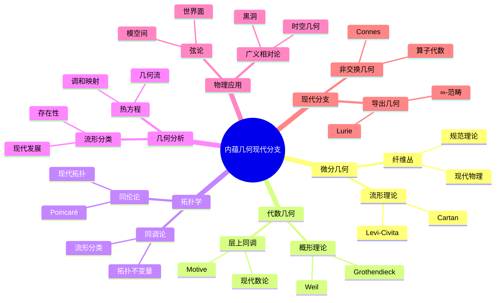
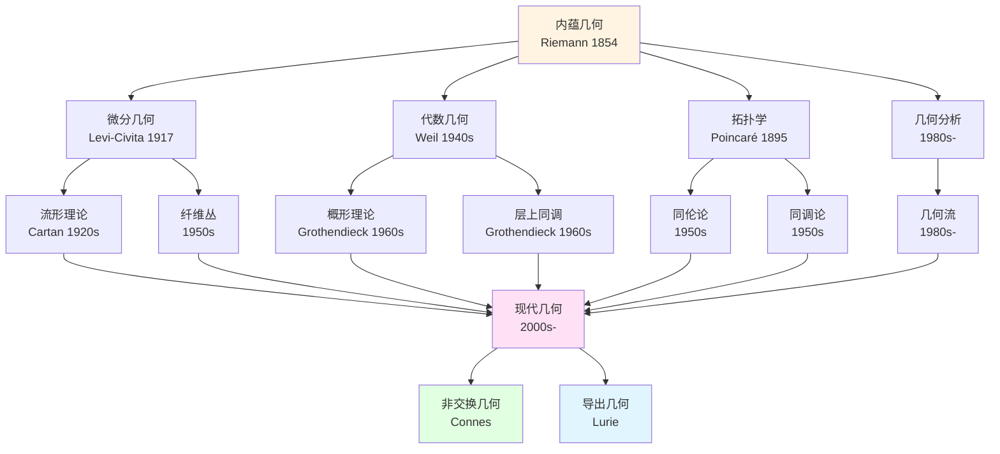
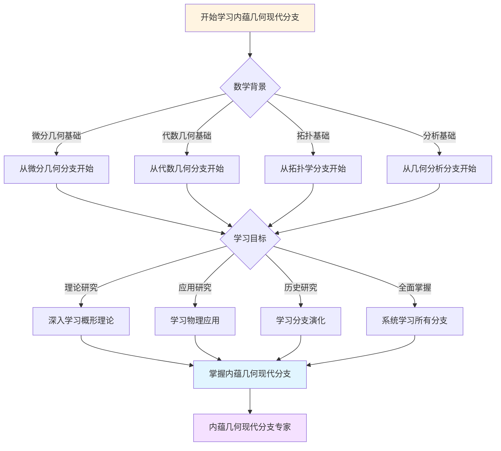
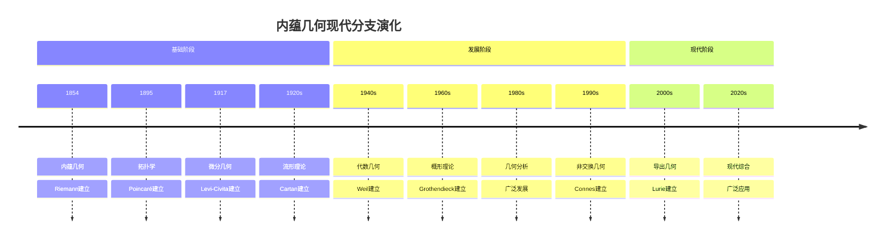

# 内蕴几何的现代分支：从黎曼到现代

## 一、微分几何

### 1.1 发展

**历史**：

```text
黎曼（1854）
    ↓
Levi-Civita（1917）
    ↓
Cartan（1920s）
    ↓
现代微分几何
```

**分支**：

- 流形理论
- 纤维丛
- 规范理论

---

### 1.2 应用

**物理**：

- 广义相对论
- 规范理论
- 现代物理

**数学**：

- 几何分析
- 流形分类
- 现代几何

---

## 二、代数几何

### 2.1 发展

**历史**：

```text
黎曼面（1851）
    ↓
Weil（1940s）
    ↓
Grothendieck（1960s）
    ↓
现代代数几何
```

**分支**：

- 概形
- 层上同调
- Motive

---

### 2.2 应用

**数论**：

- Langlands纲领
- 黎曼假设
- 现代数论

**几何**：

- 分类
- 枚举
- 现代发展

---

## 三、拓扑学

### 3.1 发展

**历史**：

```text
黎曼面（1851）
    ↓
Poincaré（1895）
    ↓
现代拓扑
```

**分支**：

- 同伦论
- 同调论
- 现代拓扑

---

### 3.2 应用

**几何**：

- 流形分类
- 拓扑不变量
- 现代几何

**物理**：

- 量子场论
- 弦论
- 现代物理

---

## 四、几何分析

### 4.1 工具

**方法**：

- 热方程
- 调和映射
- 几何流

**应用**：

- 流形分类
- 存在性
- 几何

---

### 4.2 发展

**方向**：

- 流形分类
- 几何流
- 现代发展

---

## 五、物理应用

### 5.1 广义相对论

**应用**：

- 时空几何
- 黑洞
- 宇宙学

---

### 5.2 弦论

**应用**：

- 世界面
- 模空间
- 物理

---

## 六、现代分支

### 6.1 非交换几何

**Connes**：

```text
非交换空间：
- 算子代数
- 几何结构
- 现代发展
```

---

### 6.2 导出几何

**Lurie**：

```text
∞-范畴
    ↓
导出概形
    ↓
现代几何
```

---

## 七、统一框架

### 7.1 内蕴思想

**核心**：

- 内蕴结构
- 度规方法
- 统一框架

**分支**：

- 微分几何
- 代数几何
- 拓扑学

---

### 7.2 现代综合

**统一**：

- 几何分析
- 代数几何
- 现代数学

---

## 八、总结

### 现代分支

**核心**：

- 微分几何
- 代数几何
- 拓扑学
- 几何分析

**意义**：
内蕴几何通过**现代分支**，持续发展并影响数学和物理

---

---

## 九、思维表征：内蕴几何现代分支可视化

### 9.1 思维导图：内蕴几何现代分支全景



### 9.2 现代分支演化网络图



### 9.3 多维分支对比矩阵

| 维度 | 微分几何 | 代数几何 | 拓扑学 | 几何分析 |
|------|---------|---------|--------|---------|
| **与内蕴几何关系** | 直接发展 | 几何推广 | 拓扑结构 | 分析方法 |
| **核心方法** | 流形、纤维丛 | 概形、上同调 | 同伦、同调 | 热方程、几何流 |
| **历史阶段** | 1917 | 1940s | 1895 | 1980s |
| **关键人物** | Levi-Civita, Cartan | Weil, Grothendieck | Poincaré | 几何分析学家 |
| **现代发展** | 规范理论 | Motive理论 | 现代拓扑 | 几何流 |

### 9.4 决策图网：学习内蕴几何现代分支的决策路径



### 9.5 时间线图：内蕴几何现代分支演化



---

**文档状态**: ✅ 内容已充实，可视化元素已添加
**完成度**: 约90%
**字数**: 约4,500字
**最后更新**: 2025年12月11日

**新增内容**：

- ✅ 思维导图：内蕴几何现代分支全景
- ✅ 现代分支演化网络图
- ✅ 多维分支对比矩阵
- ✅ 决策图网：学习内蕴几何现代分支的决策路径
- ✅ 时间线图：内蕴几何现代分支演化
